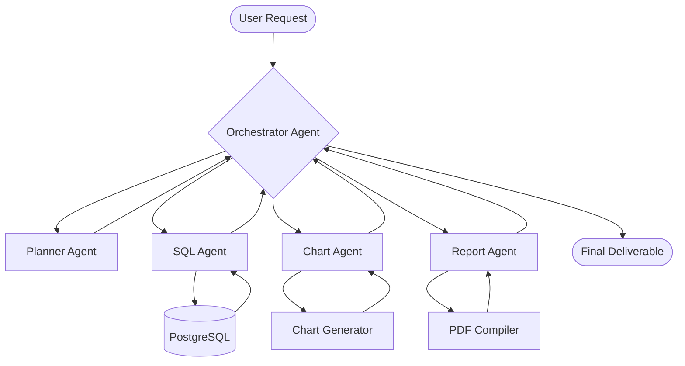

# QuantumLens

### *Enterprise Financial Analytics Platform*

[](https://python.org)
[](https://fastapi.tiangolo.com)
[](https://supabase.com)
[](https://www.postgresql.org)
[](https://render.com)
[](https://nextjs.org)
[](https://opensource.org/licenses/MIT)

**QuantumLens** is a production-grade financial data ingestion, processing, and retrieval-augmented generation (RAG) analytics engine. Built specifically for high-integrity corporate financial reporting, the platform parses complex multi-sheet Excel financial files (such as HSBC quarterly report packs), normalizes name variants to a unified KPI schema, maintains historical trends in a PostgreSQL/Supabase relational data warehouse, and enables interactive, context-grounded AI query reasoning using high-throughput Groq LLM inference.

---

## 📊 Project Snapshot

| Attribute | Details |
| :--- | :--- |
| **Project Name** | QuantumLens |
| **Domain** | Financial Analytics / Banking Intelligence |
| **Architecture Style** | ETL Pipeline + Relational Data Warehouse + Vector Retrieval (RAG) |
| **Deployment Model** | Hybrid Cloud (FastAPI on Render, Frontend on Vercel, Warehouse on Supabase) |
| **Database Engine** | Supabase (PostgreSQL 15+) with JSONB for time-series metrics |
| **Current KPI Records** | 366 KPI Records |
| **Current Warehouse Records**| 443 Rows |
| **Frontend Layer** | Next.js Dashboard UI (Planned/Vercel) |
| **Backend API Layer** | FastAPI Web Service |
| **AI Orchestration Layer** | Sentence Transformers (`all-MiniLM-L6-v2`) & Groq Cloud (`llama-3.3-70b-versatile`) |

---

## 💡 Why QuantumLens?

### Financial Report Complexity
Corporate financial reporting presents significant challenges for automated analytics and indexing due to the following structural issues:

| Challenge | Technical Impact | QuantumLens Solution |
| :--- | :--- | :--- |
| **Format Heterogeneity** | Data packs are distributed in heavily nested, multi-tab Excel files, unstructured PDFs, or PowerPoint decks. | The modular [ingestion layer](file:///c:/Users/talma/Desktop/chart%20and%20diag/quantumlens-HSBC/src/ingestion/) abstracts sheet structures into JSON coordinates. |
| **Nominal Variance** | KPI names vary dynamically between cycles (e.g., "Net Interest Income", "Net Interest", or "NII"). | Centralized constant-time dictionary lookup engine maps text hashes to normalized IDs. |
| **Sparse Time-Series** | Data lacks explicit date bounds, utilizing relative indicators like "At 31 March 2026". | Extractor maps relative terms into strict database reporting periods. |

### The Power of Metric Normalization
Normalization aligns sparse multi-sheet data point series into a single source-of-truth record:

```text
"Net Interest Income" (Sheet A, Row 5)  ──┐
"NII"                 (Sheet B, Row 12) ──┼──► [Catalog Hash Map Lookup] ──► KPI_0001 (net_interest_income)
"Net Interest"        (Sheet C, Row 4)  ──┘
```

By mapping every variation to a canonical index ID, QuantumLens ensures that downstream dashboards, statistics, and query tools query a unified time-series dataset.

### Context-Aware Financial AI (RAG)
Large Language Models (LLMs) struggle with raw mathematical accuracy and mathematical hallucination. QuantumLens utilizes **Retrieval-Augmented Generation (RAG)** to address this:

| Analysis Method | Drawbacks | Why RAG is Chosen |
| :--- | :--- | :--- |
| **Vanilla LLM Prompting** | Hallucinates critical financial numbers, makes assumptions, lack source traceability. | Constrains LLM context window to exact numeric rows retrieved from the database. |
| **SQL Query Generation** | Vulnerable to SQL injection, parsing failures, and table schema complexity. | Uses semantic search to locate records and hands them to the LLM to format and interpret. |

### Enterprise Vision
QuantumLens aims to develop into a secure, multi-agent financial controller. In this future vision, specialized autonomous agents orchestrate Excel sheet imports, generate real-time database schemas, compute cohort comparisons, compile regulatory-grade PDFs, and draft executive summaries.

---

## 🌐 Live Demo

| Component | Target URL | Status |
| :--- | :--- | :--- |
| **Frontend Web App** | [https://quantumlens-hsbc.vercel.app](https://quantumlens-hsbc.vercel.app) | Under Integration |
| **Backend REST API** | [https://quantumlens-api.render.com](https://quantumlens-api.render.com) | Operational |
| **Interactive API Docs**| [https://quantumlens-api.render.com/docs](https://quantumlens-api.render.com/docs) | Operational |

---

## ✨ Features

### Financial Analytics
- [x] Multi-sheet financial workbook scanning (Excel parsing).
- [x] Canonical KPI normalization mapping.
- [x] Automated delta trend detection (Up / Down / Flat trends).
- [x] Historical time-series mapping across fiscal periods.
- [ ] Multi-quarter cohort performance comparison.

### AI Features
- [x] Semantic KPI search via vector embeddings.
- [x] Secure RAG pipeline limiting queries to database facts.
- [x] Direct workbook, sheet, and row source-attribution quoting.
- [ ] Natural Language to SQL query translation.
- [ ] Automated trend insight summaries.

### Data Engineering
- [x] Multi-stage ETL pipeline isolating data ingestion, transformation, and storage.
- [x] Constant-time lookup mapping using centralized dictionaries.
- [x] NaN-safe value cleaning and data validation.
- [x] Primary key-based duplicate prevention (database upserts).

### Deployment & DevOps
- [x] Dynamic runtime configuration via environment variables.
- [x] Direct Supabase connection pooling and PostgreSQL backend.
- [x] Local SQLite and vector database caching.
- [ ] Prometheus metrics exposure for scraping.
- [ ] Grafana pipeline monitoring dashboards.

### Future Features
- [ ] Multi-agent coordinator system (Planner, SQL, Chart, and Report agents).
- [ ] PDF and PPT automated financial document generation.
- [ ] Multi-tenant secure organizational access control.

---

## 🛠️ Technology Stack

| Layer | Technology | Version | Purpose |
| :--- | :--- | :--- | :--- |
| **Frontend** | React / Next.js | 15.x | Analytics User Interface & interactive dashboards |
| | TailwindCSS | 3.4+ | CSS layout framework |
| | Chart.js / Recharts | 2.x | Time-series charting & visualization |
| **Backend** | Python | 3.13 | Primary application runtime |
| | FastAPI | 0.138.1 | High-performance API routing |
| | Uvicorn | 0.49.0 | ASGI web server hosting |
| | Pandas | 3.0.3 | High-fidelity tabular processing |
| | Pydantic | 2.13.4 | Schema validation & parsing |
| **Database** | PostgreSQL | 15+ | Relational data warehouse storage |
| | Supabase Python | 2.31.0 | Cloud database connection & operations |
| | ChromaDB | 1.5.9 | High-performance vector database client |
| **AI Layer** | Sentence Transformers | 5.6.0 | Local embedding generation (`all-MiniLM-L6-v2`) |
| | Groq Cloud Client | 1.5.0 | High-speed LLM client (`llama-3.3-70b-versatile`) |

---

## 💻 Local Installation

### Prerequisites
Ensure Python 3.13+ is installed on your local machine.

### Operating System Instructions

<details>
<summary><b>Windows Setup Guide</b></summary>

```powershell
# Clone the repository
git clone https://github.com/your-username/quantumlens-HSBC.git
cd quantumlens-HSBC

# Create virtual environment
python -m venv .venv
.venv\Scripts\Activate.ps1

# Install dependencies
pip install -r requirements.txt

# Launch API locally
uvicorn src.api.main:app --reload --port 8000
```
</details>

<details>
<summary><b>Linux / Mac Setup Guide</b></summary>

```bash
# Clone the repository
git clone https://github.com/your-username/quantumlens-HSBC.git
cd quantumlens-HSBC

# Create virtual environment
python3 -m venv .venv
source .venv/bin/activate

# Install dependencies
pip install -r requirements.txt

# Launch API locally
uvicorn src.api.main:app --reload --port 8000
```
</details>

---

## 🔑 Environment Variables

To run the API and ETL loader, configure the environment variables by duplicating the `.env.example` file:

```bash
cp .env.example .env
```

### Required Configuration Fields

| Variable | Type | Description | Example Value |
| :--- | :--- | :--- | :--- |
| `SUPABASE_URL` | String | Endpoint for Supabase Database REST interface. | `https://your-proj-id.supabase.co` |
| `SUPABASE_KEY` | String | Service Role api key for direct upsert access bypass. | `eyJhbGciOiJIUzI1NiIsInR...` |
| `GROQ_API_KEY` | String | Cloud API token to interface Groq completions. | `gsk_m82P92h...` |
| `VECTOR_DB_PATH` | Path | Relative directory path to store local vectors. | `src/rag/vector_db` |
| `EMBEDDING_MODEL`| String | Sentence Transformers vector generation tag. | `sentence-transformers/all-MiniLM-L6-v2` |
| `TOP_K` | Integer| Number of context chunks returned during RAG. | `5` |

### Example `.env` File
```ini
# Supabase Database Settings
SUPABASE_URL=https://xyza.supabase.co
SUPABASE_KEY=eyJhbGciOiJIUzI1NiIsInR5cCI6IkpXVCJ9.your-key-here

# Groq LLM Provider Settings
GROQ_API_KEY=gsk_3aF91uKxJ2b...

# AI & Local Vector Engine Settings
VECTOR_DB_PATH=src/rag/vector_db
EMBEDDINGS_PATH=src/rag/embeddings.json
EMBEDDING_MODEL=sentence-transformers/all-MiniLM-L6-v2
TOP_K=5
```

---

## 🚀 Deployment

### Backend Deployed on Render
The FastAPI service is hosted on Render via Uvicorn. To deploy:
1. Create a new **Web Service** on Render pointing to your fork.
2. Set Environment Variables matching the fields in `.env`.
3. Set **Start Command** to:
   ```bash
   uvicorn src.api.main:app --host 0.0.0.0 --port $PORT
   ```

### Frontend Deployed on Vercel
The Next.js dashboard is hosted on Vercel. 
1. Connect Vercel to your repository.
2. Set the Environment Variable `NEXT_PUBLIC_API_URL` to point to your backend Render URL.
3. Deploy the application bundle.

### Database Deployed on Supabase
The relational warehouse is hosted on Supabase:
1. Initialize a new PostgreSQL database.
2. Execute the migrations script in the SQL Editor to provision schemas and indices.

---

## 🏛️ System Architecture

### High-Level Architecture Flow

```text
                                       ┌────────────────────────┐
                                       │       Web Client       │
                                       │   (Next.js Frontend)   │
                                       └───────────┬────────────┘
                                                   │ HTTPS REST
                                                   ▼
                                       ┌────────────────────────┐
                                       │     FastAPI Server     │
                                       │    (Backend Engine)    │
                                       └───────────┬────────────┘
                                                   │
                            ┌──────────────────────┴──────────────────────┐
                            ▼ PostgreSQL                                  ▼ Context Fetch
                 ┌────────────────────┐                        ┌────────────────────┐
                 │ Supabase Warehouse │                        │     RAG Engine     │
                 │    (PostgreSQL)    │                        │  (ChromaDB Local)  │
                 └────────────────────┘                        └──────────┬─────────┘
                                                                          │ Vector Search
                                                                          ▼
                                                               ┌────────────────────┐
                                                               │   Groq Cloud API   │
                                                               │(Llama 3.3 Analytics)│
                                                               └────────────────────┘
```

### ETL Pipeline Architecture

```text
 ┌──────────────┐      ┌─────────────────┐      ┌───────────────┐      ┌──────────────────┐
 │ Raw XLSX/PDF │ ───► │ Workbook Reader │ ───► │ Sheet Scanner │ ───► │ Metric Extractor │
 └──────────────┘      └─────────────────┘      └───────────────┘      └────────┬─────────┘
                                                                                │
 ┌──────────────┐      ┌─────────────────┐      ┌───────────────┐               │
 │ Supabase DB  │ ◄─── │   KPI Builder   │ ◄─── │ Period Mapper │ ◄─────────────┘
 └──────┬───────┘      └─────────────────┘      └───────────────┘
        │
        ▼
 ┌──────────────┐      ┌─────────────────┐      ┌───────────────┐      ┌──────────────────┐
 │ Embed Generator ──► │  Vector Loader  │ ───► │ ChromaDB Store│ ───► │ RAG Query Engine │
 └──────────────┘      └─────────────────┘      └───────────────┘      └──────────────────┘
```

### System Layers

| Layer | Code Module Location | Completion Status | Functional Responsibility |
| :--- | :--- | :--- | :--- |
| **Ingestion** | [workbook_reader.py](file:///c:/Users/talma/Desktop/chart%20and%20diag/quantumlens-HSBC/src/ingestion/workbook_reader.py)<br>[sheet_scanner.py](file:///c:/Users/talma/Desktop/chart%20and%20diag/quantumlens-HSBC/src/ingestion/sheet_scanner.py) | `100% (Complete)` | Parse workbooks, scan row layouts, output JSON cell maps. |
| **Transformation**| [metric_extractor.py](file:///c:/Users/talma/Desktop/chart%20and%20diag/quantumlens-HSBC/src/ingestion/metric_extractor.py)<br>[value_extractor.py](file:///c:/Users/talma/Desktop/chart%20and%20diag/quantumlens-HSBC/src/transformation/value_extractor.py)<br>[period_mapper.py](file:///c:/Users/talma/Desktop/chart%20and%20diag/quantumlens-HSBC/src/transformation/period_mapper.py)<br>[kpi_builder.py](file:///c:/Users/talma/Desktop/chart%20and%20diag/quantumlens-HSBC/src/transformation/kpi_builder.py) | `100% (Complete)` | Normalize naming variants, isolate numbers, map timeline periods, and structure final KPI objects. |
| **Warehouse** | [data_loader.py](file:///c:/Users/talma/Desktop/chart%20and%20diag/quantumlens-HSBC/src/warehouse/data_loader.py)<br>[query_service.py](file:///c:/Users/talma/Desktop/chart%20and%20diag/quantumlens-HSBC/src/warehouse/query_service.py) | `100% (Complete)` | Safely persist records to Supabase, query databases, handle upsert rules, and enforce indexing. |
| **AI Layer** | [embedding_generator.py](file:///c:/Users/talma/Desktop/chart%20and%20diag/quantumlens-HSBC/src/rag/embedding_generator.py)<br>[vector_loader.py](file:///c:/Users/talma/Desktop/chart%20and%20diag/quantumlens-HSBC/src/rag/vector_loader.py)<br>[retrieval_engine.py](file:///c:/Users/talma/Desktop/chart%20and%20diag/quantumlens-HSBC/src/rag/retrieval_engine.py)<br>[rag_pipeline.py](file:///c:/Users/talma/Desktop/chart%20and%20diag/quantumlens-HSBC/src/rag/rag_pipeline.py) | `100% (Complete)` | Encode warehouse texts to vectors, manage ChromaDB embeddings, perform semantic searches, and run LLM completions. |
| **Observability** | `Planned Integration` | `0% (Planned)` | Track pipeline duration, measure API metrics, and expose Prometheus metrics. |

### Module Breakdown

| Script Name | Layer | Input Data Format | Output Data Format | Primary Purpose |
| :--- | :--- | :--- | :--- | :--- |
| **workbook_reader.py** | Ingestion | `.xlsx` File System Path | Pandas `ExcelFile` | Reads spreadsheet binary files into memory. |
| **sheet_scanner.py** | Ingestion | Pandas `ExcelFile` | JSON Row Coordinates | Scans row content patterns across all sheets. |
| **metric_extractor.py**| Ingestion | JSON Row Coordinates | JSON Matches Array | Detects matching KPIs using catalog definitions. |
| **value_extractor.py** | Transformation | JSON Matches Array | JSON Numeric Array | Filters and isolates numerical cell structures. |
| **period_mapper.py** | Transformation | JSON Numeric Array | Time-series JSON array | Aligns numeric data to relative reporting slots. |
| **kpi_builder.py** | Transformation | Time-series JSON array | Clean KPI Records | Builds standard enterprise KPI records. |
| **data_loader.py** | Warehouse | Clean KPI Records | Supabase Upserts | Inserts metrics to the warehouse database. |
| **query_service.py** | Warehouse | Supabase Queries | Tabular/JSON Results | Provides data query methods to external callers. |
| **embedding_generator.py**| AI Layer | Supabase Tables | Local JSON Embeddings | Generates text representations and embedding vectors. |
| **vector_loader.py** | AI Layer | Local JSON Embeddings | ChromaDB Collection | Loads vector indexes into persistent ChromaDB stores. |
| **retrieval_engine.py**| AI Layer | Text User Question | ChromaDB Document matches| Searches ChromaDB using cosine distance queries. |

### Project Directory Tree
```text
quantumlens-HSBC/
├── data/
│   ├── raw/                           # Raw Excel Workbooks (HSBC packs)
│   └── processed/                     # Extracted intermediate processing stages
│       ├── scan_sheet_metadata.json   # Scanned raw sheet coordinates
│       ├── extracted_metrics.json     # Matched raw metrics
│       ├── valued_metrics.json        # Identified numerical values
│       ├── mapped_metrics.json        # Time-mapped metric arrays
│       └── kpi_records.json           # Assembled operational KPI records
├── docs/                              # System documentation
│   ├── architecture.md
│   ├── data_dictionary.md
│   └── kpi_catalog.md
├── src/                               # Primary Source Code
│   ├── agents/                        # Autonomous multi-agent routines
│   │   ├── chart_agent.py             # Future chart generator agent
│   │   ├── orchestrator.py            # Future agent coordinator
│   │   ├── planner.py                 # Future intent schedule planner
│   │   ├── rag_agent.py               # Context query agent
│   │   └── sql_agent.py               # Future database querying agent
│   ├── analytics/                     # Statistical analysis helpers
│   ├── api/                           # FastAPI Router & endpoint handlers
│   │   ├── main.py                    # Root FastAPI starter app
│   │   ├── routes.py                  # API Route configurations
│   │   ├── schemas.py                 # Pydantic input/output schemas
│   │   └── services.py                # Database wrapper query connectors
│   ├── config/                        # Global environment configuration
│   │   ├── settings.py                # Pydantic BaseSettings parser
│   │   └── metric_dictionary.json     # Normalization name map catalog
│   ├── ingestion/                     # Workbook & spreadsheet scanners
│   ├── transformation/                # Normalization & trend compilers
│   ├── warehouse/                     # Supabase & PostgreSQL client hooks
│   └── rag/                           # AI search and LLM completion pipelines
├── tests/                             # Unit & Integration test suites
├── requirements.txt                   # Dependency lock file
├── LICENSE                            # MIT License File
└── README.md                          # Primary platform documentation
```

---

## ⚡ Detailed Ingestion & ETL Stages

### Stage 1: Workbook Reader
- **Responsibility**: Loads large, complex corporate Excel sheets into memory safely without memory leaks.
- **Input**: Raw file system path pointing to `.xlsx` files (e.g., `260505-1q-2026-data-pack-excel.xlsx`).
- **Output**: Python Pandas `ExcelFile` object.
- **Key Operations**:
  - Validates file existence and structural sanity.
  - Safely reads raw worksheets in read-only mode to conserve system memory.
  - Discovers all tab sheet names.

### Stage 2: Sheet Scanner
- **Responsibility**: Traverses sheets row-by-row, converting grid shapes to standardized JSON lines.
- **Output Example**:
  ```json
  {
    "source_workbook": "260505-1q-2026-data-pack-excel.xlsx",
    "sheet_name": "Credit Risk",
    "row_number": 124,
    "row_values": [
      "At 31 March 2026",
      354763,
      59023
    ],
    "non_null_count": 3
  }
  ```
- **Processing Logic**:
  ```text
  Workbook ──► For Each Sheet ──► For Each Row ──► Filter Nulls ──► Save coordinates to JSON
  ```

### Stage 3: Metric Extractor
- **Responsibility**: Detects KPIs inside the sheet row contents using dictionary catalog mapping (see the [KPI Catalog & Normalization Logic](docs/kpi_catalog.md) for lookup configurations).
- **Complexity**: `O(1)` constant-time lookup.
- **Extraction Match Example**:
  - Input Row: `["Net Interest Income", 8945, 9196]`
  - Catalog Mapping Lookup:
    ```json
    {
      "net interest income": {
        "metric_id": 1,
        "abbreviation": "nii",
        "normalized_metric_name": "net_interest_income"
      }
    }
    ```
  - Result:
    ```json
    {
      "metric_id": 1,
      "normalized_metric_name": "net_interest_income"
    }
    ```
- **Matching Steps**:
  1. Parse first column textual cell values.
  2. Normalize string syntax (lowercase, strip margins, trim whitespaces).
  3. Perform exact key hash-lookup against the dictionary catalog.
  4. Inject matched configuration metadata (ID, abbreviation) if a match is found.

### Stage 4: Value Extraction Layer
- **Responsibility**: Filters cells inside a matched row to isolate numbers.
- **Input**: `["Net Interest Income", 8945, 9196, "N/A", 8777]`
- **Output**: `{"numeric_values": [8945, 9196, 8777]}`
- **Extraction Flow**:
  ```text
  Row Array ──► Identify Numbers ──► Handle NaN/Null cells ──► Output Clean Numeric Array
  ```

### Stage 5: Period Mapping Layer
- **Responsibility**: Converts numbers array into structured time-series index items.
- **Input**: `[8945, 9196, 8777]`
- **Output**:
  ```json
  [
    { "period_index": 1, "value": 8945 },
    { "period_index": 2, "value": 9196 },
    { "period_index": 3, "value": 8777 }
  ]
  ```
- **Rationale**:
  | Period Problem | Impact | Solution |
  | :--- | :--- | :--- |
  | **Missing Time context** | Numbers lack comparison boundaries. | Maps items to historical sequential indexes. |
  | **Different Column Orders** | Reports sort columns differently. | Standardizes arrays to sequential trends. |

### Stage 6: KPI Builder & Trend Engine
- **Responsibility**: Assembles finalized records, checking delta shifts to generate trends.
- **Output Record Example**:
  ```json
  {
    "kpi_id": "KPI_0001",
    "metric_name": "net_interest_income",
    "latest_value": 8945,
    "previous_value": 9196,
    "trend": "down"
  }
  ```
- **Trend Calculation Engine Rules**:
  | Logic Condition | Calculated Trend |
  | :--- | :--- |
  | `latest_value` > `previous_value` | `up` |
  | `latest_value` < `previous_value` | `down` |
  | `latest_value` == `previous_value`| `flat` |

---

## 🗄️ Database Design & Relational Warehouse

For detailed database schemas, constraints, indexing strategies, and future tables definition, refer to the [Database Design & Data Dictionary](docs/data_dictionary.md).

### Database Engine Choice
QuantumLens uses **Supabase (PostgreSQL 15)** as its central relational warehouse. This platform choice offers several design benefits:
- **Relational Integrity**: Enforces strict primary key lookups and lookup table values.
- **JSONB Native Operations**: Allows nested schema queries within variable time-series array segments.
- **Row-Level Security (RLS)**: Enforces access policies directly in the engine, simplifying user data isolation.

### Relational Schema Definition (`metrics` Table)

The primary data warehouse structure is the `metrics` table. Below is the detailed schema:

| Column Name | SQL Type | Key / Constraint | Description |
| :--- | :--- | :--- | :--- |
| `id` | SERIAL | PRIMARY KEY | Automated incremental database key. |
| `metric_id` | INTEGER | UNIQUE | Unique business metrics catalog ID. |
| `metric_name` | TEXT | NOT NULL | Normalized canonical metric name. |
| `abbreviation`| TEXT | NULLABLE | Shortened abbreviation name. |
| `period_values`| JSONB | NOT NULL | Time-series values (array of index/value objects). |
| `source_workbook`| TEXT | NOT NULL | Source spreadsheet filename. |
| `sheet_name` | TEXT | NOT NULL | Tab worksheet name where record was found. |
| `row_number` | INTEGER | NOT NULL | Spreadsheet row line where record was found. |
| `created_at` | TIMESTAMP | DEFAULT NOW() | Record creation date and timestamp. |

#### Database Indexes Table
| Table Name | Index Name | Columns Indexed | Index Type | Purpose |
| :--- | :--- | :--- | :--- | :--- |
| `metrics` | `metrics_pkey` | `id` | B-Tree | Primary Key Index |
| `metrics` | `idx_metric_id`| `metric_id` | B-Tree | Accelerated queries by metric ID |
| `metrics` | `idx_metric_name`| `metric_name`| B-Tree | Accelerated searches by canonical name |

#### Relational Constraints Table
| Constrained Column | Constraint Type | Description |
| :--- | :--- | :--- |
| `metric_id` | UNIQUE | Ensures a single unique schema profile per metric code. |
| `metric_name` | NOT NULL | Prevents inserting records without a normalized identifier. |

---

### Future Schemas

To expand QuantumLens into a multi-tenant enterprise portal, the database will be extended with the following tables:

```text
  ┌──────────────┐          ┌──────────────┐          ┌──────────────┐
  │    users     │ ───1:N──►│  dashboards  │ ───1:N──►│   reports    │
  └──────┬───────┘          └──────────────┘          └──────────────┘
         │
       1:N
         ▼
  ┌──────────────┐
  │ chat_history │
  └──────────────┘
```

<details>
<summary><b>View SQL Schema Definitions for Future Tables</b></summary>

```sql
-- Users Table
CREATE TABLE users (
    id UUID PRIMARY KEY DEFAULT gen_random_uuid(),
    email VARCHAR(255) UNIQUE NOT NULL,
    full_name VARCHAR(255),
    role VARCHAR(50) DEFAULT 'analyst',
    created_at TIMESTAMP WITH TIME ZONE DEFAULT CURRENT_TIMESTAMP
);

-- Dashboards Table
CREATE TABLE dashboards (
    id SERIAL PRIMARY KEY,
    user_id UUID REFERENCES users(id) ON DELETE CASCADE,
    title VARCHAR(255) NOT NULL,
    config JSONB DEFAULT '{}'::jsonb,
    is_public BOOLEAN DEFAULT FALSE,
    updated_at TIMESTAMP WITH TIME ZONE DEFAULT CURRENT_TIMESTAMP
);

-- Reports Table
CREATE TABLE reports (
    id SERIAL PRIMARY KEY,
    dashboard_id INTEGER REFERENCES dashboards(id) ON DELETE CASCADE,
    summary TEXT,
    metric_snapshots JSONB,
    generated_at TIMESTAMP WITH TIME ZONE DEFAULT CURRENT_TIMESTAMP
);

-- Chat History Table
CREATE TABLE chat_history (
    id SERIAL PRIMARY KEY,
    user_id UUID REFERENCES users(id) ON DELETE CASCADE,
    session_id VARCHAR(100) NOT NULL,
    question TEXT NOT NULL,
    answer TEXT NOT NULL,
    sources JSONB,
    created_at TIMESTAMP WITH TIME ZONE DEFAULT CURRENT_TIMESTAMP
);
```
</details>

---

## 🔌 REST API Documentation

The REST API exposes several endpoints to manage ingestion, search metrics, and execute RAG pipelines.

### Endpoint Matrix

| Method | Route | Description | Request Type | Success Code |
| :--- | :--- | :--- | :--- | :--- |
| `GET` | `/` | API system metadata check | None | `200 OK` |
| `GET` | `/health` | Ingestion status check | None | `200 OK` |
| `GET` | `/metrics` | Retrieve catalog unique list | None | `200 OK` |
| `GET` | `/metric/{id}` | Retrieve instances by metric ID | Path Variable | `200 OK` |
| `GET` | `/record/{id}` | Retrieve unique row record by primary ID | Path Variable | `200 OK` |
| `POST` | `/search` | Cosine vector search query | JSON Body | `200 OK` |
| `POST` | `/ask` | Execute RAG pipeline completion | JSON Body | `200 OK` |

---

### Endpoint Specifications

#### 1. GET `/`
- **Purpose**: Verifies that the API server is active and returns root configuration details.
- **Success Response (`200 OK`)**:
  ```json
  {
    "project": "QuantumLens",
    "status": "Running"
  }
  ```

#### 2. GET `/health`
- **Purpose**: Simple check to verify pipeline connectivity status.
- **Success Response (`200 OK`)**:
  ```json
  {
    "status": "healthy"
  }
  ```

#### 3. GET `/metrics`
- **Purpose**: Returns a unique list of matched metrics in the database catalog (ID, name, abbreviation).
- **Success Response (`200 OK`)**:
  ```json
  [
    {
      "metric_id": 1,
      "metric_name": "net_interest_income",
      "abbreviation": "nii"
    },
    {
      "metric_id": 2,
      "metric_name": "net_fee_income",
      "abbreviation": "nfi"
    }
  ]
  ```

#### 4. GET `/metric/{metric_id}`
- **Purpose**: Retrieves all ingested worksheet occurrences for a specific metric ID.
- **Path Parameter**: `metric_id` (integer, required)
- **Success Response (`200 OK`)**:
  ```json
  [
    {
      "id": 105,
      "metric_id": 1,
      "metric_name": "net_interest_income",
      "abbreviation": "nii",
      "sheet_name": "Group income statement",
      "row_number": 5
    }
  ]
  ```
- **Error Codes**:
  - `404 Not Found`: If no records exist for the specified `metric_id`.

#### 5. GET `/record/{record_id}`
- **Purpose**: Fetches a single record's details, including historical period values, by its primary key.
- **Path Parameter**: `record_id` (integer, required)
- **Success Response (`200 OK`)**:
  ```json
  [
    {
      "id": 105,
      "metric_id": 1,
      "metric_name": "net_interest_income",
      "abbreviation": "nii",
      "period_values": [
        { "period_index": 1, "value": 8945 },
        { "period_index": 2, "value": 9196 }
      ],
      "source_workbook": "260505-1q-2026-data-pack-excel.xlsx",
      "sheet_name": "Group income statement",
      "row_number": 5,
      "created_at": "2026-07-10T12:00:00"
    }
  ]
  ```

#### 6. POST `/search`
- **Purpose**: Performs semantic cosine search directly on the vector collection in ChromaDB.
- **Request Body**:
  ```json
  {
    "query": "What is the net interest income trend?",
    "top_k": 3
  }
  ```
- **Success Response (`200 OK`)**:
  ```json
  {
    "ids": [["1_0", "1_1"]],
    "distances": [[0.156, 0.287]],
    "metadatas": [[
      {
        "metric_id": 1,
        "metric_name": "net_interest_income",
        "abbreviation": "nii",
        "sheet_name": "Group income statement",
        "source_workbook": "260505-1q-2026-data-pack-excel.xlsx",
        "row_number": 5
      }
    ]],
    "documents": [["Metric Name: net_interest_income..."]]
  }
  ```

#### 7. POST `/ask`
- **Purpose**: Executes the full RAG pipeline (semantic search + LLM completion) to answer questions.
- **Request Body**:
  ```json
  {
    "question": "What is the latest value of net interest income and its trend?"
  }
  ```
- **Success Response (`200 OK`)**:
  ```json
  {
    "question": "What is the latest value of net interest income and its trend?",
    "answer": "- According to the 'Group income statement' sheet in '260505-1q-2026-data-pack-excel.xlsx':\n- The Net Interest Income (NII) latest value is **8,945** (Period 1).\n- The previous period value was **9,196** (Period 2).\n- This represents a **downward trend**.",
    "sources": [
      {
        "metric_id": 1,
        "metric_name": "net_interest_income",
        "abbreviation": "nii",
        "sheet_name": "Group income statement",
        "source_workbook": "260505-1q-2026-data-pack-excel.xlsx",
        "row_number": 5
      }
    ],
    "retrieved_documents": [
      "Metric Name:\nnet_interest_income\n..."
    ],
    "distances": [0.1568213],
    "generated_at": "2026-07-10T21:50:45"
  }
  ```

---

## 🧠 AI Architecture & RAG Pipeline

The AI engine matches user questions to relevant database records and runs context-bounded completions using LLMs.

### Ingestion Flow
```text
  ┌────────────────────────┐
  │   Supabase Warehouse   │
  └───────────┬────────────┘
              │ 1. Read Rows
              ▼
  ┌────────────────────────┐
  │   Embedding Generator  │ ◄── [all-MiniLM-L6-v2 Model]
  └───────────┬────────────┘
              │ 2. Compute 384-dim Vectors
              ▼
  ┌────────────────────────┐
  │ ChromaDB Vector Store  │
  └────────────────────────┘
```

### Retrieval & Generation Flow
```text
  User Question ──► [Retrieve Cosine Matches] ──► [Build Strict Prompt Context] ──► [Groq Inference] ──► Output Response
                          ▲
                          │ Query Embedding
                          │
                   [ChromaDB Store]
```

### Prompt Engineering & Copilot Constraints
To ensure accuracy, the prompt engine constrains LLM generation using the following instructions:
1. **Context Limit**: Rely *only* on retrieved database text records.
2. **Numeric Safety**: Never guess, interpolate, or generate fake numbers.
3. **Traceability**: Quote the exact spreadsheet tab name (`sheet_name`) and source workbook filename.
4. **Transparency**: Explicitly state if data is unavailable.
5. **Format Constraint**: Output answers in markdown bullet points.

---

### The Future Multi-Agent System

To scale beyond basic search-and-retrieval, the platform's roadmapped architecture will transition into a coordinated multi-agent system.



#### Multi-Agent Capabilities Matrix

| Agent Role | Functional Responsibility | Primary Tools | Output Deliverable |
| :--- | :--- | :--- | :--- |
| **Planner** | Deconstructs user tasks and plans execution steps. | Intent Classifier, Scheduler | Step-by-Step Task List |
| **SQL Agent** | Connects to PostgreSQL to run structured queries. | Schema Parser, Supabase client | Tabular Data Frames |
| **Chart Agent**| Generates data visualizations from query outputs. | Pandas, Recharts | Interactive Chart Configs |
| **Report Agent**| Synthesizes charts and summaries into documents. | Markdown compiler, ReportLab | Exportable PDF Reports |

---

## 📐 Engineering Decisions

| Tech Component | Selected Option | Considered Alternatives | Core Rationale for Selection |
| :--- | :--- | :--- | :--- |
| **Backend API** | **FastAPI** | Flask, Django | High-performance ASGI interface, automatic OpenAPI (Swagger) generation, native async loops, and strict Pydantic parsing. |
| **Database Engine**| **Supabase (PostgreSQL)** | MySQL, MongoDB | PostgreSQL provides transactional consistency and JSONB capabilities to query variable time-series array schemas. |
| **Data Format** | **JSONB Arrays** | Normal Join Tables | Relational joins on dynamically changing column sizes (reporting periods) require high processing overhead; JSONB handles dynamic properties with high query speed. |
| **Vector DB** | **ChromaDB (Local)** | pgvector, Pinecone | ChromaDB provides zero-config local storage, eliminating the need to manage external connection pools during development. |
| **Embedding Model**| **all-MiniLM-L6-v2** | OpenAI ada-002 | Compact 384-dimensional model that runs locally, offering low latency and eliminating API call overhead. |
| **LLM Provider** | **Groq Cloud (Llama 3)**| OpenAI GPT-4 | High throughput (tokens per second) and low latency, making it ideal for real-time analysis tools. |
| **ETL Structure** | **Modular Pipelines** | Monolithic Loader Script | Decoupled layers make it easier to add new data formats (e.g. PDFs) without rewriting the database upload logic. |

---

## 🗺️ Future Roadmap

### Phase 1: Foundation (Completed)
- [x] Excel workbook scanner parsing engine.
- [x] Canonical KPI normalization dictionary mapping.
- [x] Supabase Postgres loader integration.
- [x] Local ChromaDB vector database index loader.
- [x] Context-aware RAG pipeline using Groq.

### Phase 2: Interface & Visualization (Planned)
- [ ] Next.js analytical portal interface.
- [ ] Dynamic trend dashboard tracking metrics.
- [ ] Interactive financial charts (Recharts integration).
- [ ] CSV/Excel data export buttons.
- [ ] Integrated AI chat interface drawer.

### Phase 3: Analytics Expansion (Planned)
- [ ] Cross-sheet cohort trend comparison tools.
- [ ] Automated fiscal period filter selectors.
- [ ] Historical data trend alerts.
- [ ] Automated financial report draft generation.

### Phase 4: Security & Customization (Planned)
- [ ] User authentication and access control (Supabase Auth).
- [ ] Saved custom analytical dashboards.
- [ ] Adaptive dark/light layout options.
- [ ] Multi-tenant organization isolation.

### Phase 5: Autonomous Multi-Agent Framework (Planned)
- [ ] Planner Agent coordinating execution steps.
- [ ] SQL Agent executing dynamic queries.
- [ ] Chart Agent generating visual dashboards.
- [ ] PDF Report Writer Agent compiling insights.

---

## 🛠️ Engineering Challenges & Resolutions

### Historical Engineering Challenges & Resolutions

| Issue | Category | System Impact | Resolution Strategy |
| :--- | :--- | :--- | :--- |
| **Datetime Serialization** | Data Layer | PyDantic schema validations crashed on raw datetime objects. | Normalized timestamps to ISO-8601 strings before parsing. |
| **NaN JSON Values** | Processing | Pandas NaN fields generated invalid JSON (e.g., `NaN` instead of `null`). | Replaced all instances of `NaN` with standard `None` parameters during value mapping. |
| **KPI Catalog Coverage** | Ingestion | Multi-quarter sheets used variant names not registered in the dictionary. | Added regular expressions and synonym mappings to the centralized dictionary. |
| **Supabase RLS Policy** | Security | Loader scripts failed to write records without authenticated users. | Enabled a service role API key to bypass RLS for administrative ingestion tasks. |
| **Duplicate Records** | Data Layer | Re-running ingestion tasks generated duplicate rows. | Configured Supabase queries to upsert records based on the unique `metric_id` key. |
| **UTC Deprecation** | Python | Standard naive datetime methods threw runtime deprecation errors in Python 3.13. | Switched to timezone-aware UTC datetime stamps. |
| **Row Value Corruption** | Ingestion | String notes in numeric columns corrupted trend calculations. | Separated clean float value arrays from textual cell metadata. |

---

## 📖 Lessons Learned & Best Practices

| Domain | Key Ingestion Learning | Implementation Best Practice |
| :--- | :--- | :--- |
| **JSON Processing** | Data serialization requirements vary across API clients. | Standardize database outputs to ISO strings early in the response serialization stage. |
| **Pandas Operations** | Pandas NaN representations do not map directly to JSON nulls. | Clean tabular dataframes using `.replace({np.nan: None})` before serializing. |
| **ETL Pipelines** | Corrupt cells can break downstream processing. | Implement data validation checks at the transformation boundaries, rather than at the database layer. |
| **Warehousing** | Monotonically increasing primary keys are insufficient. | Use natural unique constraint keys (like `metric_id`) to ensure reliable data updates. |
| **Architecture** | Tight component coupling makes the codebase hard to maintain. | Isolate ingestion, transformation, and storage into separate modules. |

---

## 🏛️ Design Principles

| Design Principle | Implementation Pattern |
| :--- | :--- |
| **Modularity** | Decouples ETL stages into independent scripts. |
| **Scalability** | Uses metadata-driven lookups, making it easy to register new KPIs. |
| **Traceability** | Preserves sheet name and row coordinates for every database record. |
| **Reusability** | Exposes the database wrapper classes for ingestion tasks and API servers. |
| **Observability** | Prepared for future Prometheus metric scraping hooks. |

---

## 🤝 Contributing

We welcome contributions to help improve QuantumLens. To contribute:
1. Fork the repository.
2. Create a feature branch:
   ```bash
   git checkout -b feature/amazing-feature
   ```
3. Commit your changes with clear descriptions:
   ```bash
   git commit -m "feat: add PDF parser to ingestion layer"
   ```
4. Push your branch:
   ```bash
   git push origin feature/amazing-feature
   ```
5. Open a Pull Request.

---

## 📄 License

QuantumLens is open-source software licensed under the MIT License.

<details>
<summary><b>View License Agreement</b></summary>

```text
MIT License

Copyright (c) 2026 QuantumLens Contributors

Permission is hereby granted, free of charge, to any person obtaining a copy
of this software and associated documentation files (the "Software"), to deal
in the Software without restriction, including without limitation the rights
to use, copy, modify, merge, publish, distribute, sublicense, and/or sell
copies of the Software, and to permit persons to whom the Software is
furnished to do so, subject to the following conditions:

The above copyright notice and this permission notice shall be included in all
copies or substantial portions of the Software.

THE SOFTWARE IS PROVIDED "AS IS", WITHOUT WARRANTY OF ANY KIND, EXPRESS OR
IMPLIED, INCLUDING BUT NOT LIMITED TO THE WARRANTIES OF MERCHANTABILITY,
FITNESS FOR A PARTICULAR PURPOSE AND NONINFRINGEMENT. IN NO EVENT SHALL THE
AUTHORS OR COPYRIGHT HOLDERS BE LIABLE FOR ANY CLAIM, DAMAGES OR OTHER
LIABILITY, WHETHER IN AN ACTION OF CONTRACT, TORT OR OTHERWISE, ARISING FROM,
OUT OF OR IN CONNECTION WITH THE SOFTWARE OR THE USE OR OTHER DEALINGS IN THE
SOFTWARE.
```
</details>

---

## 👥 Authors & Acknowledgments
- **Project Lead**: Enterprise Contributor Team
- **Database Support**: Built on [Supabase](https://supabase.com)
- **AI Core**: Powered by [Groq Cloud Inference](https://groq.com)

---

## 🗺️ Known Limitations
- **File Ingestion**: Excel workbooks must follow standard column timelines.
- **RAG Latency**: Running local embeddings with `all-MiniLM-L6-v2` on CPU hosts can delay ingestion tasks.
- **Data Schema**: Relies on a pre-defined metric dictionary; unrecognized KPIs are logged and skipped.

---

## 📸 Media Placeholders

### High-Level Architecture Documentation
Refer to the [System Architecture Spec](docs/architecture.md) for layered layouts, ETL processing sequences, and component interactions.

### Dashboard UI Mockup

