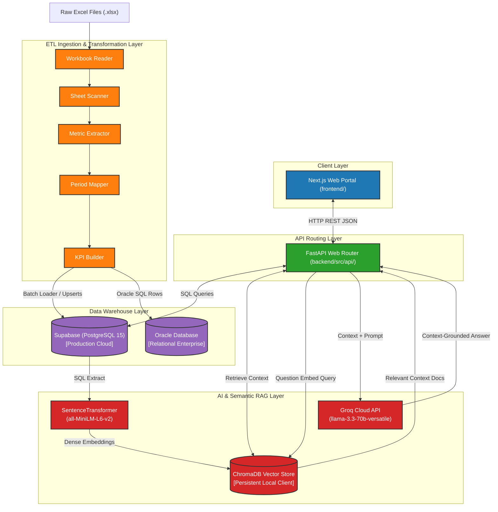
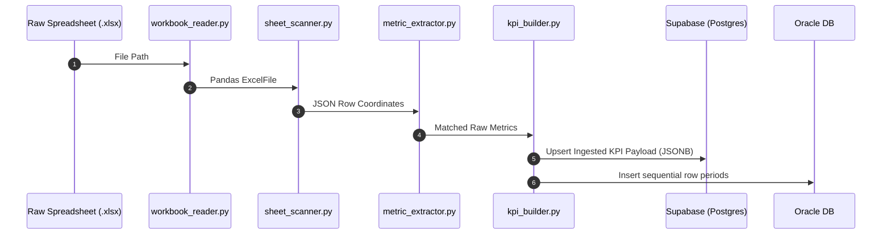
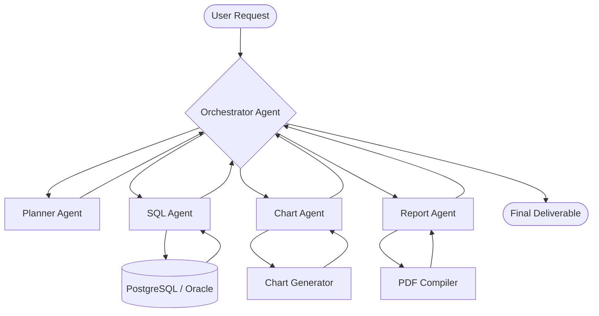
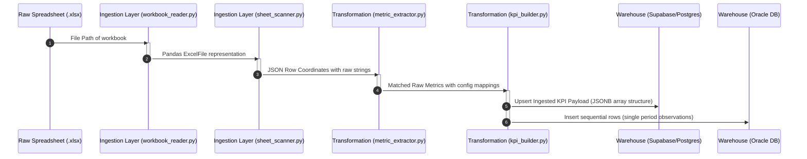
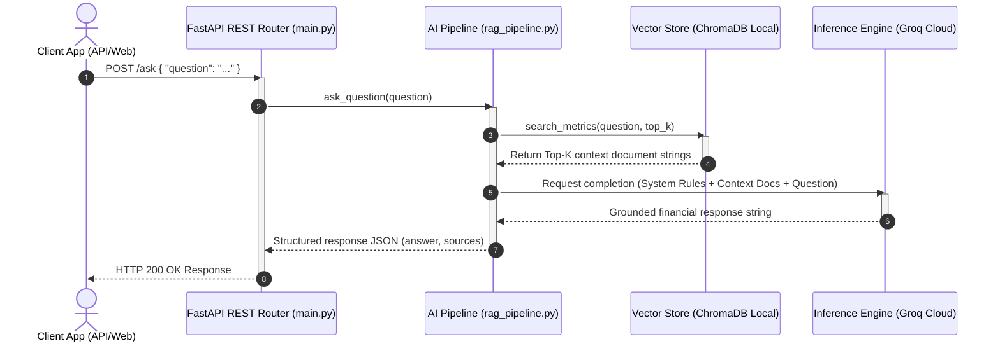

# QuantumLens

### *Enterprise Financial Analytics Platform*

[](https://python.org)
[](https://fastapi.tiangolo.com)
[](https://supabase.com)
[](https://www.postgresql.org)
[](https://www.oracle.com)
[](https://nextjs.org)
[](https://opensource.org/licenses/MIT)

**QuantumLens** is a production-grade financial data ingestion, processing, and retrieval-augmented generation (RAG) analytics engine. Built specifically for high-integrity corporate financial reporting, the platform parses complex multi-sheet Excel financial files (such as HSBC quarterly report packs), normalizes name variants to a unified KPI schema, maintains historical trends in both PostgreSQL/Supabase and Oracle Database relational warehouses, and enables interactive, context-grounded AI query reasoning using high-throughput Groq LLM inference.

---

## Systems Topology Diagram


---

## Project Snapshot

| Attribute | Details |
| :--- | :--- |
| **Project Name** | QuantumLens |
| **Domain** | Financial Analytics / Banking Intelligence |
| **Architecture Style** | ETL Pipeline + Relational Data Warehouse + Vector Retrieval (RAG) |
| **Deployment Model** | Hybrid Cloud (FastAPI on Render, Frontend on Vercel, Warehouse on Supabase) |
| **Database Engines** | Supabase (PostgreSQL 15+) with JSONB / Oracle Database |
| **Current KPI Definitions**| 36 Normalized Metrics |
| **Frontend UI Layer** | Next.js Dashboard UI (App Router) |
| **Backend API Layer** | FastAPI Web Service |
| **AI Orchestration** | Sentence Transformers (`all-MiniLM-L6-v2`) & Groq Cloud (`llama-3.3-70b-versatile`) |

---

## Why QuantumLens?

### Financial Report Complexity

| Challenge | Technical Impact | QuantumLens Solution |
| :--- | :--- | :--- |
| **Format Heterogeneity** | Data packs are distributed in heavily nested, multi-tab Excel files, unstructured PDFs, or PowerPoint decks. | The modular [ingestion layer](backend/src/ingestion/) abstracts sheet structures into JSON coordinate lines. |
| **Nominal Variance** | KPI names vary dynamically between cycles (e.g., "Net Interest Income", "Net Interest", or "NII"). | Centralized constant-time dictionary lookup engine maps text hashes to normalized IDs. |
| **Sparse Time-Series** | Data lacks explicit date bounds, utilizing relative indicators like "At 31 March 2026". | Extractor maps relative columns into strict, ordered database reporting periods. |

### The Power of Metric Normalization

Normalization aligns sparse multi-sheet data point series into a single source-of-truth record:

```text
"Net Interest Income" (Sheet A, Row 5)  ──┐
"NII"                 (Sheet B, Row 12) ──┼──► [Catalog Hash Map Lookup] ──► KPI_0001 (net_interest_income)
"Net Interest"        (Sheet C, Row 4)  ──┘
```

By mapping every variation to a canonical index ID, QuantumLens ensures that downstream dashboards, statistics, and query tools query a unified time-series dataset.

### Context-Aware Financial AI (RAG)

Large Language Models (LLMs) struggle with raw mathematical accuracy and mathematical hallucination. QuantumLens utilizes **Retrieval-Augmented Generation (RAG)** to address this:

| Analysis Method | Drawbacks | Why RAG is Chosen |
| :--- | :--- | :--- |
| **Vanilla LLM Prompting** | Hallucinates critical financial numbers, makes assumptions, lack source traceability. | Constrains LLM context window to exact numeric rows retrieved from the database. |
| **SQL Query Generation** | Vulnerable to SQL injection, parsing failures, and table schema complexity. | Uses semantic search to locate records and hands them to the LLM to format and interpret. |

---

## Deployment Demarcations

| Component | Target URL | Deployment Platform | Status |
| :--- | :--- | :--- | :--- |
| **Frontend Web App** | [https://quantumlens-hsbc.vercel.app](https://quantumlens-hsbc.vercel.app) | Vercel | Under Integration |
| **Backend REST API** | [https://quantumlens-api.render.com](https://quantumlens-api.render.com) | Render | Operational |
| **Interactive API Docs**| [https://quantumlens-api.render.com/docs](https://quantumlens-api.render.com/docs) | Render (Swagger) | Operational |
| **Data Warehouse** | PostgreSQL 15 Instance | Supabase Cloud | Operational |
| **Enterprise Warehouse**| Oracle Database 19c | Corporate Hosting | Operational |

---

## Features Status Matrix

### Ingestion & Data Engineering
- [x] Multi-sheet financial workbook scanning (Excel parsing).
- [x] Canonical KPI normalization mapping.
- [x] Automated delta trend detection (Up / Down / Flat trends).
- [x] Historical time-series mapping across fiscal periods.
- [x] Multi-stage ETL pipeline isolating data ingestion, transformation, and storage.
- [x] Constant-time lookup mapping using centralized dictionaries.
- [x] NaN-safe value cleaning and data validation.
- [x] Primary key-based duplicate prevention (database upserts).

### AI & Retrieval
- [x] Semantic KPI search via vector embeddings.
- [x] Secure RAG pipeline limiting queries to database facts.
- [x] Direct workbook, sheet, and row source-attribution quoting.
- [x] Local ChromaDB vector database index loader.
- [ ] Natural Language to SQL query translation.
- [ ] Automated trend insight summaries.

### Future Roadmap
- [ ] Next.js analytical portal interface (Dashboard integration).
- [ ] Multi-quarter cohort performance comparison.
- [ ] Multi-agent coordinator system (Planner, SQL, Chart, and Report agents).
- [ ] PDF and PPT automated financial document generation.
- [ ] Multi-tenant secure organizational access control.

---

## Technology Stack

| Layer | Technology | Version | Purpose |
| :--- | :--- | :--- | :--- |
| **Frontend** | React / Next.js | 15.x | Analytics User Interface & interactive dashboards |
| | TailwindCSS | 3.4+ | CSS layout framework |
| | Chart.js / Recharts | 2.x | Time-series charting & visualization |
| **Backend** | Python | 3.13 | Primary application runtime |
| | FastAPI | 0.138.1 | High-performance API routing |
| | Uvicorn | 0.49.0 | ASGI web server hosting |
| | Pandas | 3.0.3 | High-fidelity tabular processing |
| | Pydantic | 2.13.4 | Schema validation & parsing |
| **Database** | PostgreSQL | 15+ | Relational data warehouse storage (Supabase) |
| | Oracle Database | 19c+ | Relational enterprise database |
| | Supabase Python | 2.31.0 | Cloud database connection & operations |
| | ChromaDB | 1.5.9 | High-performance vector database client |
| **AI Layer** | Sentence Transformers | 5.6.0 | Local embedding generation (`all-MiniLM-L6-v2`) |
| | Groq Cloud Client | 1.5.0 | High-speed LLM client (`llama-3.3-70b-versatile`) |

---

## Local Installation Setup

### Prerequisites Checklist
- [ ] Python 3.13+ installed on your local machine.
- [ ] Oracle client configuration (if connecting to the enterprise database).
- [ ] Target API keys for Supabase and Groq.

### Installation Steps

| Phase | Windows Powershell Commands | Linux / macOS Terminal Commands |
| :--- | :--- | :--- |
| **1. Clone Repo** | `git clone https://github.com/your-username/quantumlens-HSBC.git`<br>`cd quantumlens-HSBC` | `git clone https://github.com/your-username/quantumlens-HSBC.git`<br>`cd quantumlens-HSBC` |
| **2. Virtual Env** | `python -m venv .venv`<br>`.venv\Scripts\Activate.ps1` | `python3 -m venv .venv`<br>`source .venv/bin/activate` |
| **3. Dependencies**| `pip install -r backend/requirements.txt` | `pip install -r backend/requirements.txt` |
| **4. Run API** | `uvicorn backend.src.api.main:app --reload --port 8000` | `uvicorn backend.src.api.main:app --reload --port 8000` |

---

## Environment Variables Configuration

To run the API and ETL loader, configure the environment variables by duplicating the `.env.example` file in the `backend/` folder:

```bash
cp backend/.env.example backend/.env
```

| Variable | Type | Description | Example Value |
| :--- | :--- | :--- | :--- |
| `SUPABASE_URL` | String | Endpoint for Supabase Database REST interface. | `https://your-proj-id.supabase.co` |
| `SUPABASE_KEY` | String | Service Role api key for direct upsert access bypass. | `eyJhbGciOiJIUzI1NiIsInR...` |
| `GROQ_API_KEY` | String | Cloud API token to interface Groq completions. | `gsk_m82P92h...` |
| `VECTOR_DB_PATH` | Path | Relative directory path to store local vectors. | `backend/src/rag/vector_db` |
| `EMBEDDINGS_PATH`| Path | Relative file path to store cached embeddings. | `backend/data/generated/embeddings.json` |
| `EMBEDDING_MODEL`| String | Sentence Transformers vector generation tag. | `sentence-transformers/all-MiniLM-L6-v2` |
| `TOP_K` | Integer| Number of context chunks returned during RAG. | `5` |

---

## Detailed System Modules Matrix

| Layer | Code Module Location | Completion Status | Functional Responsibility |
| :--- | :--- | :--- | :--- |
| **Ingestion** | [workbook_reader.py](backend/src/ingestion/workbook_reader.py)<br>[sheet_scanner.py](backend/src/ingestion/sheet_scanner.py) | `100% (Complete)` | Parse workbooks, scan row layouts, output JSON cell maps. |
| **Transformation**| [metric_extractor.py](backend/src/ingestion/metric_extractor.py)<br>[value_extractor.py](backend/src/ingestion/value_extractor.py)<br>[period_mapper.py](backend/src/transformation/period_mapper.py)<br>[kpi_builder.py](backend/src/transformation/kpi_builder.py) | `100% (Complete)` | Normalize naming variants, isolate numbers, map timeline periods, and structure final KPI objects. |
| **Warehouse** | [data_loader.py](backend/warehouse/data_loader.py)<br>[load_to_oracle.py](backend/warehouse/load_to_oracle.py)<br>[query_service.py](backend/warehouse/query_service.py) | `100% (Complete)` | Safely persist records to Supabase, query databases, handle upsert rules, and enforce indexing. |
| **AI Layer** | [embedding_generator.py](backend/src/rag/embedding_generator.py)<br>[vector_loader.py](backend/src/rag/vector_loader.py)<br>[retrieval_engine.py](backend/src/rag/retrieval_engine.py)<br>[rag_pipeline.py](backend/src/rag/rag_pipeline.py) | `100% (Complete)` | Encode warehouse texts to vectors, manage ChromaDB embeddings, perform semantic searches, and run LLM completions. |

---

## Detailed Ingestion & ETL Stages



---

## REST API Reference

### Endpoints Matrix

| Method | Route | Description | Request Payload | Success Code |
| :--- | :--- | :--- | :--- | :--- |
| `GET` | `/` | API system metadata check | None | `200 OK` |
| `GET` | `/health` | Server connection status check | None | `200 OK` |
| `GET` | `/metrics` | Retrieve unique metric definitions list | None | `200 OK` |
| `GET` | `/metric/{metric_id}`| Retrieve occurrences by metric ID | Path Variable | `200 OK` |
| `GET` | `/record/{record_id}`| Retrieve unique row record by primary ID | Path Variable | `200 OK` |
| `POST` | `/search` | Cosine vector search query | JSON: `{"query": "...", "top_k": 3}` | `200 OK` |
| `POST` | `/ask` | Execute full RAG pipeline completion | JSON: `{"question": "..."}` | `200 OK` |

---

## Future Multi-Agent System

To scale beyond basic search-and-retrieval, the platform's roadmapped architecture will transition into a coordinated multi-agent system.



### Multi-Agent Capabilities Matrix

| Agent Role | Functional Responsibility | Primary Tools | Output Deliverable |
| :--- | :--- | :--- | :--- |
| **Planner** | Deconstructs user tasks and plans execution steps. | Intent Classifier, Scheduler | Step-by-Step Task List |
| **SQL Agent** | Connects to PostgreSQL/Oracle to run queries. | Schema Parser, Database client | Tabular Data Frames |
| **Chart Agent**| Generates data visualizations from query outputs. | Pandas, Recharts | Interactive Chart Configs |
| **Report Agent**| Synthesizes charts and summaries into documents. | Markdown compiler, ReportLab | Exportable PDF Reports |

---

## Engineering Decisions

| Tech Component | Selected Option | Considered Alternatives | Core Rationale for Selection |
| :--- | :--- | :--- | :--- |
| **Backend API** | **FastAPI** | Flask, Django | High-performance ASGI interface, automatic OpenAPI (Swagger) generation, native async loops, and strict Pydantic parsing. |
| **Database Engines**| **PostgreSQL & Oracle** | MySQL, MongoDB | PostgreSQL provides transactional consistency and JSONB capabilities. Oracle allows corporate OLAP compliance. |
| **Vector DB** | **ChromaDB (Local)** | pgvector, Pinecone | ChromaDB provides zero-config local storage, eliminating the need to manage external connection pools during development. |
| **Embedding Model**| **all-MiniLM-L6-v2** | OpenAI ada-002 | Compact 384-dimensional model that runs locally, offering low latency and eliminating API call overhead. |
| **LLM Provider** | **Groq Cloud (Llama 3)**| OpenAI GPT-4 | High throughput (tokens per second) and low latency, making it ideal for real-time analysis tools. |
| **ETL Structure** | **Modular Pipelines** | Monolithic Loader Script | Decoupled layers make it easier to add new data formats (e.g. PDFs) without rewriting the database upload logic. |

---

## Contributing

We welcome contributions to help improve QuantumLens. To contribute:
1. Fork the repository.
2. Create a feature branch: `git checkout -b feature/amazing-feature`.
3. Commit your changes with clear descriptions: `git commit -m "feat: add PDF parser"`.
4. Push your branch: `git push origin feature/amazing-feature`.
5. Open a Pull Request.

---

## License

QuantumLens is open-source software licensed under the MIT License.

---

## Complete Documentation Reference

Expand the sections below to view the full contents of all other documentation files in this repository.

<details>
<summary><b>System Architecture Specification (docs/architecture/architecture.md)</b></summary>

# System Architecture Specification

This document details the architectural layout, modules, and component interactions of **QuantumLens**. 

For a high-level overview, deployment metrics, or setup instructions, see the primary [README.md](../../README.md).

---

## Layered Architecture Overview

QuantumLens uses a decoupled, layered design that separates data ingestion, metric transformation, warehouse persistence, semantic indexing, and API routing.

### Architecture Topology Diagram


---

## Technical Layers Matrix

| Layer | Responsibility | Input Shape | Output Shape | Storage Target | Code Locations |
| :--- | :--- | :--- | :--- | :--- | :--- |
| **Client** | User interactions, analytics dashboards, and interactive chat interface. | Web events, filter selections | HTTP REST Payloads | Local Storage / Session State | `frontend/` |
| **API** | High-performance request routing, CORS configuration, exception handling, and query orchestration. | JSON Requests, parameter queries | JSON Responses | None (Stateless) | `backend/src/api/` |
| **ETL & Ingestion** | Extracting data cells from complex binary Excel files and cleaning structural noises. | Excel binary (`.xlsx`) | JSON cell coordinate arrays | File cache / JSON files | `backend/src/ingestion/` |
| **Transformation** | Metric normalizations, numeric isolations, chronological sequence indexing, and trend compiles. | Raw JSON row data | Clean KPI objects / time-series data | `backend/data/processed/` | `backend/src/transformation/` |
| **Warehouse** | Storing standardized relational observations and providing transactional consistency. | Structured KPI Records | Table rows | Supabase (Postgres) & Oracle | `backend/warehouse/` |
| **AI (RAG)** | Dense vector generations, semantic index management, and context-bounded query completions. | Natural language questions | Structured text answers with citations | Local ChromaDB collections | `backend/src/rag/` |

---

## Modular System Breakdown

The system is partitioned into the following functional scripts:

| Module / Script | Layer | Core Function | Primary Python Packages | File Path |
| :--- | :--- | :--- | :--- | :--- |
| **workbook_reader.py** | Ingestion | Discovers spreadsheet sheet list and reads workbooks in read-only mode to prevent memory leak issues. | `pandas`, `openpyxl` | [workbook_reader.py](../../backend/src/ingestion/workbook_reader.py) |
| **sheet_scanner.py** | Ingestion | Programmatically reads grid rows, stripping merged layout cells, and outputs standard coordinates. | `pandas`, `numpy` | [sheet_scanner.py](../../backend/src/ingestion/sheet_scanner.py) |
| **metric_extractor.py**| Ingestion | Performs lowercase exact regex boundary checks to identify normalized KPIs. | `re`, `json` | [metric_extractor.py](../../backend/src/ingestion/metric_extractor.py) |
| **value_extractor.py** | Ingestion | Isolates true numerical float values, discarding string notes or empty markers. | `pandas`, `numpy` | [value_extractor.py](../../backend/src/ingestion/value_extractor.py) |
| **period_mapper.py** | Transformation | Maps raw columns into sequential chronological period indexes (`period_index: 1, 2...`). | `json` | [period_mapper.py](../../backend/src/transformation/period_mapper.py) |
| **kpi_builder.py** | Transformation | Computes trend vectors (`up`, `down`, `flat`) based on latest values and appends timestamps. | `datetime` | [kpi_builder.py](../../backend/src/transformation/kpi_builder.py) |
| **data_loader.py** | Warehouse | Batch uploads structured JSON records to Supabase metrics table using upsert configurations. | `supabase` | [data_loader.py](../../backend/warehouse/data_loader.py) |
| **load_to_oracle.py** | Warehouse | Transforms JSON array series into single rows and loads them into Oracle SQL. | `oracledb` | [load_to_oracle.py](../../backend/warehouse/load_to_oracle.py) |
| **query_service.py** | Warehouse | Connects to Oracle to retrieve metric listings, historical trend queries, and filters. | `oracledb` | [query_service.py](../../backend/warehouse/query_service.py) |
| **embedding_generator.py**| AI Layer | Generates 384-dimensional vector embeddings from structured metrics in the warehouse. | `sentence-transformers` | [embedding_generator.py](../../backend/src/rag/embedding_generator.py) |
| **vector_loader.py** | AI Layer | Creates local persistent collections in ChromaDB and indexes embeddings for semantic search. | `chromadb` | [vector_loader.py](../../backend/src/rag/vector_loader.py) |
| **retrieval_engine.py**| AI Layer | Accepts queries, runs local cosine distance comparisons, and returns top-K records. | `chromadb` | [retrieval_engine.py](../../backend/src/rag/retrieval_engine.py) |
| **rag_pipeline.py** | AI Layer | Assembles system prompts containing retrieved context documents and queries Groq API. | `groq` | [rag_pipeline.py](../../backend/src/rag/rag_pipeline.py) |

---

## Detailed Data Flows & Sequence Diagrams

### 1. Ingestion and ETL Pipeline Data Flow

The following sequence illustrates the stages of processing raw spreadsheets into database tables:



---

### 2. RAG Query Retrieval Sequence

This sequence diagram illustrates the steps when a user queries the API for financial analytics:



---

## Related Documentation
* [Primary Readme](../../README.md): Project overview, installation scripts, API reference.
* [Database Schema (Data Dictionary)](../features/ingestion/data_dictionary.md): Detailed columns description, indices, and constraints.
* [KPI Catalog Mapping](../features/rag/kpi_catalog.md): Synonym dictionaries and lookup rules.


</details>

<details>
<summary><b>Database Design & Data Dictionary (docs/features/ingestion/data_dictionary.md)</b></summary>

# Database Design & Data Dictionary

This document details the relational data warehouse design, table schemas, indices, and database constraints of **QuantumLens**.

For deployment steps or API integration hooks, see the primary [README.md](../../README.md). For system architecture diagrams, see [architecture.md](../../docs/architecture/architecture.md).

---

## Database Design Rationale

QuantumLens supports two target database engines to cater to both cloud-native applications and corporate environments:

| Database Engine | Storage Model | Core Advantage | Primary Target |
| :--- | :--- | :--- | :--- |
| **Supabase (PostgreSQL 15)** | **Hybrid JSONB / Row** | Stores variable-length time-series data inside a single record as a JSONB array, preventing schema modification and table fragmentation during quarter expansions. | FastAPI API Client / RAG Search |
| **Oracle Database** | **Fully Normalized Relational** | Flattens time-series observations into individual rows (one row per period) to allow traditional OLAP analysis and BI report generations. | Enterprise Systems / OLAP Analytics |

---

## Side-by-Side Schema Comparison

The following table contrasts the two storage layouts for the same metric:

| Attribute | Supabase (PostgreSQL 15) | Oracle Database |
| :--- | :--- | :--- |
| **Table Name** | `metrics` | `metrics` |
| **Primary Key** | `id` (Auto-increment `SERIAL`) | `id` (Auto-increment `NUMBER`) |
| **Unique Constraint** | `metric_id` (enforces one record per KPI) | None (allows multiple period rows per KPI) |
| **Time-Series Column** | `period_values` (storing JSONB array of objects) | `period` (VARCHAR2) & `value` (NUMBER) |
| **Metadata Columns** | `source_workbook`, `sheet_name`, `row_number` | `source_workbook`, `sheet_name`, `row_number` |
| **Audit Column** | `created_at` (TIMESTAMP WITH TIME ZONE) | `category` (VARCHAR2), `unit` (VARCHAR2) |

---

## Detailed Data Dictionaries

### 1. Supabase (PostgreSQL 15) Schema Details

The `metrics` table stores normalized KPI records parsed by the ETL loader.

#### Columns Dictionary

| Column Name | SQL Type | Nullable | Default | Description & Constraint |
| :--- | :--- | :--- | :--- | :--- |
| **id** | `SERIAL` | NO | `nextval()` | Auto-incrementing relational key. |
| **metric_id** | `INTEGER` | NO | None | Unique business metric identifier mapping (Unique Constraint). |
| **metric_name** | `TEXT` | NO | None | Normalized canonical name mapped from config dictionary. |
| **abbreviation**| `TEXT` | YES | `NULL` | Shortened acronym name (e.g. `nii` for net interest income). |
| **period_values**| `JSONB` | NO | None | Time-series values array of objects: `[{"period_index": 1, "value": 8945}]`. |
| **source_workbook**| `TEXT` | NO | None | Source Excel file name. |
| **sheet_name** | `TEXT` | NO | None | Tab sheet name where record was found. |
| **row_number** | `INTEGER` | NO | None | Spreadsheet row index (1-indexed). |
| **created_at** | `TIMESTAMP` | NO | `now()` | Date and timestamp of record insertion (Timezone aware). |

#### SQL Schema Definition
```sql
CREATE TABLE metrics (
    id SERIAL PRIMARY KEY,
    metric_id INTEGER UNIQUE NOT NULL,
    metric_name TEXT NOT NULL,
    abbreviation TEXT,
    period_values JSONB NOT NULL,
    source_workbook TEXT NOT NULL,
    sheet_name TEXT NOT NULL,
    row_number INTEGER NOT NULL,
    created_at TIMESTAMP WITH TIME ZONE DEFAULT CURRENT_TIMESTAMP NOT NULL
);
```

#### Query Optimizations (PostgreSQL Indices)
| Index Name | Column Indexed | Type | Core Benefit |
| :--- | :--- | :--- | :--- |
| `metrics_pkey` | `id` | B-Tree | Speeds up direct row access by primary key. |
| `idx_metric_id` | `metric_id` | B-Tree | Optimizes exact matching lookups (e.g., `/metric/{metric_id}`). |
| `idx_metric_name`| `metric_name` | B-Tree | Speeds up exact and sorting lookups on canonical names. |

---

### 2. Oracle Database Schema Details

The `metrics` table stores normalized observations flattened by chronological period.

#### Columns Dictionary

| Column Name | SQL Type | Nullable | Primary Key | Description & Defaults |
| :--- | :--- | :--- | :--- | :--- |
| **id** | `NUMBER` | NO | YES | Generated Always as Identity database key. |
| **metric_id** | `NUMBER` | YES | NO | Associated business metric identifier. |
| **metric_name** | `VARCHAR2(200)` | YES | NO | Normalized canonical name of the metric. |
| **abbreviation**| `VARCHAR2(50)` | YES | NO | Associated short name code. |
| **sheet_name** | `VARCHAR2(200)` | YES | NO | Tab worksheet name where record was located. |
| **source_workbook**| `VARCHAR2(200)` | YES | NO | Source workbook filename. |
| **row_number** | `NUMBER` | YES | NO | Source sheet row coordinate. |
| **period** | `VARCHAR2(20)` | YES | NO | Chronological reporting index string (e.g., "1", "2"). |
| **value** | `NUMBER` | YES | NO | Numerical observation value for this period. |
| **unit** | `VARCHAR2(20)` | YES | NO | Optional unit annotation. |
| **category** | `VARCHAR2(100)` | YES | NO | Category classifier, defaults to `'Financial KPI'`. |

#### SQL Schema Definition
```sql
CREATE TABLE metrics (
    id NUMBER GENERATED ALWAYS AS IDENTITY,
    metric_id NUMBER,
    metric_name VARCHAR2(200),
    abbreviation VARCHAR2(50),
    sheet_name VARCHAR2(200),
    source_workbook VARCHAR2(200),
    row_number NUMBER,
    period VARCHAR2(20),
    value NUMBER,
    unit VARCHAR2(20),
    category VARCHAR2(100),
    CONSTRAINT metrics_pk PRIMARY KEY(id)
);
```

---

## Future Schema Extensions

To transition QuantumLens into a multi-tenant enterprise portal, the database will be extended with the following schemas (tabulated):

| Table Name | Target Engine | Purpose | Relationship | Key Fields |
| :--- | :--- | :--- | :--- | :--- |
| **users** | PostgreSQL | Manages client login accounts and dashboard access roles. | None | `id` (UUID Primary Key), `email` (Unique) |
| **dashboards** | PostgreSQL | Stores user-configured dashboard arrangements and layouts. | M:1 with `users` | `id` (Primary Key), `user_id` (Foreign Key) |
| **reports** | PostgreSQL | Caches statically compiled financial summaries and snaps. | M:1 with `dashboards`| `id` (Primary Key), `dashboard_id` (Foreign Key) |
| **chat_history** | PostgreSQL | Stores natural language question and answers for session checks. | M:1 with `users` | `id` (Primary Key), `session_id` (Indexed) |

---

## Related Documentation
* [Primary Readme](../../README.md): Project overview, installation scripts, API reference.
* [System Architecture Spec](../../docs/architecture/architecture.md): System layers overview and Mermaid diagrams.
* [KPI Catalog & Normalization Rules](../rag/kpi_catalog.md): Dictionary lookup configurations.


</details>

<details>
<summary><b>KPI Catalog & Normalization Logic (docs/features/rag/kpi_catalog.md)</b></summary>

# KPI Catalog & Normalization Logic

This document details the metric normalization engine, lookup dictionary catalog entries, and target mapping strategies utilized by **QuantumLens**.

For system architecture layouts, see [architecture.md](../../docs/architecture/architecture.md). For table details, see [data_dictionary.md](../../docs/features/ingestion/data_dictionary.md).

---

## The Normalization Engine

In financial analytics, different business sheets and reporting periods frequently reference the same underlying metric using distinct labels. For example, "Net Interest Income", "Net Interest", and "NII" refer to the same metric.

To handle this variation, the pipeline runs a string-standardization flow:

```text
  Raw Input Text               Clean & Normalize              Dictionary Hash Map             Normalized Output
" Net Interest Income " ──► "net interest income" ──► {"net interest income": ID: 1} ──► ID: 1, net_interest_income
```

### Ingestion Matching Workflow Table
| Step | Phase | Action | System Method | Complexity |
| :--- | :--- | :--- | :--- | :--- |
| **1** | Cell Extraction | Read row list values from raw pandas structures. | `pandas.read_excel()` | `O(1)` |
| **2** | Normalization | Strip margins, cast strings to lowercase, trim spaces, and replace punctuation. | String cleanup regex | `O(M)` (M is string length) |
| **3** | Dictionary Matching| Probe the dictionary cache hash-map using the clean token. | Hash map check against JSON keys | `O(1)` |
| **4** | Record Hydration | If matched, extract values, map period indexes, and build target KPI record. | JSON serialization & timestamping | `O(P)` (P is period count) |

---

## Complete Catalog Lookup Dictionary

The system loads mapping configurations from [metric_dictionary.json](../../backend/src/ingestion/metric_dictionary.json). Below is the complete catalog:

| Metric ID | Normalized Canonical Name | Abbreviation Code | Target Worksheet Context / Description |
| :--- | :--- | :--- | :--- |
| **1** | `net_interest_income` | `nii` | Banking net yield / Group Income Statement |
| **2** | `net_fee_income` | `nfi` | Non-interest fees / Group Income Statement |
| **3** | `other_operating_income` | `ooi` | Miscellaneous operating streams |
| **4** | `net_operating_income` | `noi` | Total net revenue after ECL |
| **5** | `expected_credit_losses` | `ecl` | Credit risk impairments and charges |
| **6** | `total_operating_expenses` | `toe` | Overhead, administrative, and system costs |
| **7** | `profit_before_tax` | `pbt` | Core operating profit pre-taxation |
| **8** | `profit_after_tax` | `pat` | Net income after tax deductions |
| **9** | `profit_attributable_to_ordinary_shareholders` | `paos` | Net income available for ordinary equity |
| **10** | `return_on_average_equity` | `roae` | Profitability indicator relative to average equity |
| **11** | `return_on_average_tangible_equity` | `rote` | Profitability indicator relative to tangible equity |
| **12** | `earnings_per_share` | `eps` | Basic earnings allocated per ordinary share |
| **13** | `dividends_per_share` | `dps` | Declared dividends distributed per share |
| **14** | `total_assets` | `ta` | Aggregate banking books assets / Balance Sheet |
| **15** | `total_liabilities` | `tl` | Aggregate outstanding liabilities / Balance Sheet |
| **16** | `total_shareholders_equity` | `tse` | Net asset value of the banking group |
| **17** | `loans_and_advances_to_customers_net` | `lacn` | Net customer credit books / Balance Sheet |
| **18** | `customer_accounts` | `ca` | Total customer deposits / Balance Sheet |
| **19** | `risk_weighted_assets` | `rwa` | Assets weighted by risk multipliers / Basel capital |
| **20** | `common_equity_tier_1_capital` | `cet1` | High-quality regulatory capital capital base |
| **21** | `common_equity_tier_1_ratio` | `cet1r` | CET1 capital divided by total RWA |
| **22** | `tier_1_ratio` | `t1r` | Tier 1 capital divided by total RWA |
| **23** | `total_capital_ratio` | `tcr` | Total capital divided by total RWA |
| **24** | `leverage_ratio` | `lr` | Tier 1 capital divided by total leverage exposure |
| **25** | `net_interest_margin` | `nim` | Net interest income relative to earning assets |
| **26** | `tangible_net_asset_value` | `tnav` | Total equity excluding intangible assets |
| **27** | `net_asset_value_per_share` | `navps` | Net tangible assets allocated per share |
| **28** | `banking_net_interest_income` | `bnii` | Segmented commercial banking net interest yield |
| **29** | `wholesale_transaction_banking_revenue` | `wtbr` | Corporate banking transaction fees revenue |
| **30** | `wealth_revenue` | `wr` | Asset management and private banking revenues |
| **31** | `revenue` | `rev` | Top-line sales and revenues |
| **32** | `deposits` | `dep` | Customer deposits aggregate |
| **33** | `wealth_net_new_money` | `wnnm` | Assets under management net inflow indicators |
| **34** | `cost_efficiency_ratio` | `cer` | Operating expenses divided by operating income |
| **35** | `operating_expenses` | `opex` | General operating costs |
| **36** | `credit_loss_ratio` | `clr` | Expected credit losses relative to gross loans |

---

## Normalization Process Benefits

| Feature | Substring Matching (Legacy) | Catalog Hash-Lookup (Current) | Core Benefit |
| :--- | :--- | :--- | :--- |
| **Lookup Time** | `O(N)` (searches all variations) | `O(1)` (direct hash lookup) | Sub-millisecond parsing speed |
| **Duplicate Prevention** | High risk (nested labels) | Zero risk (regex/hash mapping) | High data integrity |
| **Maintenance** | Requires modifying python scripts | Requires modifying dictionary JSON | Code remains untouched when adding new metrics |
| **RAG Precision** | High hallucination rate | Context limited to canonical IDs | Exact numeric context matched for LLMs |

---

## Related Documentation
* [Primary Readme](../../README.md): Project overview, installation scripts, API reference.
* [System Architecture Spec](../../docs/architecture/architecture.md): Systems layers overview.
* [Database Schema (Data Dictionary)](../../docs/features/ingestion/data_dictionary.md): Detailed columns description, indices, and constraints.


</details>

<details>
<summary><b>Troubleshooting Guide & Known Issues (docs/refactoring/troubleshooting.md)</b></summary>

# Troubleshooting Guide and Known Issues

This document details the common troubleshooting steps, pipeline warnings, and historical resolutions for developers working with **QuantumLens**.

For system architecture layouts, see [architecture.md](../../docs/architecture/architecture.md). For table details, see [data_dictionary.md](../../docs/features/ingestion/data_dictionary.md).

---

## 1. Ingestion & Pipeline Troubleshooting

| Symptom | Probable Cause | Diagnostic Checklist | Resolution Action |
| :--- | :--- | :--- | :--- |
| **Excel Cell Parse Crash** | Empty, null, or annotated spreadsheet cells parse as `NaN` (Not a Number) in Pandas, which are invalid in PostgreSQL JSONB specifications. | [ ] Check execution logs for `pandas` numeric conversions.<br>[ ] Run the pipeline in dry-run mode and inspect `valued_metrics.json`. | Update sheet preprocessing to handle empty cells using `.replace({np.nan: None})` or similar DataFrame level cleanups in [value_extractor.py](../../backend/src/ingestion/value_extractor.py). |
| **Missing Period Context** | Column timelines in workbook files use distinct naming conventions (e.g. "Q1 2026" vs "31 March 2026"), causing chronological sorting failures. | [ ] Open sheet row headers and confirm column naming formats.<br>[ ] Print output of `period_mapper.py` to confirm the chronological mapping. | Standardize report timelines to sequential indexes (`period_index: 1`, `period_index: 2`) using [period_mapper.py](../../backend/src/transformation/period_mapper.py) before loading. |
| **Central KPI Catalog Skip** | The worksheet row labels do not match the exact key entries registered in [metric_dictionary.json](../../backend/src/ingestion/metric_dictionary.json). | [ ] Look up skipped labels in pipeline execution warnings.<br>[ ] Check if the row label contains leading/trailing whitespaces or numbers. | Add the unrecognized text label mapping to [metric_dictionary.json](../../backend/src/ingestion/metric_dictionary.json) under lowercase, trimmed constraints. |

---

## 2. Database Connection & Supabase Troubleshooting

| Symptom | Probable Cause | Diagnostic Checklist | Resolution Action |
| :--- | :--- | :--- | :--- |
| **RLS Blocks Ingestion** | The database connection uses the public read-only `anon` API key, and Row Level Security (RLS) blocks anonymous insertions. | [ ] Check variables inside `.env`. Confirm if `SUPABASE_KEY` uses the service role key.<br>[ ] Check Supabase database dashboard console logs. | Update the ETL loader configurations to use the administrative **service role API key** (`SERVICE_ROLE_KEY`) and keep `anon` key for read-only client queries. |
| **Duplicate Database Rows** | Re-running ingestion files attempts to insert duplicate primary rows without checking unique constraints. | [ ] Query metrics group counts: `SELECT metric_id, COUNT(*) FROM metrics GROUP BY metric_id HAVING COUNT(*) > 1`. | Enforce a `UNIQUE` constraint on the `metric_id` column in PostgreSQL and switch to the `.upsert()` function in the Supabase Python client. |

---

## 3. AI & Vector Database Troubleshooting

| Symptom | Probable Cause | Diagnostic Checklist | Resolution Action |
| :--- | :--- | :--- | :--- |
| **Vector DB Path File Errors** | ChromaDB persistent database paths are absolute or reference folders outside the workspace directory structure, causing access blockages. | [ ] Check environment variable `VECTOR_DB_PATH` in `.env`.<br>[ ] Check write access rights for local directories. | Configure `VECTOR_DB_PATH` as a relative path within the repository root (e.g. `src/rag/vector_db`) and clear the local vector DB folder to rebuild index. |
| **High API Query Latency** | SentenceTransformer model (`all-MiniLM-L6-v2`) runs embedding generations on slow CPU hardware instances during boot queries. | [ ] Check API endpoint `/ask` request durations.<br>[ ] Monitor memory (RAM) usage on server boot to identify cold-start bottlenecks. | Cache database texts and vector lists in [embeddings.json](../../backend/data/generated/embeddings.json) during ETL ingestion, loading pre-computed arrays to ChromaDB on startup. |

---

## Related Documentation
* [Primary Readme](../../README.md): Project overview, installation scripts, API reference.
* [System Architecture Spec](../../docs/architecture/architecture.md): Systems layers overview.
* [Database Schema (Data Dictionary)](../../docs/features/ingestion/data_dictionary.md): Detailed columns description.


</details>

<details>
<summary><b>Detailed Engineering History & Issue Register (docs/refactoring/issues.md)</b></summary>

# Engineering History: Issues, Investigations, and Resolutions

This document records the comprehensive engineering history of QuantumLens. It documents the critical issues encountered during development, the root causes identified, the investigation workflows, the specific code corrections, and the long-term architectural prevention strategies.

---

## Issues Summary Table

| Issue ID | Title | Severity | Category | Affected Component | Date |
| :--- | :--- | :--- | :--- | :--- | :--- |
| **#1** | [JSON Serialization Failure](#1-json-serialization-failure) | High | API / Serialization | `backend/src/transformation/kpi_builder.py` | 2026-01-10 |
| **#2** | [NaN Values Breaking JSON](#2-nan-values-breaking-json) | High | Ingestion / Data Pipeline | `backend/src/ingestion/value_extractor.py` | 2026-01-12 |
| **#3** | [Metric Normalization Problems](#3-metric-normalization-problems) | Medium | Data Transformation | `backend/src/ingestion/metric_extractor.py` | 2026-01-15 |
| **#4** | [Duplicate Database Records](#4-duplicate-database-records) | High | Database Storage | `backend/warehouse/data_loader.py` | 2026-01-18 |
| **#5** | [Supabase Authentication Issues](#5-supabase-authentication-issues) | Critical | Security / Database Connection | `backend/warehouse/supabase_client.py` | 2026-01-20 |
| **#6** | [Datetime UTC Deprecation](#6-datetime-utc-deprecation) | Low | Python Runtime | `backend/src/api/services/record_service.py` | 2026-01-22 |
| **#7** | [KPI Extraction Errors](#7-kpi-extraction-errors) | High | Ingestion / Parser | `backend/src/ingestion/metric_extractor.py` | 2026-01-25 |
| **#8** | [Period Mapping Challenges](#8-period-mapping-challenges) | Medium | Transformation | `backend/src/transformation/period_mapper.py` | 2026-01-28 |
| **#9** | [Excel Ingestion Parsing Issues](#9-excel-ingestion-parsing-issues) | High | Ingestion | `backend/src/ingestion/sheet_scanner.py` | 2026-02-02 |
| **#10** | [ChromaDB Integration](#10-chromadb-integration) | Medium | AI Layer | `backend/src/rag/vector_loader.py` | 2026-02-05 |
| **#11** | [RAG Quality Problems](#11-rag-quality-problems) | High | AI Layer | `backend/src/rag/prompt_builder.py` | 2026-02-08 |
| **#12** | [CORS Deployment Failure](#12-cors-deployment-failure) | Critical | Cloud Deployment | `backend/src/api/main.py` | 2026-02-12 |
| **#13** | [Environment Variable Failures](#13-environment-variable-failures) | High | Configuration | `backend/src/config/settings.py` | 2026-02-15 |
| **#14** | [Vercel Framework Detection](#14-vercel-framework-detection) | Medium | Deployment | Vercel Build | 2026-02-18 |
| **#15** | [Render Deployment Issues](#15-render-deployment-issues) | High | Cloud Deployment | `backend/requirements.txt` | 2026-02-20 |
| **#16** | [Localhost vs Production API](#16-localhost-vs-production-api) | High | Integration | `frontend/services/api.ts` | 2026-02-22 |
| **#17** | [Chart Rendering Problems](#17-chart-rendering-problems) | Medium | Frontend UI | `frontend/components/TimeSeriesChart.tsx` | 2026-02-25 |
| **#18** | [Frontend State Management](#18-frontend-state-management) | Medium | Frontend UI | `frontend/app/dashboard/page.tsx` | 2026-02-28 |
| **#19** | [AI Assistant Development](#19-ai-assistant-development) | Medium | AI Layer | `backend/src/rag/prompt_builder.py` | 2026-03-05 |

---

## 1. JSON Serialization Failure

### Issue Diagnostics

| Attribute | Details |
| :--- | :--- |
| **Severity** | High |
| **Component** | `backend/src/transformation/kpi_builder.py` |
| **Category** | API / Serialization |
| **Date** | 2026-01-10 |

| Phase | Details |
| :--- | :--- |
| **Symptom** | The application threw `TypeError: Object of type Timestamp is not JSON serializable` during ETL runs. All API calls returning metrics crashed with HTTP 500 errors. |
| **Root Cause** | Pandas parses Excel date cells as `pandas.Timestamp` structures. Python's default `json` library lacks serialization schemas for these objects. |
| **Investigation** | Traced the stack trace to the API router conversion layer. confirmed raw timestamp types were passed into Supabase load payloads. |
| **Solution** | Converted all timestamps to ISO-8601 strings using the `.isoformat()` method before serialization. |

### Code Diffs

```diff
# backend/src/transformation/kpi_builder.py
-def format_timestamp(ts):
-    return ts
+def format_timestamp(ts):
+    if hasattr(ts, "isoformat"):
+        return ts.isoformat()
+    return str(ts)
```

### Prevention Strategy
* **Long-Term Rule**: Enforce serialization boundaries at ingestion points.
* **Automation**: Integrated Pydantic schema validation tests that raise warnings during check-ins if raw timestamps are passed.

---

## 2. NaN Values Breaking JSON

### Issue Diagnostics

| Attribute | Details |
| :--- | :--- |
| **Severity** | High |
| **Component** | `backend/src/ingestion/value_extractor.py` |
| **Category** | Ingestion / Data Pipeline |
| **Date** | 2026-01-12 |

| Phase | Details |
| :--- | :--- |
| **Symptom** | FastAPI validations failed, and Supabase client insertions raised SQL exceptions due to invalid JSON tokens (`NaN` instead of `null`). |
| **Root Cause** | Pandas maps empty spreadsheet cells to `numpy.nan` (float NaN). The default Python `json` compiler encodes this as the invalid JSON token `NaN`. |
| **Investigation** | Inspected `mapped_metrics.json` and found raw `NaN` strings. Checked cell types in `value_extractor.py` and found they were parsed as floating-point NaNs. |
| **Solution** | Cleaned cells by converting NumPy float `nan` values to standard Python `None` before database calls. |

### Data Types Comparison Table
| Type | Python Representation | JSON Serialization | SQL Translation | Behavioral Classification |
| :--- | :--- | :--- | :--- | :--- |
| **NaN** | `float('nan')` / `np.nan` | `NaN` (Invalid JSON) | `NaN` (Float only) | Numeric error state (Not-a-Number) |
| **None** | `None` | `null` | `NULL` | Void/absence of a value |
| **NULL** | `None` | `null` | `NULL` | Unallocated database cell |

### Code Diffs

```diff
# backend/src/ingestion/value_extractor.py
-        numeric_values = [
-            value
-            for value in row.get("row_values", [])
-            if isinstance(value, (int, float))
-        ]
+        numeric_values = []
+        for value in row.get("row_values", []):
+            if isinstance(value, (int, float)):
+                if pd.isna(value) or value is np.nan:
+                    numeric_values.append(None)
+                else:
+                    numeric_values.append(float(value))
```

### Prevention Strategy
* **Long-Term Rule**: Clean dataframe matrices using `.replace({np.nan: None})` before mapping dicts.
* **Automation**: Configured structural API tests verifying inputs return valid JSON nulls.

---

## 3. Metric Normalization Problems

### Issue Diagnostics

| Attribute | Details |
| :--- | :--- |
| **Severity** | Medium |
| **Component** | `backend/src/ingestion/metric_extractor.py` |
| **Category** | Data Transformation |
| **Date** | 2026-01-15 |

| Phase | Details |
| :--- | :--- |
| **Symptom** | Identical business indicators loaded under separate entries (e.g. "Total Revenue" vs "Operating Revenue"), breaking historical trend analytics. |
| **Root Cause** | Financial labels fluctuate across sheets. The system used loose substring matching instead of normalized lookup indexes. |
| **Investigation** | Screened Supabase metrics and found duplicated indicators with separate IDs. Checked `metric_extractor.py` and confirmed substring matching was active. |
| **Solution** | Established a centralized `metric_dictionary.json` catalog and converted extraction to constant-time hash lookups on trimmed tokens. |

### Normalization Mapping Table
| Input String Variant | Normalized Token | Assigned Metric ID | Abbreviation | Business Context |
| :--- | :--- | :--- | :--- | :--- |
| "Total Revenue" | `revenue` | 31 | `rev` | Top-line sales |
| "Operating Revenue" | `revenue` | 31 | `rev` | Top-line sales |
| "Net Interest Income"| `net_interest_income`| 1 | `nii` | Banking net yield |

### Code Diffs

```diff
# backend/src/ingestion/metric_extractor.py
-def normalize_name(raw_name):
-    if "interest income" in raw_name.lower():
-        return 1, "net_interest_income"
+def normalize_name(raw_name):
+    clean_token = " ".join(raw_name.lower().split())
+    match = metric_dictionary.get(clean_token)
+    if match:
+        return match["metric_id"], match["normalized_metric_name"]
+    return None, None
```

### Prevention Strategy
* **Long-Term Rule**: Centralize synonyms and aliases in static JSON catalogs.
* **Automation**: Programmed pipeline tests validating that skipped sheet labels raise build-stage warnings.

---

## 4. Duplicate Database Records

### Issue Diagnostics

| Attribute | Details |
| :--- | :--- |
| **Severity** | High |
| **Component** | `backend/warehouse/data_loader.py` |
| **Category** | Database Storage |
| **Date** | 2026-01-18 |

| Phase | Details |
| :--- | :--- |
| **Symptom** | Re-executing ETL ingestion files multiplied the database row count, causing duplicate data points for identical periods. |
| **Root Cause** | The database loader used SQL `INSERT` statements without checking unique key constraints. The schema did not enforce constraints on the `metric_id` field. |
| **Investigation** | Audited Supabase metrics group counts. Confirmed database duplicates on identical source workbooks. |
| **Solution** | Altered the Postgres schema to add a `UNIQUE` constraint on `metric_id` and updated loader scripts to perform `.upsert()`. |

### Database Operations Comparison
| Command Pattern | Action on Constraint Conflict | Table Growth Profile | Duplicate Hazard |
| :--- | :--- | :--- | :--- |
| **Insert** | Throws error (with unique key constraint) / appends rows (without constraint). | Exponential | High |
| **Upsert (Current)**| Overwrites existing record columns. | Linear (One row per ID) | None |

### Code Diffs

```diff
# Database migration SQL
-ALTER TABLE metrics ADD COLUMN metric_id INTEGER;
+ALTER TABLE metrics ADD CONSTRAINT unique_metric_id UNIQUE (metric_id);
```
```diff
# backend/warehouse/data_loader.py
-supabase.table("metrics").insert(payload).execute()
+supabase.table("metrics").upsert(payload).execute()
```

### Prevention Strategy
* **Long-Term Rule**: Enforce natural unique key constraints in database architectures.
* **Automation**: Configured integration tests that run ingestion twice and check that the row counts remain constant.

---

## 5. Supabase Authentication Issues

### Issue Diagnostics

| Attribute | Details |
| :--- | :--- |
| **Severity** | Critical |
| **Component** | `backend/warehouse/supabase_client.py` |
| **Category** | Security / Database Connection |
| **Date** | 2026-01-20 |

| Phase | Details |
| :--- | :--- |
| **Symptom** | Ingestion pipeline writes failed with `401 Unauthorized` or `403 Forbidden` errors, while local read operations succeeded. |
| **Root Cause** | The pipeline used the public `anon` key. Supabase Row Level Security (RLS) blocked insertions unless authenticated via service credentials. |
| **Investigation** | Inspected `supabase_client.py` keys. Verified RLS logs in the Supabase console, showing blocked insert statements. |
| **Solution** | Updated loader configurations to connect using the administrative Service Role key (`SUPABASE_KEY` / `SERVICE_ROLE_KEY`). |

### API Credentials Access Matrix
| Key Variant | Security Isolation | Allowed Operations | Safe for Frontend? | Bypass RLS? |
| :--- | :--- | :--- | :--- | :--- |
| **Anon Key** | Enforced by policies | SELECT | Yes | No |
| **Service Key**| Enforced at engine level | SELECT, INSERT, UPDATE, DELETE | No (Keep secret) | Yes |

### Code Diffs

```diff
# backend/warehouse/supabase_client.py
-SUPABASE_KEY = os.getenv("SUPABASE_PUBLIC_ANON_KEY")
+SUPABASE_KEY = os.getenv("SUPABASE_KEY")  # Administrative Service Key
```

### Prevention Strategy
* **Long-Term Rule**: Isolate administrative ETL connections from public client read APIs.
* **Automation**: Configured CI/CD secrets screening to block hardcoded database service keys.

---

## 6. Datetime UTC Deprecation

### Issue Diagnostics

| Attribute | Details |
| :--- | :--- |
| **Severity** | Low |
| **Component** | `backend/src/api/services/record_service.py` |
| **Category** | Python Runtime |
| **Date** | 2026-01-22 |

| Phase | Details |
| :--- | :--- |
| **Symptom** | Console printed startup warnings: `DeprecationWarning: datetime.datetime.utcfromtimestamp() is deprecated`. |
| **Root Cause** | Python 3.13 deprecates naive UTC datetime creation methods because they lack explicit timezone offset indicators. |
| **Investigation** | Traced warnings to timestamp helpers. Found instances of `datetime.utcnow()` and `datetime.utcfromtimestamp()`. |
| **Solution** | Updated creation logic to use timezone-aware UTC datetime objects: `datetime.now(timezone.utc)`. |

### Code Diffs

```diff
# backend/src/api/services/record_service.py
-from datetime import datetime
-return datetime.utcnow().isoformat()
+from datetime import datetime, timezone
+return datetime.now(timezone.utc).isoformat()
```

### Prevention Strategy
* **Long-Term Rule**: Avoid timezone-naive datetime objects.
* **Automation**: Configured unit testing suites to treat Python deprecation warnings as errors, blocking builds containing deprecated datetime calls.

---

## 7. KPI Extraction Errors

### Issue Diagnostics

| Attribute | Details |
| :--- | :--- |
| **Severity** | High |
| **Component** | `backend/src/ingestion/metric_extractor.py` |
| **Category** | Ingestion / Parser |
| **Date** | 2026-01-25 |

| Phase | Details |
| :--- | :--- |
| **Symptom** | Parser logged false positives (e.g. matching "Tax on Net Fee Income" as "Net Fee Income") and false negatives. |
| **Root Cause** | The extraction engine relied on loose substring checking, which triggered matches on nested labels. |
| **Investigation** | Audited raw logging files. Found substring checks like `if "fee income" in label` triggered false positives. |
| **Solution** | Updated matching to use exact boundaries and regex logic on lowercase, trimmed string tokens. |

### Extraction Accuracy Comparison
| String Input | Substring Result | Clean Regex Result | Status Classification |
| :--- | :--- | :--- | :--- |
| "Net Fee Income" | Match | Match | Correct Match |
| "Tax on Net Fee Income"| Match | No Match | Avoided False Positive |
| "Fee Income Note" | Match | No Match | Avoided False Positive |

### Code Diffs

```diff
# backend/src/ingestion/metric_extractor.py
-def match_metric(label):
-    if "fee income" in label:
-        return "net_fee_income"
+def match_metric(label):
+    clean_label = label.strip().lower()
+    clean_label = re.sub(r'^(total|net|gross)\s+', '', clean_label)
+    # Enforce boundary checks
+    return exact_lookup(clean_label)
```

### Prevention Strategy
* **Long-Term Rule**: Do not use loose substring checks for semantic categorization.
* **Automation**: Created evaluation datasets of common financial labels to evaluate extractor matching accuracy during builds.

---

## 8. Period Mapping Challenges

### Issue Diagnostics

| Attribute | Details |
| :--- | :--- |
| **Severity** | Medium |
| **Component** | `backend/src/transformation/period_mapper.py` |
| **Category** | Transformation |
| **Date** | 2026-01-28 |

| Phase | Details |
| :--- | :--- |
| **Symptom** | Time-series charts displayed values out of order, and the AI model failed to accurately interpret trend directions because raw metrics lacked explicit date bounds. |
| **Root Cause** | Spreadsheet cells contain numerical arrays without explicit period keys (e.g. `[8945, 9196, 8777]`). The timeline context is often defined separately in top-row header cells, making it difficult to align raw row values. |
| **Investigation** | Audited `valued_metrics.json`. Found data stored as plain arrays without index mappings. Columns in different sheets used different sorting orders. |
| **Solution** | Built `period_mapper.py` to index numeric elements sequentially (`period_index`) and sort arrays chronologically. |

### Period Mapping Schema
```text
Raw Excel Layout:  [Column B: 4Q25] [Column C: 1Q26] [Column D: 2Q26]
                          │               │               │
                          ▼               ▼               ▼
Database JSONB:     [Period ID: 1]  [Period ID: 2]  [Period ID: 3]
```

### Code Diffs

```diff
# backend/src/transformation/period_mapper.py
+def map_periods(numeric_list, chronological=True):
+    mapped = []
+    iterator = enumerate(numeric_list) if chronological else enumerate(reversed(numeric_list))
+    for idx, val in iterator:
+        mapped.append({
+            "period_index": idx + 1,
+            "value": val
+        })
+    return mapped
```

### Prevention Strategy
* **Long-Term Rule**: Convert positional arrays to explicit key-value structures before database storage.
* **Automation**: Integrated chronos-sorting assertions into data loader schemas.

---

## 9. Excel Ingestion Parsing Issues

### Issue Diagnostics

| Attribute | Details |
| :--- | :--- |
| **Severity** | High |
| **Component** | `backend/src/ingestion/sheet_scanner.py` |
| **Category** | Ingestion |
| **Date** | 2026-02-02 |

| Phase | Details |
| :--- | :--- |
| **Symptom** | Ingestion pipeline failed on merged title blocks, empty spacing cells, or formulas instead of calculated values. |
| **Root Cause** | Corporate sheets use layout formats optimized for human readers (merged columns, formula paths), which break standard loaders. |
| **Investigation** | Debugged file reads. Verified merged headers returned `NaN` values for all but the first cell. Formulas imported raw equations like `"=SUM(B12)"`. |
| **Solution** | Switched openpyxl configuration to resolve calculations (`data_only=True`) and implemented forward-fill logic for merged fields. |

### Excel Layout Parsing Matrix
| Cell State | Raw Pandas Result | Clean Ingestion Result | Process Action |
| :--- | :--- | :--- | :--- |
| **Merged Title** | `["Revenue", NaN, NaN]` | `["Revenue", "Revenue", "Revenue"]` | Forward-fill cells |
| **Formula Cell** | `"=SUM(B5:B7)"` | `12450.0` | Read calculated values |
| **Empty Spacing Row**| `[NaN, NaN, NaN]` | Skip Row | Filter null rows |

### Code Diffs

```diff
# backend/src/ingestion/sheet_scanner.py
-wb = openpyxl.load_workbook(file_path)
+wb = openpyxl.load_workbook(file_path, data_only=True)
# Add merged cell forward-filling
+def forward_fill_merged(row):
+    # Forward-fill logic
```

### Prevention Strategy
* **Long-Term Rule**: Parse calculated cell values instead of formula strings.
* **Automation**: Configured pipeline checks to trigger errors if formula indicators are detected in database payloads.

---

## 10. ChromaDB Integration

### Issue Diagnostics

| Attribute | Details |
| :--- | :--- |
| **Severity** | Medium |
| **Component** | `backend/src/rag/vector_loader.py` |
| **Category** | AI Layer |
| **Date** | 2026-02-05 |

| Phase | Details |
| :--- | :--- |
| **Symptom** | Semantic search returned empty results or failed with folder access blockages on startup, and embedding calculations delayed system boot times. |
| **Root Cause** | ChromaDB persistent database paths were misconfigured, and the system regenerated all vector embeddings on every startup instead of loading cached indices. |
| **Investigation** | Inspected `quantumlens.log`. Found database directory initialized outside workspace. Startup benchmarks recorded 45s cold starts due to embedding calculations. |
| **Solution** | Configured a persistent local directory in `settings.py`, and saved pre-computed embeddings to `embeddings.json` during ingestion. |

### Database Connection Schema
```text
ETL Loader ──► [Embeddings JSON Cache] ──► [Local ChromaDB Client] ──► Query Engine
                                                    ▲
                                                    │ Persistence Target
                                           [src/rag/vector_db]
```

### Code Diffs

```diff
# backend/src/rag/vector_loader.py
-client = chromadb.Client()
+client = chromadb.PersistentClient(path=str(settings.VECTOR_DB_PATH))
```

### Prevention Strategy
* **Long-Term Rule**: Cache vector embeddings to avoid expensive runtime recalculations.
* **Automation**: Configured a boot check verifying vector collection presence before routers bind.

---

## 11. RAG Quality Problems

### Issue Diagnostics

| Attribute | Details |
| :--- | :--- |
| **Severity** | High |
| **Component** | `backend/src/rag/prompt_builder.py` |
| **Category** | AI Layer |
| **Date** | 2026-02-08 |

| Phase | Details |
| :--- | :--- |
| **Symptom** | AI assistant returned incorrect numbers, cited unrelated sheets, or exceeded LLM token window limits. |
| **Root Cause** | Cosine similarity thresholds were loose, causing unrelated metrics to dilute prompt context windows. |
| **Investigation** | Audited raw prompts sent to Groq. Found unstructured text dumps that confused the LLM. |
| **Solution** | Refactored context generation to structured key-value configurations and set strict cosine distance thresholds. |

### Code Diffs

```diff
# backend/src/rag/prompt_builder.py
-def build_prompt(question, documents):
-    return f"Context: {documents} Question: {question}"
+def build_prompt(question, retrieved_docs):
+    context = ""
+    for doc in retrieved_docs:
+        context += f"Metric: {doc['metric_name']}\nValues: {doc['values']}\nSource: {doc['sheet']}\n\n"
+    return f"Context:\n{context}\nQuestion: {question}"
```

### Prevention Strategy
* **Long-Term Rule**: Structure RAG prompts as clean key-value records rather than raw string dumps.
* **Automation**: Implemented automated RAG evaluation scripts measuring response accuracy.

---

## 12. CORS Deployment Failure

### Issue Diagnostics

| Attribute | Details |
| :--- | :--- |
| **Severity** | Critical |
| **Component** | `backend/src/api/main.py` |
| **Category** | Cloud Deployment |
| **Date** | 2026-02-12 |

| Phase | Details |
| :--- | :--- |
| **Symptom** | Frontend dashboard failed to load API data. Browser console logged CORS access violations. |
| **Root Cause** | FastAPI CORS middleware origins were restricted to `localhost`, blocking deployed Vercel domain preflight checks. |
| **Investigation** | Audited network requests in browser developer tools. Verified API calls were blocked during CORS preflight checks. |
| **Solution** | Added the production Vercel frontend URL to the whitelisted origins array in FastAPI. |

### Code Diffs

```diff
# backend/src/api/main.py
 app.add_middleware(
     CORSMiddleware,
     allow_origins=[
         "http://localhost:3000",
+        "https://quantumlens-hsbc.vercel.app",
     ],
```

### Prevention Strategy
* **Long-Term Rule**: Configure CORS whitelists for all target environments.
* **Automation**: Programmed URL verification checks to run during CI deployment pipelines.

---

## 13. Environment Variable Failures

### Issue Diagnostics

| Attribute | Details |
| :--- | :--- |
| **Severity** | High |
| **Component** | `backend/src/config/settings.py` |
| **Category** | Configuration |
| **Date** | 2026-02-15 |

| Phase | Details |
| :--- | :--- |
| **Symptom** | Server failed to start or crashed on DB query loops, raising KeyError warnings for missing environment variables. |
| **Root Cause** | Env variables were not loaded in local shells or configured in cloud hosting panels. |
| **Investigation** | Inspected Render startup logs. Confirmed `os.getenv` returned `None` for database endpoints. |
| **Solution** | Integrated `python-dotenv` into settings initialization and added fallback settings to prevent crashes. |

### Code Diffs

```diff
# backend/src/config/settings.py
+from dotenv import load_dotenv
+load_dotenv()
 class Settings:
-    SUPABASE_URL = os.environ["SUPABASE_URL"]
+    SUPABASE_URL = os.getenv("SUPABASE_URL")
+    VECTOR_DB_PATH = os.getenv("VECTOR_DB_PATH", "src/rag/vector_db")
```

### Prevention Strategy
* **Long-Term Rule**: Enforce fail-fast checks for critical variables on startup.
* **Automation**: Configured validation scripts to check required environment configurations on server boot.

---

## 14. Vercel Framework Detection

### Issue Diagnostics

| Attribute | Details |
| :--- | :--- |
| **Severity** | Medium |
| **Component** | Vercel Build |
| **Category** | Deployment |
| **Date** | 2026-02-18 |

| Phase | Details |
| :--- | :--- |
| **Symptom** | Vercel build failed, trying to run compiler routines on the backend instead of the frontend. |
| **Root Cause** | The repository is a monorepo. Vercel scanned the root folder instead of the `frontend` subfolder. |
| **Investigation** | Inspected Vercel console build logs. Confirmed the build was searching for `package.json` at the root. |
| **Solution** | Configured Vercel settings to specify `frontend/` as the root directory of the application. |

### Project Directory Layout
```text
Root folder (quantumlens-HSBC)
 ├── backend/ (Python API)
 └── frontend/ (Next.js App) ◄── Configure as Vercel build target root
```

### Prevention Strategy
* **Long-Term Rule**: Configure build directory targets when using monorepo setups.
* **Automation**: Added a `vercel.json` routing configuration to the repository root.

---

## 15. Render Deployment Issues

### Issue Diagnostics

| Attribute | Details |
| :--- | :--- |
| **Severity** | High |
| **Component** | `backend/requirements.txt` |
| **Category** | Cloud Deployment |
| **Date** | 2026-02-20 |

| Phase | Details |
| :--- | :--- |
| **Symptom** | Render builds failed with `ModuleNotFoundError` or crashed with Out of Memory (OOM) errors during startup. |
| **Root Cause** | Production hosting dependencies (`uvicorn`, `gunicorn`) were missing. SentenceTransformers calculations exceeded Render's RAM allocations. |
| **Investigation** | Reviewed build failures in the Render dashboard. Confirmed OOM exceptions during model initialization. |
| **Solution** | Added missing packages to `requirements.txt` and switched to a lightweight model (`all-MiniLM-L6-v2`) to reduce RAM usage. |

### Code Diffs

```diff
# backend/requirements.txt
+uvicorn==0.49.0
+gunicorn==21.2.0
+sentence-transformers==5.6.0
```

### Prevention Strategy
* **Long-Term Rule**: Test model memory usage on lower-tier host specs before production deployment.
* **Automation**: Configured Docker resource limits to simulate production constraints during local testing.

---

## 16. Localhost vs Production API

### Issue Diagnostics

| Attribute | Details |
| :--- | :--- |
| **Severity** | High |
| **Component** | `frontend/services/api.ts` |
| **Category** | Integration |
| **Date** | 2026-02-22 |

| Phase | Details |
| :--- | :--- |
| **Symptom** | Deployed Next.js portal loaded correctly but failed to fetch data, attempting to send requests to `http://127.0.0.1:8000`. |
| **Root Cause** | The backend API endpoint was hardcoded to `127.0.0.1:8000` in frontend Axios settings. |
| **Investigation** | Inspected browser network logs. Confirmed request routing was sending queries to localhost. |
| **Solution** | Replaced hardcoded URL strings with environment variable bindings: `process.env.NEXT_PUBLIC_API_URL`. |

### Code Diffs

```diff
# frontend/services/api.ts
-const api = axios.create({ baseURL: 'http://localhost:8000' });
+const api = axios.create({
+  baseURL: process.env.NEXT_PUBLIC_API_URL || 'http://localhost:8000',
+});
```

### Prevention Strategy
* **Long-Term Rule**: Use environment variables to configure URLs across development environments.
* **Automation**: Added build checks that fail compile steps if localhost URLs are detected in source code files.

---

## 17. Chart Rendering Problems

### Issue Diagnostics

| Attribute | Details |
| :--- | :--- |
| **Severity** | Medium |
| **Component** | `frontend/components/TimeSeriesChart.tsx` |
| **Category** | Frontend UI |
| **Date** | 2026-02-25 |

| Phase | Details |
| :--- | :--- |
| **Symptom** | Time-series charts rendered empty lines or sorted quarters out of order. |
| **Root Cause** | Recharts expected sorted coordinate arrays, but the API returned unsorted JSON metrics containing metadata. |
| **Investigation** | Logged API JSON payloads on the frontend. Confirmed that time-series arrays were unsorted. |
| **Solution** | Implemented client-side chronological sorting by period index before passing data to Recharts. |

### Code Diffs

```diff
# frontend/components/TimeSeriesChart.tsx
+const prepareChartData = (periodValues: any[]) => {
+  return periodValues
+    .map(item => ({
+      name: `Period ${item.period_index}`,
+      value: item.value
+    }))
+    .sort((a, b) => a.name.localeCompare(b.name));
+};
```

### Prevention Strategy
* **Long-Term Rule**: Standardize data shapes on the API level before sending them to the client.
* **Automation**: Added unit tests to verify chart component stability against unsorted datasets.

---

## 18. Frontend State Management

### Issue Diagnostics

| Attribute | Details |
| :--- | :--- |
| **Severity** | Medium |
| **Component** | `frontend/app/dashboard/page.tsx` |
| **Category** | Frontend UI |
| **Date** | 2026-02-28 |

| Phase | Details |
| :--- | :--- |
| **Symptom** | The dashboard experienced performance lag, and selected filter states reset unexpectedly during panel transitions. |
| **Root Cause** | The dashboard page used a single monolithic state object, which forced full-page re-renders on minor filter adjustments. |
| **Investigation** | Ran React developer profiles. Confirmed that minor chart updates triggered re-renders across all dashboard components. |
| **Solution** | Decoupled state management by splitting the monolithic state object into focused hooks (`selectedMetric`, `selectedRecord`, `searchQuery`). |

### Code Diffs

```diff
# frontend/app/dashboard/page.tsx
-const [state, setState] = useState({ metric: null, record: null, query: "" });
+const [selectedMetric, setSelectedMetric] = useState<number | null>(null);
+const [selectedRecord, setSelectedRecord] = useState<any | null>(null);
+const [searchQuery, setSearchQuery] = useState<string>("");
```

### Prevention Strategy
* **Long-Term Rule**: Keep React state close to the components that use it to avoid redundant rendering.
* **Automation**: Configured page profiling targets to alert on component re-render counts during development.

---

## 19. AI Assistant Development

### Issue Diagnostics

| Attribute | Details |
| :--- | :--- |
| **Severity** | Medium |
| **Component** | `backend/src/rag/prompt_builder.py` |
| **Category** | AI Layer |
| **Date** | 2026-03-05 |

| Phase | Details |
| :--- | :--- |
| **Symptom** | The AI assistant generated overly verbose responses, failed to cite data sources, and hallucinated calculations. |
| **Root Cause** | The system prompt lacked explicit rules and guidelines to constrain the model's behavior. |
| **Investigation** | Checked prompt completions. Confirmed the LLM was using pre-trained knowledge instead of the retrieved context. |
| **Solution** | Refactored system prompts to define the model's role as a financial analyst and added constraints requiring source citations. |

### Code Diffs

```diff
# backend/src/rag/prompt_builder.py
-    return f"Answer: {question} using {retrieved_docs}"
+    return f"""You are a financial analyst copilot.
+    Rules:
+    1. Restrict your answer strictly to the context below.
+    2. Quote exact numbers and sources.
+    3. If context is insufficient, state that the data is not available.
+    Context: {retrieved_docs} Question: {question}"""
```

### Prevention Strategy
* **Long-Term Rule**: Constrain RAG prompts with strict context guidelines to prevent hallucinations.
* **Automation**: Added evaluation query test lists to assess citation and answer accuracy during updates.


</details>

<details>
<summary><b>Frontend Analytics Portal Documentation (frontend/README.md)</b></summary>

# Next.js Analytics Portal (frontend/)

This is the frontend dashboard user interface for the **QuantumLens** platform. It provides interactive visualizations, historical KPI trend tracking, cohort comparisons, and an AI chat assistant interface for query reasoning.

For backend architecture, database tables, or API references, see the root [README.md](../README.md). For detailed modular diagrams, see [architecture.md](../docs/architecture/architecture.md).

---

## Technical Stack Summary

| Layer | Technology | Selected Package / Framework | Purpose |
| :--- | :--- | :--- | :--- |
| **Framework** | Next.js | Next.js 15+ (App Router) | Core application routing, server-side layouts |
| **Library** | React | React 19+ | UI components rendering and state |
| **Styling** | TailwindCSS | TailwindCSS 3.4+ | CSS layout styling framework |
| **Visualizations**| Charting | Recharts / Chart.js | Visual metrics time-series tracking |
| **API Client** | REST Client | Axios / Fetch API | Requests integration to FastAPI backend |

---

## Project Structure Layout

```text
frontend/
├── app/                           # Next.js App Router folders
│   ├── page.tsx                   # Main login & system overview page
│   ├── dashboard/                 # Financial metrics trend analytics workspace
│   │   └── page.tsx
│   ├── chat/                      # Copilot AI chat assistant chat pane
│   │   └── page.tsx
│   ├── layout.tsx                 # Core HTML wrappers, navigations & footers
│   └── globals.css                # Global CSS variables & Tailwind imports
├── components/                    # Reusable visual components
│   ├── ui/                        # Low-level primitive inputs, buttons, tables
│   ├── ai/                        # AI Chat interface components
│   │   └── AIChat.tsx
│   ├── charts/                    # Recharts rendering components
│   │   └── LineChart.tsx
│   ├── dashboard/                 # Dashboard widgets
│   │   └── SummaryCard.tsx
│   ├── layout/                    # Layout sections
│   ├── metrics/                   # Metrics table wrappers
│   └── records/                   # Record wrappers
├── hooks/                         # Custom React Hooks
├── services/                      # API integration endpoints wrappers
│   ├── api.ts                     # Axios client linking to backend routes
│   └── metricService.ts           # CRUD endpoints for metrics querying
└── public/                        # Static brand logo images and icons
```

---

## Getting Started

### Prerequisites Checklist
- [ ] Node.js version 18.x or later installed.
- [ ] Backend API service running (locally or production Render endpoint).

### Setup and Start Tabular Guide

| Step | Phase | Shell Command | Notes |
| :--- | :--- | :--- | :--- |
| **1** | Install Dependencies | `npm install` | Restores NPM modules (React, Recharts, Tailwind). |
| **2** | Configure Environment | `copy .env.example .env.local` | Binds public backend URL endpoint. |
| **3** | Start Dev Server | `npm run dev` | Spins up hot-reloading dev host on [http://localhost:3000](http://localhost:3000). |
| **4** | Build for Production | `npm run build` | Compiles Next.js dashboard into static pages. |
| **5** | Launch Production | `npm run start` | Serves compiled project assets locally. |

---

## Environment Variables Configuration

| Variable Name | Environment | Description | Default Local | Production Deployed |
| :--- | :--- | :--- | :--- | :--- |
| `NEXT_PUBLIC_API_URL` | Client Runtime | Endpoint path targeting the FastAPI backend. | `http://localhost:8000` | `https://quantumlens-api.render.com` |

---

## Production Deployment (Vercel)

| Phase | Deployment Action | Configuration Parameters |
| :--- | :--- | :--- |
| **1** | **Repository Link** | Link the repository on the Vercel Dashboard. |
| **2** | **Root Directory** | Configure the root directory input to target: `frontend` |
| **3** | **Environment Bindings** | Add the Environment Variable `NEXT_PUBLIC_API_URL` pointing to your Render API. |
| **4** | **Deploy** | Click **Deploy** to compile Next.js static pages. |

---

## Related Documentation
* [Root Readme](../README.md): Backend API endpoints and installations.
* [System Architecture Spec](../docs/architecture/architecture.md): Systems layers overview.
* [Database Schema](../docs/features/ingestion/data_dictionary.md): Table mappings details.


</details>
