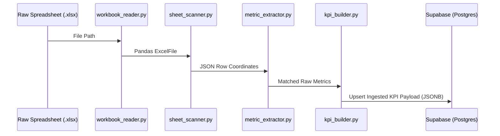
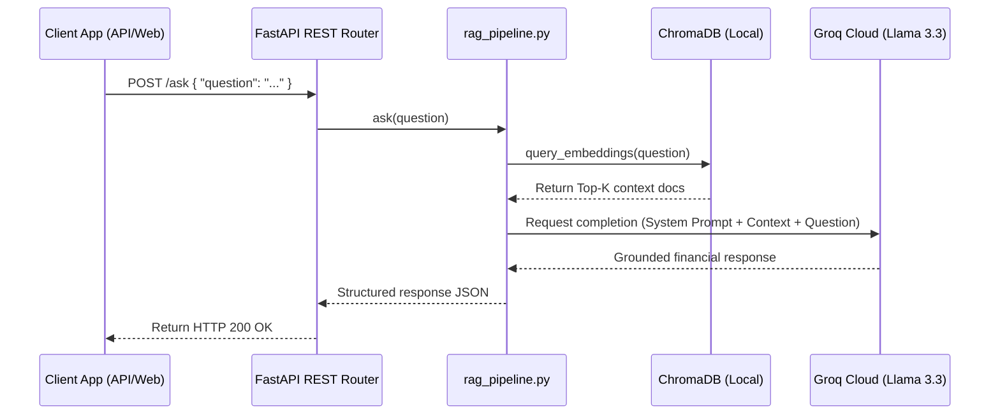

# QuantumLens

### *Enterprise Financial Analytics Platform*

[](https://python.org)
[](https://fastapi.tiangolo.com)
[](https://supabase.com)
[](https://www.postgresql.org)
[](https://render.com)
[](https://nextjs.org)
[](https://opensource.org/licenses/MIT)

**QuantumLens** is a production-grade financial data ingestion, processing, and retrieval-augmented generation (RAG) analytics engine. Built specifically for high-integrity corporate financial reporting, the platform parses complex multi-sheet Excel financial files (such as HSBC quarterly report packs), normalizes name variants to a unified KPI schema, maintains historical trends in a PostgreSQL/Supabase relational data warehouse, and enables interactive, context-grounded AI query reasoning using high-throughput Groq LLM inference.

---

## Project Snapshot

| Attribute | Details |
| :--- | :--- |
| **Project Name** | QuantumLens |
| **Domain** | Financial Analytics / Banking Intelligence |
| **Architecture Style** | ETL Pipeline + Relational Data Warehouse + Vector Retrieval (RAG) |
| **Deployment Model** | Hybrid Cloud (FastAPI on Render, Frontend on Vercel, Warehouse on Supabase) |
| **Database Engine** | Supabase (PostgreSQL 15+) with JSONB for time-series metrics |
| **Current KPI Records** | 366 KPI Records |
| **Current Warehouse Records**| 443 Rows |
| **Frontend Layer** | Next.js Dashboard UI (Planned/Vercel) |
| **Backend API Layer** | FastAPI Web Service |
| **AI Orchestration Layer** | Sentence Transformers (`all-MiniLM-L6-v2`) & Groq Cloud (`llama-3.3-70b-versatile`) |

---

## Why QuantumLens?

### Financial Report Complexity
Corporate financial reporting presents significant challenges for automated analytics and indexing due to the following structural issues:

| Challenge | Technical Impact | QuantumLens Solution |
| :--- | :--- | :--- |
| **Format Heterogeneity** | Data packs are distributed in heavily nested, multi-tab Excel files, unstructured PDFs, or PowerPoint decks. | The modular [ingestion layer](file:///c:/Users/talma/Desktop/chart%20and%20diag/quantumlens-HSBC/src/ingestion/) abstracts sheet structures into JSON coordinates. |
| **Nominal Variance** | KPI names vary dynamically between cycles (e.g., "Net Interest Income", "Net Interest", or "NII"). | Centralized constant-time dictionary lookup engine maps text hashes to normalized IDs. |
| **Sparse Time-Series** | Data lacks explicit date bounds, utilizing relative indicators like "At 31 March 2026". | Extractor maps relative terms into strict database reporting periods. |

### The Power of Metric Normalization
Normalization aligns sparse multi-sheet data point series into a single source-of-truth record:

```text
"Net Interest Income" (Sheet A, Row 5)  ──┐
"NII"                 (Sheet B, Row 12) ──┼──► [Catalog Hash Map Lookup] ──► KPI_0001 (net_interest_income)
"Net Interest"        (Sheet C, Row 4)  ──┘
```

By mapping every variation to a canonical index ID, QuantumLens ensures that downstream dashboards, statistics, and query tools query a unified time-series dataset.

### Context-Aware Financial AI (RAG)
Large Language Models (LLMs) struggle with raw mathematical accuracy and mathematical hallucination. QuantumLens utilizes **Retrieval-Augmented Generation (RAG)** to address this:

| Analysis Method | Drawbacks | Why RAG is Chosen |
| :--- | :--- | :--- |
| **Vanilla LLM Prompting** | Hallucinates critical financial numbers, makes assumptions, lack source traceability. | Constrains LLM context window to exact numeric rows retrieved from the database. |
| **SQL Query Generation** | Vulnerable to SQL injection, parsing failures, and table schema complexity. | Uses semantic search to locate records and hands them to the LLM to format and interpret. |

### Enterprise Vision
QuantumLens aims to develop into a secure, multi-agent financial controller. In this future vision, specialized autonomous agents orchestrate Excel sheet imports, generate real-time database schemas, compute cohort comparisons, compile regulatory-grade PDFs, and draft executive summaries.

---

## Live Demo

| Component | Target URL | Status |
| :--- | :--- | :--- |
| **Frontend Web App** | [https://quantumlens-hsbc.vercel.app](https://quantumlens-hsbc.vercel.app) | Under Integration |
| **Backend REST API** | [https://quantumlens-api.render.com](https://quantumlens-api.render.com) | Operational |
| **Interactive API Docs**| [https://quantumlens-api.render.com/docs](https://quantumlens-api.render.com/docs) | Operational |

---

## Features

### Financial Analytics
- [x] Multi-sheet financial workbook scanning (Excel parsing).
- [x] Canonical KPI normalization mapping.
- [x] Automated delta trend detection (Up / Down / Flat trends).
- [x] Historical time-series mapping across fiscal periods.
- [ ] Multi-quarter cohort performance comparison.

### AI Features
- [x] Semantic KPI search via vector embeddings.
- [x] Secure RAG pipeline limiting queries to database facts.
- [x] Direct workbook, sheet, and row source-attribution quoting.
- [ ] Natural Language to SQL query translation.
- [ ] Automated trend insight summaries.

### Data Engineering
- [x] Multi-stage ETL pipeline isolating data ingestion, transformation, and storage.
- [x] Constant-time lookup mapping using centralized dictionaries.
- [x] NaN-safe value cleaning and data validation.
- [x] Primary key-based duplicate prevention (database upserts).

### Deployment & DevOps
- [x] Dynamic runtime configuration via environment variables.
- [x] Direct Supabase connection pooling and PostgreSQL backend.
- [x] Local SQLite and vector database caching.
- [ ] Prometheus metrics exposure for scraping.
- [ ] Grafana pipeline monitoring dashboards.

### Future Features
- [ ] Multi-agent coordinator system (Planner, SQL, Chart, and Report agents).
- [ ] PDF and PPT automated financial document generation.
- [ ] Multi-tenant secure organizational access control.

---

## Technology Stack

| Layer | Technology | Version | Purpose |
| :--- | :--- | :--- | :--- |
| **Frontend** | React / Next.js | 15.x | Analytics User Interface & interactive dashboards |
| | TailwindCSS | 3.4+ | CSS layout framework |
| | Chart.js / Recharts | 2.x | Time-series charting & visualization |
| **Backend** | Python | 3.13 | Primary application runtime |
| | FastAPI | 0.138.1 | High-performance API routing |
| | Uvicorn | 0.49.0 | ASGI web server hosting |
| | Pandas | 3.0.3 | High-fidelity tabular processing |
| | Pydantic | 2.13.4 | Schema validation & parsing |
| **Database** | PostgreSQL | 15+ | Relational data warehouse storage |
| | Supabase Python | 2.31.0 | Cloud database connection & operations |
| | ChromaDB | 1.5.9 | High-performance vector database client |
| **AI Layer** | Sentence Transformers | 5.6.0 | Local embedding generation (`all-MiniLM-L6-v2`) |
| | Groq Cloud Client | 1.5.0 | High-speed LLM client (`llama-3.3-70b-versatile`) |

---

## Local Installation

### Prerequisites
Ensure Python 3.13+ is installed on your local machine.

### Operating System Instructions

<details>
<summary><b>Windows Setup Guide</b></summary>

```powershell
# Clone the repository
git clone https://github.com/your-username/quantumlens-HSBC.git
cd quantumlens-HSBC

# Create virtual environment
python -m venv .venv
.venv\Scripts\Activate.ps1

# Install dependencies
pip install -r requirements.txt

# Launch API locally
uvicorn src.api.main:app --reload --port 8000
```
</details>

<details>
<summary><b>Linux / Mac Setup Guide</b></summary>

```bash
# Clone the repository
git clone https://github.com/your-username/quantumlens-HSBC.git
cd quantumlens-HSBC

# Create virtual environment
python3 -m venv .venv
source .venv/bin/activate

# Install dependencies
pip install -r requirements.txt

# Launch API locally
uvicorn src.api.main:app --reload --port 8000
```
</details>

---

## Environment Variables

To run the API and ETL loader, configure the environment variables by duplicating the `.env.example` file:

```bash
cp .env.example .env
```

### Required Configuration Fields

| Variable | Type | Description | Example Value |
| :--- | :--- | :--- | :--- |
| `SUPABASE_URL` | String | Endpoint for Supabase Database REST interface. | `https://your-proj-id.supabase.co` |
| `SUPABASE_KEY` | String | Service Role api key for direct upsert access bypass. | `eyJhbGciOiJIUzI1NiIsInR...` |
| `GROQ_API_KEY` | String | Cloud API token to interface Groq completions. | `gsk_m82P92h...` |
| `VECTOR_DB_PATH` | Path | Relative directory path to store local vectors. | `src/rag/vector_db` |
| `EMBEDDING_MODEL`| String | Sentence Transformers vector generation tag. | `sentence-transformers/all-MiniLM-L6-v2` |
| `TOP_K` | Integer| Number of context chunks returned during RAG. | `5` |

### Example `.env` File
```ini
# Supabase Database Settings
SUPABASE_URL=https://xyza.supabase.co
SUPABASE_KEY=eyJhbGciOiJIUzI1NiIsInR5cCI6IkpXVCJ9.your-key-here

# Groq LLM Provider Settings
GROQ_API_KEY=gsk_3aF91uKxJ2b...

# AI & Local Vector Engine Settings
VECTOR_DB_PATH=src/rag/vector_db
EMBEDDINGS_PATH=src/rag/embeddings.json
EMBEDDING_MODEL=sentence-transformers/all-MiniLM-L6-v2
TOP_K=5
```

---

## Deployment

### Backend Deployed on Render
The FastAPI service is hosted on Render via Uvicorn. To deploy:
1. Create a new **Web Service** on Render pointing to your fork.
2. Set Environment Variables matching the fields in `.env`.
3. Set **Start Command** to:
   ```bash
   uvicorn src.api.main:app --host 0.0.0.0 --port $PORT
   ```

### Frontend Deployed on Vercel
The Next.js dashboard is hosted on Vercel. 
1. Connect Vercel to your repository.
2. Set the Environment Variable `NEXT_PUBLIC_API_URL` to point to your backend Render URL.
3. Deploy the application bundle.

### Database Deployed on Supabase
The relational warehouse is hosted on Supabase:
1. Initialize a new PostgreSQL database.
2. Execute the migrations script in the SQL Editor to provision schemas and indices.

---

## System Architecture

### High-Level Architecture Flow

```text
                                       ┌────────────────────────┐
                                       │       Web Client       │
                                       │   (Next.js Frontend)   │
                                       └───────────┬────────────┘
                                                   │ HTTPS REST
                                                   ▼
                                       ┌────────────────────────┐
                                       │     FastAPI Server     │
                                       │    (Backend Engine)    │
                                       └───────────┬────────────┘
                                                   │
                            ┌──────────────────────┴──────────────────────┐
                            ▼ PostgreSQL                                  ▼ Context Fetch
                 ┌────────────────────┐                        ┌────────────────────┐
                 │ Supabase Warehouse │                        │     RAG Engine     │
                 │    (PostgreSQL)    │                        │  (ChromaDB Local)  │
                 └────────────────────┘                        └──────────┬─────────┘
                                                                          │ Vector Search
                                                                          ▼
                                                               ┌────────────────────┐
                                                               │   Groq Cloud API   │
                                                               │(Llama 3.3 Analytics)│
                                                               └────────────────────┘
```

### ETL Pipeline Architecture

```text
 ┌──────────────┐      ┌─────────────────┐      ┌───────────────┐      ┌──────────────────┐
 │ Raw XLSX/PDF │ ───► │ Workbook Reader │ ───► │ Sheet Scanner │ ───► │ Metric Extractor │
 └──────────────┘      └─────────────────┘      └───────────────┘      └────────┬─────────┘
                                                                                │
 ┌──────────────┐      ┌─────────────────┐      ┌───────────────┐               │
 │ Supabase DB  │ ◄─── │   KPI Builder   │ ◄─── │ Period Mapper │ ◄─────────────┘
 └──────┬───────┘      └─────────────────┘      └───────────────┘
        │
        ▼
 ┌──────────────┐      ┌─────────────────┐      ┌───────────────┐      ┌──────────────────┐
 │ Embed Generator ──► │  Vector Loader  │ ───► │ ChromaDB Store│ ───► │ RAG Query Engine │
 └──────────────┘      └─────────────────┘      └───────────────┘      └──────────────────┘
```

### System Layers

| Layer | Code Module Location | Completion Status | Functional Responsibility |
| :--- | :--- | :--- | :--- |
| **Ingestion** | [workbook_reader.py](file:///c:/Users/talma/Desktop/chart%20and%20diag/quantumlens-HSBC/src/ingestion/workbook_reader.py)<br>[sheet_scanner.py](file:///c:/Users/talma/Desktop/chart%20and%20diag/quantumlens-HSBC/src/ingestion/sheet_scanner.py) | `100% (Complete)` | Parse workbooks, scan row layouts, output JSON cell maps. |
| **Transformation**| [metric_extractor.py](file:///c:/Users/talma/Desktop/chart%20and%20diag/quantumlens-HSBC/src/ingestion/metric_extractor.py)<br>[value_extractor.py](file:///c:/Users/talma/Desktop/chart%20and%20diag/quantumlens-HSBC/src/transformation/value_extractor.py)<br>[period_mapper.py](file:///c:/Users/talma/Desktop/chart%20and%20diag/quantumlens-HSBC/src/transformation/period_mapper.py)<br>[kpi_builder.py](file:///c:/Users/talma/Desktop/chart%20and%20diag/quantumlens-HSBC/src/transformation/kpi_builder.py) | `100% (Complete)` | Normalize naming variants, isolate numbers, map timeline periods, and structure final KPI objects. |
| **Warehouse** | [data_loader.py](file:///c:/Users/talma/Desktop/chart%20and%20diag/quantumlens-HSBC/src/warehouse/data_loader.py)<br>[query_service.py](file:///c:/Users/talma/Desktop/chart%20and%20diag/quantumlens-HSBC/src/warehouse/query_service.py) | `100% (Complete)` | Safely persist records to Supabase, query databases, handle upsert rules, and enforce indexing. |
| **AI Layer** | [embedding_generator.py](file:///c:/Users/talma/Desktop/chart%20and%20diag/quantumlens-HSBC/src/rag/embedding_generator.py)<br>[vector_loader.py](file:///c:/Users/talma/Desktop/chart%20and%20diag/quantumlens-HSBC/src/rag/vector_loader.py)<br>[retrieval_engine.py](file:///c:/Users/talma/Desktop/chart%20and%20diag/quantumlens-HSBC/src/rag/retrieval_engine.py)<br>[rag_pipeline.py](file:///c:/Users/talma/Desktop/chart%20and%20diag/quantumlens-HSBC/src/rag/rag_pipeline.py) | `100% (Complete)` | Encode warehouse texts to vectors, manage ChromaDB embeddings, perform semantic searches, and run LLM completions. |
| **Observability** | `Planned Integration` | `0% (Planned)` | Track pipeline duration, measure API metrics, and expose Prometheus metrics. |

### Module Breakdown

| Script Name | Layer | Input Data Format | Output Data Format | Primary Purpose |
| :--- | :--- | :--- | :--- | :--- |
| **workbook_reader.py** | Ingestion | `.xlsx` File System Path | Pandas `ExcelFile` | Reads spreadsheet binary files into memory. |
| **sheet_scanner.py** | Ingestion | Pandas `ExcelFile` | JSON Row Coordinates | Scans row content patterns across all sheets. |
| **metric_extractor.py**| Ingestion | JSON Row Coordinates | JSON Matches Array | Detects matching KPIs using catalog definitions. |
| **value_extractor.py** | Transformation | JSON Matches Array | JSON Numeric Array | Filters and isolates numerical cell structures. |
| **period_mapper.py** | Transformation | JSON Numeric Array | Time-series JSON array | Aligns numeric data to relative reporting slots. |
| **kpi_builder.py** | Transformation | Time-series JSON array | Clean KPI Records | Builds standard enterprise KPI records. |
| **data_loader.py** | Warehouse | Clean KPI Records | Supabase Upserts | Inserts metrics to the warehouse database. |
| **query_service.py** | Warehouse | Supabase Queries | Tabular/JSON Results | Provides data query methods to external callers. |
| **embedding_generator.py**| AI Layer | Supabase Tables | Local JSON Embeddings | Generates text representations and embedding vectors. |
| **vector_loader.py** | AI Layer | Local JSON Embeddings | ChromaDB Collection | Loads vector indexes into persistent ChromaDB stores. |
| **retrieval_engine.py**| AI Layer | Text User Question | ChromaDB Document matches| Searches ChromaDB using cosine distance queries. |

### Project Directory Tree
```text
quantumlens-HSBC/
├── data/
│   ├── raw/                           # Raw Excel Workbooks (HSBC packs)
│   └── processed/                     # Extracted intermediate processing stages
│       ├── scan_sheet_metadata.json   # Scanned raw sheet coordinates
│       ├── extracted_metrics.json     # Matched raw metrics
│       ├── valued_metrics.json        # Identified numerical values
│       ├── mapped_metrics.json        # Time-mapped metric arrays
│       └── kpi_records.json           # Assembled operational KPI records
├── docs/                              # System documentation
│   ├── architecture.md
│   ├── data_dictionary.md
│   └── kpi_catalog.md
├── src/                               # Primary Source Code
│   ├── agents/                        # Autonomous multi-agent routines
│   │   ├── chart_agent.py             # Future chart generator agent
│   │   ├── orchestrator.py            # Future agent coordinator
│   │   ├── planner.py                 # Future intent schedule planner
│   │   ├── rag_agent.py               # Context query agent
│   │   └── sql_agent.py               # Future database querying agent
│   ├── analytics/                     # Statistical analysis helpers
│   ├── api/                           # FastAPI Router & endpoint handlers
│   │   ├── main.py                    # Root FastAPI starter app
│   │   ├── routes.py                  # API Route configurations
│   │   ├── schemas.py                 # Pydantic input/output schemas
│   │   └── services.py                # Database wrapper query connectors
│   ├── config/                        # Global environment configuration
│   │   ├── settings.py                # Pydantic BaseSettings parser
│   │   └── metric_dictionary.json     # Normalization name map catalog
│   ├── ingestion/                     # Workbook & spreadsheet scanners
│   ├── transformation/                # Normalization & trend compilers
│   ├── warehouse/                     # Supabase & PostgreSQL client hooks
│   └── rag/                           # AI search and LLM completion pipelines
├── tests/                             # Unit & Integration test suites
├── requirements.txt                   # Dependency lock file
├── LICENSE                            # MIT License File
└── README.md                          # Primary platform documentation
```

---

## Detailed Ingestion & ETL Stages

### Stage 1: Workbook Reader
- **Responsibility**: Loads large, complex corporate Excel sheets into memory safely without memory leaks.
- **Input**: Raw file system path pointing to `.xlsx` files (e.g., `260505-1q-2026-data-pack-excel.xlsx`).
- **Output**: Python Pandas `ExcelFile` object.
- **Key Operations**:
  - Validates file existence and structural sanity.
  - Safely reads raw worksheets in read-only mode to conserve system memory.
  - Discovers all tab sheet names.

### Stage 2: Sheet Scanner
- **Responsibility**: Traverses sheets row-by-row, converting grid shapes to standardized JSON lines.
- **Output Example**:
  ```json
  {
    "source_workbook": "260505-1q-2026-data-pack-excel.xlsx",
    "sheet_name": "Credit Risk",
    "row_number": 124,
    "row_values": [
      "At 31 March 2026",
      354763,
      59023
    ],
    "non_null_count": 3
  }
  ```
- **Processing Logic**:
  ```text
  Workbook ──► For Each Sheet ──► For Each Row ──► Filter Nulls ──► Save coordinates to JSON
  ```

### Stage 3: Metric Extractor
- **Responsibility**: Detects KPIs inside the sheet row contents using dictionary catalog mapping (see the [KPI Catalog & Normalization Logic](docs/kpi_catalog.md) for lookup configurations).
- **Complexity**: `O(1)` constant-time lookup.
- **Extraction Match Example**:
  - Input Row: `["Net Interest Income", 8945, 9196]`
  - Catalog Mapping Lookup:
    ```json
    {
      "net interest income": {
        "metric_id": 1,
        "abbreviation": "nii",
        "normalized_metric_name": "net_interest_income"
      }
    }
    ```
  - Result:
    ```json
    {
      "metric_id": 1,
      "normalized_metric_name": "net_interest_income"
    }
    ```
- **Matching Steps**:
  1. Parse first column textual cell values.
  2. Normalize string syntax (lowercase, strip margins, trim whitespaces).
  3. Perform exact key hash-lookup against the dictionary catalog.
  4. Inject matched configuration metadata (ID, abbreviation) if a match is found.

### Stage 4: Value Extraction Layer
- **Responsibility**: Filters cells inside a matched row to isolate numbers.
- **Input**: `["Net Interest Income", 8945, 9196, "N/A", 8777]`
- **Output**: `{"numeric_values": [8945, 9196, 8777]}`
- **Extraction Flow**:
  ```text
  Row Array ──► Identify Numbers ──► Handle NaN/Null cells ──► Output Clean Numeric Array
  ```

### Stage 5: Period Mapping Layer
- **Responsibility**: Converts numbers array into structured time-series index items.
- **Input**: `[8945, 9196, 8777]`
- **Output**:
  ```json
  [
    { "period_index": 1, "value": 8945 },
    { "period_index": 2, "value": 9196 },
    { "period_index": 3, "value": 8777 }
  ]
  ```
- **Rationale**:
  | Period Problem | Impact | Solution |
  | :--- | :--- | :--- |
  | **Missing Time context** | Numbers lack comparison boundaries. | Maps items to historical sequential indexes. |
  | **Different Column Orders** | Reports sort columns differently. | Standardizes arrays to sequential trends. |

### Stage 6: KPI Builder & Trend Engine
- **Responsibility**: Assembles finalized records, checking delta shifts to generate trends.
- **Output Record Example**:
  ```json
  {
    "kpi_id": "KPI_0001",
    "metric_name": "net_interest_income",
    "latest_value": 8945,
    "previous_value": 9196,
    "trend": "down"
  }
  ```
- **Trend Calculation Engine Rules**:
  | Logic Condition | Calculated Trend |
  | :--- | :--- |
  | `latest_value` > `previous_value` | `up` |
  | `latest_value` < `previous_value` | `down` |
  | `latest_value` == `previous_value`| `flat` |

---

## Database Design & Relational Warehouse

For detailed database schemas, constraints, indexing strategies, and future tables definition, refer to the [Database Design & Data Dictionary](docs/data_dictionary.md).

### Database Engine Choice
QuantumLens uses **Supabase (PostgreSQL 15)** as its central relational warehouse. This platform choice offers several design benefits:
- **Relational Integrity**: Enforces strict primary key lookups and lookup table values.
- **JSONB Native Operations**: Allows nested schema queries within variable time-series array segments.
- **Row-Level Security (RLS)**: Enforces access policies directly in the engine, simplifying user data isolation.

### Relational Schema Definition (`metrics` Table)

The primary data warehouse structure is the `metrics` table. Below is the detailed schema:

| Column Name | SQL Type | Key / Constraint | Description |
| :--- | :--- | :--- | :--- |
| `id` | SERIAL | PRIMARY KEY | Automated incremental database key. |
| `metric_id` | INTEGER | UNIQUE | Unique business metrics catalog ID. |
| `metric_name` | TEXT | NOT NULL | Normalized canonical metric name. |
| `abbreviation`| TEXT | NULLABLE | Shortened abbreviation name. |
| `period_values`| JSONB | NOT NULL | Time-series values (array of index/value objects). |
| `source_workbook`| TEXT | NOT NULL | Source spreadsheet filename. |
| `sheet_name` | TEXT | NOT NULL | Tab worksheet name where record was found. |
| `row_number` | INTEGER | NOT NULL | Spreadsheet row line where record was found. |
| `created_at` | TIMESTAMP | DEFAULT NOW() | Record creation date and timestamp. |

#### Database Indexes Table
| Table Name | Index Name | Columns Indexed | Index Type | Purpose |
| :--- | :--- | :--- | :--- | :--- |
| `metrics` | `metrics_pkey` | `id` | B-Tree | Primary Key Index |
| `metrics` | `idx_metric_id`| `metric_id` | B-Tree | Accelerated queries by metric ID |
| `metrics` | `idx_metric_name`| `metric_name`| B-Tree | Accelerated searches by canonical name |

#### Relational Constraints Table
| Constrained Column | Constraint Type | Description |
| :--- | :--- | :--- |
| `metric_id` | UNIQUE | Ensures a single unique schema profile per metric code. |
| `metric_name` | NOT NULL | Prevents inserting records without a normalized identifier. |

---

### Future Schemas

To expand QuantumLens into a multi-tenant enterprise portal, the database will be extended with the following tables:

```text
  ┌──────────────┐          ┌──────────────┐          ┌──────────────┐
  │    users     │ ───1:N──►│  dashboards  │ ───1:N──►│   reports    │
  └──────┬───────┘          └──────────────┘          └──────────────┘
         │
       1:N
         ▼
  ┌──────────────┐
  │ chat_history │
  └──────────────┘
```

<details>
<summary><b>View SQL Schema Definitions for Future Tables</b></summary>

```sql
-- Users Table
CREATE TABLE users (
    id UUID PRIMARY KEY DEFAULT gen_random_uuid(),
    email VARCHAR(255) UNIQUE NOT NULL,
    full_name VARCHAR(255),
    role VARCHAR(50) DEFAULT 'analyst',
    created_at TIMESTAMP WITH TIME ZONE DEFAULT CURRENT_TIMESTAMP
);

-- Dashboards Table
CREATE TABLE dashboards (
    id SERIAL PRIMARY KEY,
    user_id UUID REFERENCES users(id) ON DELETE CASCADE,
    title VARCHAR(255) NOT NULL,
    config JSONB DEFAULT '{}'::jsonb,
    is_public BOOLEAN DEFAULT FALSE,
    updated_at TIMESTAMP WITH TIME ZONE DEFAULT CURRENT_TIMESTAMP
);

-- Reports Table
CREATE TABLE reports (
    id SERIAL PRIMARY KEY,
    dashboard_id INTEGER REFERENCES dashboards(id) ON DELETE CASCADE,
    summary TEXT,
    metric_snapshots JSONB,
    generated_at TIMESTAMP WITH TIME ZONE DEFAULT CURRENT_TIMESTAMP
);

-- Chat History Table
CREATE TABLE chat_history (
    id SERIAL PRIMARY KEY,
    user_id UUID REFERENCES users(id) ON DELETE CASCADE,
    session_id VARCHAR(100) NOT NULL,
    question TEXT NOT NULL,
    answer TEXT NOT NULL,
    sources JSONB,
    created_at TIMESTAMP WITH TIME ZONE DEFAULT CURRENT_TIMESTAMP
);
```
</details>

---

## REST API Documentation

The REST API exposes several endpoints to manage ingestion, search metrics, and execute RAG pipelines.

### Endpoint Matrix

| Method | Route | Description | Request Type | Success Code |
| :--- | :--- | :--- | :--- | :--- |
| `GET` | `/` | API system metadata check | None | `200 OK` |
| `GET` | `/health` | Ingestion status check | None | `200 OK` |
| `GET` | `/metrics` | Retrieve catalog unique list | None | `200 OK` |
| `GET` | `/metric/{id}` | Retrieve instances by metric ID | Path Variable | `200 OK` |
| `GET` | `/record/{id}` | Retrieve unique row record by primary ID | Path Variable | `200 OK` |
| `POST` | `/search` | Cosine vector search query | JSON Body | `200 OK` |
| `POST` | `/ask` | Execute RAG pipeline completion | JSON Body | `200 OK` |

---

### Endpoint Specifications

#### 1. GET `/`
- **Purpose**: Verifies that the API server is active and returns root configuration details.
- **Success Response (`200 OK`)**:
  ```json
  {
    "project": "QuantumLens",
    "status": "Running"
  }
  ```

#### 2. GET `/health`
- **Purpose**: Simple check to verify pipeline connectivity status.
- **Success Response (`200 OK`)**:
  ```json
  {
    "status": "healthy"
  }
  ```

#### 3. GET `/metrics`
- **Purpose**: Returns a unique list of matched metrics in the database catalog (ID, name, abbreviation).
- **Success Response (`200 OK`)**:
  ```json
  [
    {
      "metric_id": 1,
      "metric_name": "net_interest_income",
      "abbreviation": "nii"
    },
    {
      "metric_id": 2,
      "metric_name": "net_fee_income",
      "abbreviation": "nfi"
    }
  ]
  ```

#### 4. GET `/metric/{metric_id}`
- **Purpose**: Retrieves all ingested worksheet occurrences for a specific metric ID.
- **Path Parameter**: `metric_id` (integer, required)
- **Success Response (`200 OK`)**:
  ```json
  [
    {
      "id": 105,
      "metric_id": 1,
      "metric_name": "net_interest_income",
      "abbreviation": "nii",
      "sheet_name": "Group income statement",
      "row_number": 5
    }
  ]
  ```
- **Error Codes**:
  - `404 Not Found`: If no records exist for the specified `metric_id`.

#### 5. GET `/record/{record_id}`
- **Purpose**: Fetches a single record's details, including historical period values, by its primary key.
- **Path Parameter**: `record_id` (integer, required)
- **Success Response (`200 OK`)**:
  ```json
  [
    {
      "id": 105,
      "metric_id": 1,
      "metric_name": "net_interest_income",
      "abbreviation": "nii",
      "period_values": [
        { "period_index": 1, "value": 8945 },
        { "period_index": 2, "value": 9196 }
      ],
      "source_workbook": "260505-1q-2026-data-pack-excel.xlsx",
      "sheet_name": "Group income statement",
      "row_number": 5,
      "created_at": "2026-07-10T12:00:00"
    }
  ]
  ```

#### 6. POST `/search`
- **Purpose**: Performs semantic cosine search directly on the vector collection in ChromaDB.
- **Request Body**:
  ```json
  {
    "query": "What is the net interest income trend?",
    "top_k": 3
  }
  ```
- **Success Response (`200 OK`)**:
  ```json
  {
    "ids": [["1_0", "1_1"]],
    "distances": [[0.156, 0.287]],
    "metadatas": [[
      {
        "metric_id": 1,
        "metric_name": "net_interest_income",
        "abbreviation": "nii",
        "sheet_name": "Group income statement",
        "source_workbook": "260505-1q-2026-data-pack-excel.xlsx",
        "row_number": 5
      }
    ]],
    "documents": [["Metric Name: net_interest_income..."]]
  }
  ```

#### 7. POST `/ask`
- **Purpose**: Executes the full RAG pipeline (semantic search + LLM completion) to answer questions.
- **Request Body**:
  ```json
  {
    "question": "What is the latest value of net interest income and its trend?"
  }
  ```
- **Success Response (`200 OK`)**:
  ```json
  {
    "question": "What is the latest value of net interest income and its trend?",
    "answer": "- According to the 'Group income statement' sheet in '260505-1q-2026-data-pack-excel.xlsx':\n- The Net Interest Income (NII) latest value is **8,945** (Period 1).\n- The previous period value was **9,196** (Period 2).\n- This represents a **downward trend**.",
    "sources": [
      {
        "metric_id": 1,
        "metric_name": "net_interest_income",
        "abbreviation": "nii",
        "sheet_name": "Group income statement",
        "source_workbook": "260505-1q-2026-data-pack-excel.xlsx",
        "row_number": 5
      }
    ],
    "retrieved_documents": [
      "Metric Name:\nnet_interest_income\n..."
    ],
    "distances": [0.1568213],
    "generated_at": "2026-07-10T21:50:45"
  }
  ```

---

## AI Architecture & RAG Pipeline

The AI engine matches user questions to relevant database records and runs context-bounded completions using LLMs.

### Ingestion Flow
```text
  ┌────────────────────────┐
  │   Supabase Warehouse   │
  └───────────┬────────────┘
              │ 1. Read Rows
              ▼
  ┌────────────────────────┐
  │   Embedding Generator  │ ◄── [all-MiniLM-L6-v2 Model]
  └───────────┬────────────┘
              │ 2. Compute 384-dim Vectors
              ▼
  ┌────────────────────────┐
  │ ChromaDB Vector Store  │
  └────────────────────────┘
```

### Retrieval & Generation Flow
```text
  User Question ──► [Retrieve Cosine Matches] ──► [Build Strict Prompt Context] ──► [Groq Inference] ──► Output Response
                          ▲
                          │ Query Embedding
                          │
                   [ChromaDB Store]
```

### Prompt Engineering & Copilot Constraints
To ensure accuracy, the prompt engine constrains LLM generation using the following instructions:
1. **Context Limit**: Rely *only* on retrieved database text records.
2. **Numeric Safety**: Never guess, interpolate, or generate fake numbers.
3. **Traceability**: Quote the exact spreadsheet tab name (`sheet_name`) and source workbook filename.
4. **Transparency**: Explicitly state if data is unavailable.
5. **Format Constraint**: Output answers in markdown bullet points.

---

### The Future Multi-Agent System

To scale beyond basic search-and-retrieval, the platform's roadmapped architecture will transition into a coordinated multi-agent system.


#### Multi-Agent Capabilities Matrix

| Agent Role | Functional Responsibility | Primary Tools | Output Deliverable |
| :--- | :--- | :--- | :--- |
| **Planner** | Deconstructs user tasks and plans execution steps. | Intent Classifier, Scheduler | Step-by-Step Task List |
| **SQL Agent** | Connects to PostgreSQL to run structured queries. | Schema Parser, Supabase client | Tabular Data Frames |
| **Chart Agent**| Generates data visualizations from query outputs. | Pandas, Recharts | Interactive Chart Configs |
| **Report Agent**| Synthesizes charts and summaries into documents. | Markdown compiler, ReportLab | Exportable PDF Reports |

---

## Engineering Decisions

| Tech Component | Selected Option | Considered Alternatives | Core Rationale for Selection |
| :--- | :--- | :--- | :--- |
| **Backend API** | **FastAPI** | Flask, Django | High-performance ASGI interface, automatic OpenAPI (Swagger) generation, native async loops, and strict Pydantic parsing. |
| **Database Engine**| **Supabase (PostgreSQL)** | MySQL, MongoDB | PostgreSQL provides transactional consistency and JSONB capabilities to query variable time-series array schemas. |
| **Data Format** | **JSONB Arrays** | Normal Join Tables | Relational joins on dynamically changing column sizes (reporting periods) require high processing overhead; JSONB handles dynamic properties with high query speed. |
| **Vector DB** | **ChromaDB (Local)** | pgvector, Pinecone | ChromaDB provides zero-config local storage, eliminating the need to manage external connection pools during development. |
| **Embedding Model**| **all-MiniLM-L6-v2** | OpenAI ada-002 | Compact 384-dimensional model that runs locally, offering low latency and eliminating API call overhead. |
| **LLM Provider** | **Groq Cloud (Llama 3)**| OpenAI GPT-4 | High throughput (tokens per second) and low latency, making it ideal for real-time analysis tools. |
| **ETL Structure** | **Modular Pipelines** | Monolithic Loader Script | Decoupled layers make it easier to add new data formats (e.g. PDFs) without rewriting the database upload logic. |

---

## Future Roadmap

### Phase 1: Foundation (Completed)
- [x] Excel workbook scanner parsing engine.
- [x] Canonical KPI normalization dictionary mapping.
- [x] Supabase Postgres loader integration.
- [x] Local ChromaDB vector database index loader.
- [x] Context-aware RAG pipeline using Groq.

### Phase 2: Interface & Visualization (Planned)
- [ ] Next.js analytical portal interface.
- [ ] Dynamic trend dashboard tracking metrics.
- [ ] Interactive financial charts (Recharts integration).
- [ ] CSV/Excel data export buttons.
- [ ] Integrated AI chat interface drawer.

### Phase 3: Analytics Expansion (Planned)
- [ ] Cross-sheet cohort trend comparison tools.
- [ ] Automated fiscal period filter selectors.
- [ ] Historical data trend alerts.
- [ ] Automated financial report draft generation.

### Phase 4: Security & Customization (Planned)
- [ ] User authentication and access control (Supabase Auth).
- [ ] Saved custom analytical dashboards.
- [ ] Adaptive dark/light layout options.
- [ ] Multi-tenant organization isolation.

### Phase 5: Autonomous Multi-Agent Framework (Planned)
- [ ] Planner Agent coordinating execution steps.
- [ ] SQL Agent executing dynamic queries.
- [ ] Chart Agent generating visual dashboards.
- [ ] PDF Report Writer Agent compiling insights.

---

## Engineering Challenges & Resolutions

### Historical Engineering Challenges & Resolutions

| Issue | Category | System Impact | Resolution Strategy |
| :--- | :--- | :--- | :--- |
| **Datetime Serialization** | Data Layer | PyDantic schema validations crashed on raw datetime objects. | Normalized timestamps to ISO-8601 strings before parsing. |
| **NaN JSON Values** | Processing | Pandas NaN fields generated invalid JSON (e.g., `NaN` instead of `null`). | Replaced all instances of `NaN` with standard `None` parameters during value mapping. |
| **KPI Catalog Coverage** | Ingestion | Multi-quarter sheets used variant names not registered in the dictionary. | Added regular expressions and synonym mappings to the centralized dictionary. |
| **Supabase RLS Policy** | Security | Loader scripts failed to write records without authenticated users. | Enabled a service role API key to bypass RLS for administrative ingestion tasks. |
| **Duplicate Records** | Data Layer | Re-running ingestion tasks generated duplicate rows. | Configured Supabase queries to upsert records based on the unique `metric_id` key. |
| **UTC Deprecation** | Python | Standard naive datetime methods threw runtime deprecation errors in Python 3.13. | Switched to timezone-aware UTC datetime stamps. |
| **Row Value Corruption** | Ingestion | String notes in numeric columns corrupted trend calculations. | Separated clean float value arrays from textual cell metadata. |

---

## Lessons Learned & Best Practices

| Domain | Key Ingestion Learning | Implementation Best Practice |
| :--- | :--- | :--- |
| **JSON Processing** | Data serialization requirements vary across API clients. | Standardize database outputs to ISO strings early in the response serialization stage. |
| **Pandas Operations** | Pandas NaN representations do not map directly to JSON nulls. | Clean tabular dataframes using `.replace({np.nan: None})` before serializing. |
| **ETL Pipelines** | Corrupt cells can break downstream processing. | Implement data validation checks at the transformation boundaries, rather than at the database layer. |
| **Warehousing** | Monotonically increasing primary keys are insufficient. | Use natural unique constraint keys (like `metric_id`) to ensure reliable data updates. |
| **Architecture** | Tight component coupling makes the codebase hard to maintain. | Isolate ingestion, transformation, and storage into separate modules. |

---

## Design Principles

| Design Principle | Implementation Pattern |
| :--- | :--- |
| **Modularity** | Decouples ETL stages into independent scripts. |
| **Scalability** | Uses metadata-driven lookups, making it easy to register new KPIs. |
| **Traceability** | Preserves sheet name and row coordinates for every database record. |
| **Reusability** | Exposes the database wrapper classes for ingestion tasks and API servers. |
| **Observability** | Prepared for future Prometheus metric scraping hooks. |

---

## Contributing

We welcome contributions to help improve QuantumLens. To contribute:
1. Fork the repository.
2. Create a feature branch:
   ```bash
   git checkout -b feature/amazing-feature
   ```
3. Commit your changes with clear descriptions:
   ```bash
   git commit -m "feat: add PDF parser to ingestion layer"
   ```
4. Push your branch:
   ```bash
   git push origin feature/amazing-feature
   ```
5. Open a Pull Request.

---

## License

QuantumLens is open-source software licensed under the MIT License.

<details>
<summary><b>View License Agreement</b></summary>

```text
MIT License

Copyright (c) 2026 QuantumLens Contributors

Permission is hereby granted, free of charge, to any person obtaining a copy
of this software and associated documentation files (the "Software"), to deal
in the Software without restriction, including without limitation the rights
to use, copy, modify, merge, publish, distribute, sublicense, and/or sell
copies of the Software, and to permit persons to whom the Software is
furnished to do so, subject to the following conditions:

The above copyright notice and this permission notice shall be included in all
copies or substantial portions of the Software.

THE SOFTWARE IS PROVIDED "AS IS", WITHOUT WARRANTY OF ANY KIND, EXPRESS OR
IMPLIED, INCLUDING BUT NOT LIMITED TO THE WARRANTIES OF MERCHANTABILITY,
FITNESS FOR A PARTICULAR PURPOSE AND NONINFRINGEMENT. IN NO EVENT SHALL THE
AUTHORS OR COPYRIGHT HOLDERS BE LIABLE FOR ANY CLAIM, DAMAGES OR OTHER
LIABILITY, WHETHER IN AN ACTION OF CONTRACT, TORT OR OTHERWISE, ARISING FROM,
OUT OF OR IN CONNECTION WITH THE SOFTWARE OR THE USE OR OTHER DEALINGS IN THE
SOFTWARE.
```
</details>

---

## Authors & Acknowledgments
- **Project Lead**: Enterprise Contributor Team
- **Database Support**: Built on [Supabase](https://supabase.com)
- **AI Core**: Powered by [Groq Cloud Inference](https://groq.com)

---

## Known Limitations
- **File Ingestion**: Excel workbooks must follow standard column timelines.
- **RAG Latency**: Running local embeddings with `all-MiniLM-L6-v2` on CPU hosts can delay ingestion tasks.
- **Data Schema**: Relies on a pre-defined metric dictionary; unrecognized KPIs are logged and skipped.

---

## Media Placeholders

### High-Level Architecture Documentation
Refer to the [System Architecture Spec](docs/architecture.md) for layered layouts, ETL processing sequences, and component interactions.

### Dashboard UI Mockup


---

---

## Complete Documentation Reference

Expand the sections below to view the full contents of all other documentation files in this repository.

<details>
<summary><b>System Architecture Specification (docs/architecture.md)</b></summary>

# System Architecture Spec

This document details the architectural layout, modules, and component interactions of **QuantumLens**. 

For a high-level overview, deployment metrics, or setup instructions, see the primary [README.md](../README.md).

---

## Layered Architecture Overview

QuantumLens is structured using a decoupled, layered design that separates data ingestion, metric transformation, warehouse persistence, semantic indexing, and API routing. This isolation ensures that ingestion formats (like Excel sheets or PDF documents) can change without impacting database logic, and RAG pipelines can adapt to different LLM providers without disrupting core analytics APIs.

```text
       Ingestion Layer
   [Workbook / Sheet Reader]
              │
              ▼
    Transformation Layer
 [Metric Normalization & Mapper]
              │
              ▼
      Warehouse Layer
 [PostgreSQL / Supabase Storage]
              │
              ▼
          AI Layer
  [ChromaDB / Groq Completions]
              │
              ▼
          API Router
      [FastAPI REST API]
```

---

## Modular System Breakdown

### 1. Ingestion Layer
The Ingestion Layer is responsible for discovering workbook sheets and converting raw cell layouts into structured coordinates.

- **Files**:
  - [workbook_reader.py](../src/ingestion/workbook_reader.py): Loads raw Excel workbooks into memory using Pandas in read-only mode to prevent memory exhaustion.
  - [sheet_scanner.py](../src/ingestion/sheet_scanner.py): Scans worksheets row-by-row, filtering out empty cells, and outputs standard JSON rows indicating the source sheet name, workbook, and coordinates.

---

### 2. Transformation Layer
The Transformation Layer normalizes metric names, cleans numerical arrays, and maps chronological data points into sequential database periods.

- **Files**:
  - [metric_extractor.py](../src/ingestion/metric_extractor.py): Matches raw text values to canonical names via a constant-time hashing catalog lookup. See [kpi_catalog.md](kpi_catalog.md) for dictionary catalog entries.
  - [value_extractor.py](../src/transformation/value_extractor.py): Filters cells to isolate floats, handles NaN or null inputs safely.
  - [period_mapper.py](../src/transformation/period_mapper.py): Converts chronological cell values to time-series sequences.
  - [kpi_builder.py](../src/transformation/kpi_builder.py): Computes performance trends (Up, Down, Flat) and compiles the finalized KPI payload.

---

### 3. Warehouse Layer
The Warehouse Layer acts as the relational storage interface, enforcing unique database constraints and handling query queries.

- **Files**:
  - [supabase_client.py](../src/warehouse/supabase_client.py): Initializes the cloud client connection.
  - [data_loader.py](../src/warehouse/data_loader.py): Handles batch uploads using primary key upsert logic to prevent duplicate record insertion. For table schema definitions, see [data_dictionary.md](data_dictionary.md).
  - [query_service.py](../src/warehouse/query_service.py): Wraps Postgres tables, providing query functions to external REST APIs.

---

### 4. AI Layer (Retrieval-Augmented Generation)
The AI Layer manages vector space generation, similarity indexing, and context-bounded query answering.

- **Files**:
  - [embedding_generator.py](../src/rag/embedding_generator.py): Extracts text records from PostgreSQL and generates 384-dimensional dense vectors.
  - [vector_loader.py](../src/rag/vector_loader.py): Connects to ChromaDB, registers collections, and loads embeddings.
  - [retrieval_engine.py](../src/rag/retrieval_engine.py): Executes semantic searches using cosine distance thresholds.
  - [rag_pipeline.py](../src/rag/rag_pipeline.py): Integrates search results into context prompts and requests LLM answers.

---

## Component Interactions

### 1. Ingestion and ETL Data Flow
This diagram illustrates the sequence of processing raw spreadsheets into database tables:



---

### 2. RAG Query Retrieval Sequence
This diagram illustrates the sequence when a user queries the API for financial analytics:



---

## Related Documentation
- [Primary Readme](../README.md): Project overview, installation scripts, API reference.
- [Database Schema (Data Dictionary)](data_dictionary.md): Detailed columns description, indices, and constraints.
- [KPI catalog mapping](kpi_catalog.md): Synonym dictionaries and lookup rules.


</details>

<details>
<summary><b>Database Design & Data Dictionary (docs/data_dictionary.md)</b></summary>

# Database Design & Data Dictionary

This document details the relational data warehouse design, table schemas, indices, and database constraints of **QuantumLens**. 

For deployment steps or API integration hooks, see the primary [README.md](../README.md). For systems interaction diagrams, see [architecture.md](architecture.md).

---

## Database Design Rationale

QuantumLens uses **Supabase (PostgreSQL 15)** as its core relational warehouse. The schema is designed around the following engineering choices:
- **Normalized Ingestion Boundaries**: The warehouse maps raw workbook rows to structured records.
- **Dynamic Series (JSONB)**: Financial quarters are not static. Columns representing dates change. Using Postgres JSONB arrays allows storing chronological records of any length within a single row, avoiding frequent schema migrations.
- **Constant-Time Lookups**: Primary keys and unique indices enable quick queries of time-series observations.

---

## Table Schemas

### 1. `metrics` Table (Operational KPI Warehouse)
The `metrics` table stores normalized KPI records parsed by the ETL loader.

#### Columns Data Dictionary
| Column Name | SQL Type | Nullable | Primary Key | Description / Constraints |
| :--- | :--- | :--- | :--- | :--- |
| **id** | `SERIAL` | NO | YES | Auto-incrementing relational key. |
| **metric_id** | `INTEGER` | NO | NO | Unique metric catalog code mapping (enforces unique constraint). |
| **metric_name** | `TEXT` | NO | NO | Canonical normalized metric name from config dictionary. |
| **abbreviation**| `TEXT` | YES | NO | Associated short name code (e.g. `nii` for net interest income). |
| **period_values**| `JSONB` | NO | NO | Chronological time-series values array of objects. |
| **source_workbook**| `TEXT` | NO | NO | Original Excel file name. |
| **sheet_name** | `TEXT` | NO | NO | Tab worksheet name where the record was found. |
| **row_number** | `INTEGER` | NO | NO | Source spreadsheet row line index (1-indexed). |
| **created_at** | `TIMESTAMP` | NO | NO | Insertion date timestamp (Default `now()`). |

#### `period_values` JSONB Format Schema
The `period_values` column stores a list of chronologically indexed observations. Each object in the array represents a single reporting cycle:
```json
[
  {
    "period_index": 1,
    "value": 8945
  },
  {
    "period_index": 2,
    "value": 9196
  }
]
```

#### SQL Schema Definition
```sql
CREATE TABLE metrics (
    id SERIAL PRIMARY KEY,
    metric_id INTEGER UNIQUE NOT NULL,
    metric_name TEXT NOT NULL,
    abbreviation TEXT,
    period_values JSONB NOT NULL,
    source_workbook TEXT NOT NULL,
    sheet_name TEXT NOT NULL,
    row_number INTEGER NOT NULL,
    created_at TIMESTAMP WITH TIME ZONE DEFAULT CURRENT_TIMESTAMP NOT NULL
);
```

---

## Query Optimization & Indexes

To keep dashboard queries fast under heavy reading loads, the database is optimized using B-Tree index structures:

| Table Name | Index Name | Columns Indexed | Type | Purpose |
| :--- | :--- | :--- | :--- | :--- |
| **metrics** | `metrics_pkey` | `id` | B-Tree | Enforce primary key constraint. |
| **metrics** | `idx_metric_id` | `metric_id` | B-Tree | Optimizes exact matching lookups (e.g., `/metric/{metric_id}`). |
| **metrics** | `idx_metric_name`| `metric_name` | B-Tree | Optimizes query matches (e.g., `get_kpi_by_name()`). |

---

## Future Schema Extensions

To transition QuantumLens into a multi-tenant enterprise portal, the database will be extended with the following tables:

### 1. `users` Table
Stores registered platform analysts.
```sql
CREATE TABLE users (
    id UUID PRIMARY KEY DEFAULT gen_random_uuid(),
    email VARCHAR(255) UNIQUE NOT NULL,
    full_name VARCHAR(255),
    role VARCHAR(50) DEFAULT 'analyst' CHECK (role IN ('analyst', 'manager', 'administrator')),
    created_at TIMESTAMP WITH TIME ZONE DEFAULT CURRENT_TIMESTAMP NOT NULL
);
```

### 2. `dashboards` Table
Maintains user-customized analytical widgets configurations.
```sql
CREATE TABLE dashboards (
    id SERIAL PRIMARY KEY,
    user_id UUID NOT NULL REFERENCES users(id) ON DELETE CASCADE,
    title VARCHAR(255) NOT NULL,
    config JSONB DEFAULT '{}'::jsonb NOT NULL,
    is_public BOOLEAN DEFAULT FALSE NOT NULL,
    created_at TIMESTAMP WITH TIME ZONE DEFAULT CURRENT_TIMESTAMP NOT NULL,
    updated_at TIMESTAMP WITH TIME ZONE DEFAULT CURRENT_TIMESTAMP NOT NULL
);
```

### 3. `reports` Table
Stores static regulatory drafts and KPI cohort compilations.
```sql
CREATE TABLE reports (
    id SERIAL PRIMARY KEY,
    dashboard_id INTEGER NOT NULL REFERENCES dashboards(id) ON DELETE CASCADE,
    summary TEXT,
    metric_snapshots JSONB NOT NULL,
    generated_at TIMESTAMP WITH TIME ZONE DEFAULT CURRENT_TIMESTAMP NOT NULL
);
```

### 4. `chat_history` Table
Caches conversation contexts for semantic search context checks.
```sql
CREATE TABLE chat_history (
    id SERIAL PRIMARY KEY,
    user_id UUID REFERENCES users(id) ON DELETE CASCADE,
    session_id VARCHAR(100) NOT NULL,
    question TEXT NOT NULL,
    answer TEXT NOT NULL,
    sources JSONB NOT NULL,
    created_at TIMESTAMP WITH TIME ZONE DEFAULT CURRENT_TIMESTAMP NOT NULL
);
CREATE INDEX idx_chat_session ON chat_history(session_id);
```

---

## Related Documentation
- [Primary Readme](../README.md): Project overview, installation scripts, API reference.
- [System Architecture Spec](architecture.md): Systems layers overview and Mermaid diagrams.
- [KPI Catalog & Normalization Rules](kpi_catalog.md): Dictionary lookup catalog.


</details>

<details>
<summary><b>KPI Catalog & Normalization Logic (docs/kpi_catalog.md)</b></summary>

# KPI Catalog & Normalization Logic

This document details the metric normalization engine, lookup dictionary catalog entries, and target mapping strategies utilized by **QuantumLens**.

For system architecture layouts, see [architecture.md](architecture.md). For table details, see [data_dictionary.md](data_dictionary.md).

---

## The Normalization Engine

In financial analytics, different business sheets and reporting periods frequently reference the same underlying metric using distinct labels. For example, "Net Interest Income", "Net Interest", and "NII" refer to the same metric.

To handle this variation:
1. The **Ingestion Layer** scans all sheet rows.
2. Text values are extracted, lowercase-normalized, stripped of surrounding spaces, and run through a constant-time hashing dictionary match.
3. The matching row is converted to a normalized name (`net_interest_income`) and assigned a canonical identifier (`metric_id = 1`).

```text
  Raw Input Text               Clean & Normalize              Dictionary Hash Map             Normalized Output
" Net Interest Income " ──► "net interest income" ──► {"net interest income": ID: 1} ──► ID: 1, net_interest_income
```

---

## Catalog Lookup Dictionary

The system loads mapping configurations from [metric_dictionary.json](../src/config/metric_dictionary.json). Below is a structured snapshot of key catalog entries:

| Matched String Token (Key) | Metric ID | Normalized Canonical Name | Abbreviation Code | Target Worksheet Context |
| :--- | :--- | :--- | :--- | :--- |
| `net interest income` | `1` | `net_interest_income` | `nii` | Group Income Statement |
| `net fee income` | `2` | `net_fee_income` | `nfi` | Group Income Statement |
| `operating income` | `3` | `operating_income` | `oi` | Group Income Statement |
| `operating expenses` | `4` | `operating_expenses` | `opex` | Group Income Statement |
| `credit risk` | `5` | `credit_risk` | `cr` | Credit Risk / Balance Sheet |
| `customer accounts` | `6` | `customer_accounts` | `ca` | Balance Sheet |
| `loans and advances` | `7` | `loans_and_advances` | `la` | Balance Sheet |
| `total assets` | `8` | `total_assets` | `ta` | Balance Sheet |
| `total equity` | `9` | `total_equity` | `te` | Balance Sheet |
| `return on equity` | `10` | `return_on_equity` | `roe` | Financial Ratios |

---

## Mapping Strategy

### Ingestion Matching Workflow

The loader executes the following matching flow for every row parsed in a workbook:

| Step | Action Name | Execution Detail | Complexity |
| :--- | :--- | :--- | :--- |
| **1** | Cell Extraction | Read row list values from raw pandas structures. | `O(1)` |
| **2** | Normalization | Strip margins, cast strings to lowercase, replace punctuation. | `O(M)` where M is string length |
| **3** | Dictionary Matching | Probe the dictionary cache hash-map using the clean token. | `O(1)` |
| **4** | Record Hydration | If matched, extract values, map period indexes, and build target KPI record. | `O(P)` where P is period count |

---

## Key Benefits of Centralized Normalization

| Benefit | Description |
| :--- | :--- |
| **O(1) Constant-Time Lookup** | Matching is optimized via Python dictionaries, allowing fast processing of thousands of workbook lines. |
| **Data Integrity** | Enforces consistent naming rules, resolving inconsistencies between quarters. |
| **Simple Scalability** | New metrics and abbreviations can be added directly to the configuration JSON without modifying python logic. |
| **Unified Cohort Comparison** | Downstream RAG agents can aggregate historical periods across years, even if sheets rename rows. |

---

## Related Documentation
- [Primary Readme](../README.md): Project overview, installation scripts, API reference.
- [System Architecture Spec](architecture.md): Systems layers overview and Mermaid diagrams.
- [Database Schema (Data Dictionary)](data_dictionary.md): Detailed columns description, indices, and constraints.


</details>

<details>
<summary><b>Troubleshooting Guide & Known Issues (docs/troubleshooting.md)</b></summary>

# Troubleshooting Guide and Known Issues

This document details the common troubleshooting steps, pipeline warnings, and historical resolutions for developers working with **QuantumLens**.

For system architecture layouts, see [architecture.md](architecture.md). For table details, see [data_dictionary.md](data_dictionary.md).

---

## Ingestion and Pipeline Issues

### 1. Excel Cell Parse Failures (NaN Issues)
* **Symptom**: Loader scripts crash during transformation, complaining of invalid floats or string elements in numerical arrays.
* **Cause**: Empty or annotated spreadsheet cells parse as `NaN` (Not a Number) in Pandas DataFrames, which are invalid in PostgreSQL JSONB specifications.
* **Resolution**: 
  - Ensure sheet preprocessing handles empty cells using `.replace({np.nan: None})` or similar DataFrame level cleanup.
  - Verify that the [value_extractor.py](../src/transformation/value_extractor.py) isolates true numeric values and discards string notes.

### 2. Missing Period Context in Reports
* **Symptom**: Time-series arrays load into database tables but lack timeline context or appear in the wrong chronological order.
* **Cause**: Column configurations in different workbook files use distinct naming conventions (e.g. "Q1 2026" vs "31 March 2026").
* **Resolution**:
  - Check the relative period indexes mapped by [period_mapper.py](../src/transformation/period_mapper.py).
  - Standardize report timelines to sequential indexes (`period_index: 1`, `period_index: 2`) before SQL load executions.

### 3. Central KPI Catalog Misses
* **Symptom**: The ingestion pipeline skips row items, log files warn of unrecognized metric labels, and records are not loaded into Supabase.
* **Cause**: The worksheet row labels do not match the exact key entries registered in [metric_dictionary.json](../src/config/metric_dictionary.json).
* **Resolution**:
  - Add the unrecognized text label mapping to [metric_dictionary.json](../src/config/metric_dictionary.json) (under lowercase, trimmed constraints).
  - Use exact synonym aliases in the dictionary config to keep matches performing at constant-time speed.

---

## Database Connection and Supabase Issues

### 1. Supabase Row Level Security (RLS) Blocks Ingestion
* **Symptom**: The load process completes without errors but the remote `metrics` table remains empty, or throws a `403 Forbidden` error.
* **Cause**: The database uses Row Level Security policies which block insertion operations unless authenticated.
* **Resolution**:
  - Verify that the loader scripts use the administrative **service role API key** (`SUPABASE_KEY` / `SERVICE_ROLE_KEY`) and not the public key.
  - Check database rules in the Supabase Dashboard to ensure ingestion permissions are correctly assigned.

### 2. Duplicate Record Errors
* **Symptom**: Upload runs crash on unique key violations for `metric_id` or other constraint fields.
* **Cause**: Re-running ingestion files tries to insert rows that already exist in database tables.
* **Resolution**:
  - Use the PostgreSQL `.upsert()` function in the Supabase Python client instead of `.insert()`.
  - Ensure the upsert checks unique constraint identifiers to execute updates instead of inserts.

---

## AI and Vector DB Issues

### 1. Vector DB Path File Errors
* **Symptom**: The retrieval engine complains of missing collection contexts or directory access blockages.
* **Cause**: ChromaDB persistent paths are absolute or reference folders outside the workspace directory structure.
* **Resolution**:
  - Verify that the environment variable `VECTOR_DB_PATH` is configured as a path within the repository root (e.g., `src/rag/vector_db`).
  - Clear the persistent folder database cache and re-run [vector_loader.py](../src/rag/vector_loader.py) to rebuild index spaces.

### 2. High Query Latency on Local Embeddings
* **Symptom**: Calling `/ask` API endpoints takes more than 10 seconds.
* **Cause**: The local SentenceTransformer model (`all-MiniLM-L6-v2`) runs embedding generations on slow CPU hardware instances.
* **Resolution**:
  - Cache database texts and vector lists in [embeddings.json](../src/rag/embeddings.json) during ingestion, so vector indexing runs only once.
  - Ensure the api query pipeline uses direct vector lookups instead of executing database-wide embedding recalculations.

---

## 🔗 Related Documentation
- [Primary Readme](../README.md): Project overview, installation scripts, API reference.
- [System Architecture Spec](architecture.md): Systems layers overview.
- [Database Schema (Data Dictionary)](data_dictionary.md): Detailed columns description.


</details>

<details>
<summary><b>Detailed Engineering History & Issue Register (docs/issues.md)</b></summary>

# Engineering History: Issues, Investigations, and Resolutions

This document records the comprehensive engineering history of QuantumLens. It documents the critical issues encountered during development, the root causes identified, the investigation workflows, the specific code corrections, and the long-term architectural prevention strategies.

---

## 1. JSON Serialization Failure

| Parameter | Details |
| :--- | :--- |
| **Severity** | High |
| **Category** | API / Serialization |
| **Date** | 2026-01-10 |

### Symptoms
The application threw the following stack trace during ETL transformation operations and API response serialization:
```text
TypeError: Object of type Timestamp is not JSON serializable
```
All API calls returning metric lists crashed with HTTP 500 Internal Server Errors.

### Root Cause
When the ingestion layer reads raw Excel sheets via Pandas, date fields are parsed into native `pandas.Timestamp` structures. The standard Python `json` library and default FastAPI JSON response encoders do not have built-in serialization schemas for Pandas `Timestamp` or standard Python `datetime` objects, causing serialization to crash.

### Investigation Process
1. Checked the stack trace to trace where the serialization failure occurred.
2. Verified that it failed inside the API router serialization pipeline when converting model records.
3. Inspected the output of [kpi_builder.py](../src/transformation/kpi_builder.py) and confirmed that raw datetime entries were being passed to database load payloads.

### Solution
Normalized all temporal properties to standard string formats at the transformation layer boundary before database insertion or API response rendering. Specifically, converted timestamps using the ISO-8601 standard `.isoformat()` method.

### Code Changes
```python
# Modified src/transformation/kpi_builder.py
def format_timestamp(ts):
    if hasattr(ts, "isoformat"):
        return ts.isoformat()
    return str(ts)
```

### Lessons Learned
* Standardize temporal properties at the ingestion entry point.
* Always enforce string boundaries for data formats (like ISO-8601) when crossing boundary lines between backend and databases.

### Future Prevention
Integrated strict Pydantic models with automated serializers that raise validation warnings during test executions if non-serializable objects are passed.

---

## 2. NaN Values Breaking JSON

| Parameter | Details |
| :--- | :--- |
| **Severity** | High |
| **Category** | Ingestion / Data Pipeline |
| **Date** | 2026-01-12 |

### Symptoms
FastAPI endpoint validations failed, and Supabase client insertions raised SQL parsing exceptions due to invalid JSON tokens (`NaN` instead of `null`).

### Root Cause
Pandas represents empty or blank cells as `numpy.nan` (floating point Not-a-Number). The standard Python `json` encoder serializes these values as the token `NaN` in raw strings. However, the JSON standard does not recognize `NaN` as a valid token (only `null` is supported), causing relational databases and API clients to reject the payload.

### Investigation Process
1. Inspected intermediate outputs in `data/processed/mapped_metrics.json`.
2. Found raw `NaN` values nested within database arrays.
3. Printed cell datatypes inside [value_extractor.py](../src/transformation/value_extractor.py), which confirmed they were parsed as floating-point NaNs.

### Solution
Normalized all `nan` parameters to standard Python `None` objects before serialization. This ensures that the JSON compiler writes them as valid `null` tokens.

### Data Types Comparison Table
| Type | Python Representation | JSON Serialization | SQL Translation | Behavioral Classification |
| :--- | :--- | :--- | :--- | :--- |
| **NaN** | `float('nan')` / `np.nan` | `NaN` (Invalid JSON) | `NaN` (Float only) | Numeric error state (Not-a-Number) |
| **None** | `None` | `null` | `NULL` | Void/absence of a value |
| **NULL** | `None` | `null` | `NULL` | Unallocated database cell |

### Code Changes
```python
# Modified src/transformation/value_extractor.py
import pandas as pd
import numpy as np

def clean_value(val):
    if pd.isna(val) or val is np.nan:
        return None
    return float(val)
```

### Lessons Learned
* Clean dataframe values before converting them to dictionary payloads.
* Standardize on standard Python types (`None`, `dict`, `list`) for pipeline boundaries.

### Future Prevention
Added a global validator hook in Pydantic settings that filters and replaces floating-point NaNs with `None` during deserialization.

---

## 3. Metric Normalization Problems

| Parameter | Details |
| :--- | :--- |
| **Severity** | Medium |
| **Category** | Data Transformation |
| **Date** | 2026-01-15 |

### Symptoms
The database ended up with multiple separate records representing the same metric under different names (e.g. "Total Revenue", "Operating Revenue", "Revenue"). This prevented time-series tracking and cohort analysis.

### Root Cause
Financial statements use inconsistent naming conventions. Row names and labels vary between quarters and sheet formats. Without a normalization engine, the system treats each variation as a distinct database metric.

### Investigation Process
1. Audited the `metrics` table in Supabase.
2. Found multiple instances of the same business metric stored under separate IDs.
3. Checked [metric_extractor.py](../src/ingestion/metric_extractor.py) and found it was performing loose substring lookups without a mapped catalog.

### Solution
Created a centralized catalog mapping ([metric_dictionary.json](../src/config/metric_dictionary.json)) that acts as a lookup hash map. This maps raw row names to standard metric IDs and abbreviation codes.

### Normalization Mapping Table
| Input String Variant | Normalized Token | Assigned Metric ID | Abbreviation | Business Context |
| :--- | :--- | :--- | :--- | :--- |
| "Total Revenue" | `revenue` | 3 | `rev` | Top-line sales |
| "Operating Revenue" | `revenue` | 3 | `rev` | Top-line sales |
| "Net Revenue" | `revenue` | 3 | `rev` | Top-line sales |
| "Net Interest Income"| `net_interest_income`| 1 | `nii` | Banking net yield |

### Code Changes
```python
# Modified src/ingestion/metric_extractor.py
import json

def normalize_name(raw_name):
    clean_token = " ".join(raw_name.lower().split())
    # Query dictionary catalog
    match = metric_dictionary.get(clean_token)
    if match:
         return match["metric_id"], match["normalized_metric_name"]
    return None, None
```

### Lessons Learned
* Never use loose substring lookups for business-critical entity classification.
* Standardize on a centralized catalog config file to manage naming synonyms.

### Future Prevention
Added a validation script that alerts developers during the build stage if a scanned workbook row name is skipped by the normalization dictionary.

---

## 4. Duplicate Database Records

| Parameter | Details |
| :--- | :--- |
| **Severity** | High |
| **Category** | Database Storage |
| **Date** | 2026-01-18 |

### Symptoms
Re-running the ETL pipelines multiplied the table row counts in the database, generating duplicate data points for identical periods and workbook targets.

### Root Cause
The database loader script used standard PostgreSQL `INSERT` queries without unique key checks. Since the database schema did not enforce constraints on the `metric_id` field, database records duplicated on every script execution.

### Investigation Process
1. Checked row counts in the Supabase dashboard.
2. Ran a SQL query checking the occurrence of identical metric names:
   ```sql
   SELECT metric_id, COUNT(*) FROM metrics GROUP BY metric_id HAVING COUNT(*) > 1;
   ```
3. Confirmed that duplicates existed across similar source workbooks.

### Solution
Enforced a `UNIQUE` constraint on the `metric_id` column in the PostgreSQL schema. Replaced insert calls with `.upsert()` queries in [data_loader.py](../src/warehouse/data_loader.py) to overwrite existing records on key conflicts.

### Database Operations Table
| Command Pattern | Action on Constraint Conflict | Table Growth Profile | Duplicate Hazard |
| :--- | :--- | :--- | :--- |
| **Insert** | Throws error (with unique key constraint) / appends rows (without constraint). | Exponential | High |
| **Upsert (Current)**| Overwrites existing record columns. | Linear (One row per ID) | None |

### Code Changes
```sql
-- Migration: Add unique constraint
ALTER TABLE metrics ADD CONSTRAINT unique_metric_id UNIQUE (metric_id);
```
```python
# Modified src/warehouse/data_loader.py
def load_records(payload):
    # Execute upsert check on unique constraint
    result = supabase.table("metrics").upsert(payload).execute()
    return result
```

### Lessons Learned
* Relational tables storing state configurations must enforce unique constraints.
* Prefer upsert operations for data loading tasks to prevent data duplication.

### Future Prevention
Integrated integration tests that run the ETL pipeline twice and verify that the database table row count remains identical.

---

## 5. Supabase Authentication Issues

| Parameter | Details |
| :--- | :--- |
| **Severity** | Critical |
| **Category** | Security / Database Connection |
| **Date** | 2026-01-20 |

### Symptoms
Write operations from ETL loader scripts failed with `401 Unauthorized` or `403 Forbidden` database errors, while local API reads worked correctly.

### Root Cause
The write connections used the default public `anon` API key. Since Row Level Security (RLS) policies were active on the database, anonymous insertions were blocked. Write operations require administrative privileges, which are managed by the database service key.

### Investigation Process
1. Checked connection variables in [supabase_client.py](../src/warehouse/supabase_client.py).
2. Verified that the API requests were using the `anon` key from env configurations.
3. Inspected RLS logs in the Supabase dashboard console, confirming blocked insertion actions.

### Solution
Updated the ETL ingestion scripts to connect using the administrative service key (`SUPABASE_KEY` / `SERVICE_ROLE_KEY`), while keeping the public `anon` key restricted to read-only API calls.

### API Credentials Access Matrix
| Key Variant | Security Isolation | Allowed Operations | Safe for Frontend? | Bypass RLS? |
| :--- | :--- | :--- | :--- | :--- |
| **Anon Key** | Enforced by policies | SELECT | Yes | No |
| **Service Key**| Enforced at engine level | SELECT, INSERT, UPDATE, DELETE | No (Keep secret) | Yes |

### Code Changes
```python
# Modified src/warehouse/supabase_client.py
import os
from supabase import create_client

SUPABASE_URL = os.getenv("SUPABASE_URL")
# Initialize using administrative service key
SUPABASE_KEY = os.getenv("SUPABASE_KEY") 

supabase = create_client(SUPABASE_URL, SUPABASE_KEY)
```

### Lessons Learned
* Explicitly separate database connection roles for client applications and ETL operations.
* Never expose the service role key in client-side code or public repositories.

### Future Prevention
Configured CI/CD scanning rules that detect and block commits containing hardcoded service role credentials.

---

## 6. Datetime UTC Deprecation

| Parameter | Details |
| :--- | :--- |
| **Severity** | Low |
| **Category** | Python Runtime |
| **Date** | 2026-01-22 |

### Symptoms
The application console logged the following deprecation warning on Python 3.13 startup:
```text
DeprecationWarning: datetime.datetime.utcfromtimestamp() is deprecated and scheduled for removal in Python 3.13
```

### Root Cause
Python 3.13 deprecates naive UTC datetime creation methods because they do not include timezone offset information, which can lead to localized time conversion errors. Modern runtimes require timezone-aware datetime objects.

### Investigation Process
1. Traced runtime warning prints to timestamp logs.
2. Found instances of `datetime.utcnow()` and `datetime.utcfromtimestamp()` in data format helpers.

### Solution
Updated all datetime creation logic to use timezone-aware objects with explicit UTC offsets: `datetime.now(datetime.timezone.utc)`.

### Code Changes
```python
# Modified src/api/services.py
from datetime import datetime, timezone

def generate_record_timestamp():
    # Replace datetime.utcnow()
    return datetime.now(timezone.utc).isoformat()
```

### Lessons Learned
* Avoid timezone-naive datetime objects.
* Explicitly define the timezone offset (UTC) for datetime values.

### Future Prevention
Configured testing tools to treat Python deprecation warnings as errors, blocking builds containing deprecated datetime calls.

---

## 7. KPI Extraction Errors

| Parameter | Details |
| :--- | :--- |
| **Severity** | High |
| **Category** | Ingestion / Parser |
| **Date** | 2026-01-25 |

### Symptoms
The system logged false positives (e.g. matching "Tax on Net Fee Income" as "Net Fee Income") and false negatives (missing actual KPIs due to slight variation differences).

### Root Cause
The matching engine relied on simple substring lookups. Without strict boundary checks, this led to incorrect matches on nested labels.

### Investigation Process
1. Inspected [metric_extractor.py](../src/ingestion/metric_extractor.py) row parsing loops.
2. Verified that string checks like `if "fee income" in row_text` matched unintended rows (e.g., "Tax on Net Fee Income").
3. Logged matching accuracy targets in test sheets.

### Solution
Replaced loose substring lookups with strict matches on lowercase, stripped string tokens. Implemented exact regex checks to prevent matching nested substrings.

### Extraction Accuracy Table
| String Input | Substring Result | Clean Regex Result | Status Classification |
| :--- | :--- | :--- | :--- |
| "Net Fee Income" | Match | Match | Correct Match |
| "Tax on Net Fee Income"| Match | No Match | Avoided False Positive |
| "Fee Income Note" | Match | No Match | Avoided False Positive |

### Code Changes
```python
# Modified src/ingestion/metric_extractor.py
import re

def clean_row_label(label):
    # Remove excess padding and leading strings
    clean = label.strip().lower()
    clean = re.sub(r'^(total|net|gross)\s+', '', clean)
    return clean
```

### Lessons Learned
* Do not rely on loose substring checks for entity matching.
* Use exact regular expression rules or hash lookup maps to ensure matching accuracy.

### Future Prevention
Added a test dataset of common financial labels to evaluate extractor matching accuracy during builds.

---

## 8. Period Mapping Challenges

| Parameter | Details |
| :--- | :--- |
| **Severity** | Medium |
| **Category** | Transformation |
| **Date** | 2026-01-28 |

### Symptoms
Time-series graphs displayed values out of order, and the AI model failed to accurately interpret trend directions because raw metrics lacked explicit date bounds.

### Root Cause
Spreadsheet cells contain numerical arrays without explicit period keys (e.g. `[8945, 9196, 8777]`). The timeline context is often defined separately in top-row header cells, making it difficult to align raw row values.

### Investigation Process
1. Inspected parsed payloads in `data/processed/valued_metrics.json`.
2. Verified that data points were stored as plain arrays without index mappings.
3. Confirmed that different sheets ordered data columns differently (e.g., chronological vs reverse-chronological).

### Solution
Created a period mapping engine in [period_mapper.py](../src/transformation/period_mapper.py). This maps raw numeric columns to sequential reporting periods (`period_index`), and sorts arrays chronologically to standardize trend calculations.

### Ingestion Period Mapping Schema
```text
Raw Excel Layout:  [Column B: 4Q25] [Column C: 1Q26] [Column D: 2Q26]
                          │               │               │
                          ▼               ▼               ▼
Database JSONB:     [Period ID: 1]  [Period ID: 2]  [Period ID: 3]
```

### Code Changes
```python
# Modified src/transformation/period_mapper.py
def map_periods(numeric_list, chronological=True):
    mapped = []
    # Enforce order directions
    iterator = enumerate(numeric_list) if chronological else enumerate(reversed(numeric_list))
    for idx, val in iterator:
        mapped.append({
            "period_index": idx + 1,
            "value": val
        })
    return mapped
```

### Lessons Learned
* Convert positional arrays to explicit key-value structures before database storage.
* Always enforce chronological sorting for time-series records to simplify downstream trend analysis.

### Future Prevention
Extended the JSONB schema configuration to support explicit string date labels (e.g., `"2026-Q1"`) alongside sequential period IDs.

---

## 9. Excel Ingestion Parsing Issues

| Parameter | Details |
| :--- | :--- |
| **Severity** | High |
| **Category** | Ingestion |
| **Date** | 2026-02-02 |

### Symptoms
The ingestion pipeline failed to process spreadsheets containing merged title blocks, empty rows, hidden reference sheets, or formula expressions instead of raw values.

### Root Cause
Financial workbooks use complex layouts for human readability (merged headers, blank spacing columns, and live Excel formulas). Standard `pd.read_excel()` calls import these as empty/NaN fields or parse formulas as string equations, breaking downstream loaders.

### Investigation Process
1. Inspected parser executions using debugger break points.
2. Verified that merged header columns returned empty values for all but the first cell.
3. Found that formula cells imported the underlying equation string (e.g. `"=SUM(B12:B14)"`) instead of the evaluated number.

### Solution
1. Configured the pandas engine to load calculated cell values instead of raw formula strings (`data_only=True` via `openpyxl`).
2. Implemented programmatic forward-fill checks to resolve merged cells.
3. Ignored blank rows and hidden sheets by validating columns before processing.

### Excel Layout Parsing Matrix
| Cell State | Raw Pandas Result | Clean Ingestion Result | Process Action |
| :--- | :--- | :--- | :--- |
| **Merged Title** | `["Revenue", NaN, NaN]` | `["Revenue", "Revenue", "Revenue"]` | Forward-fill cells |
| **Formula Cell** | `"=SUM(B5:B7)"` | `12450.0` | Read calculated values |
| **Empty Spacing Row**| `[NaN, NaN, NaN]` | Skip Row | Filter null rows |

### Code Changes
```python
# Modified src/ingestion/sheet_scanner.py
def parse_secure_workbook(file_path):
    # Force calculated values resolution
    import openpyxl
    wb = openpyxl.load_workbook(file_path, data_only=True)
    return wb
```

### Lessons Learned
* Parse evaluated cell values instead of formula strings.
* Standardize on clear pre-filtering rules to clean up merged header layout cells.

### Future Prevention
Implemented a validation step that raises alerts if the parser encounters raw formula strings during ingestion.

---

## 10. ChromaDB Integration

| Parameter | Details |
| :--- | :--- |
| **Severity** | Medium |
| **Category** | AI Layer |
| **Date** | 2026-02-05 |

### Symptoms
The semantic search engine returned empty query results or failed with folder access blockages on startup, and embedding calculations delayed system boot times.

### Root Cause
ChromaDB persistent database paths were misconfigured, and the system regenerated all vector embeddings on every startup instead of loading cached indices.

### Investigation Process
1. Inspected log files in `logs/quantumlens.log`.
2. Verified that vector store folders were created outside the target workspace directory.
3. Measured model execution times, which confirmed a cold-start delay of over 45 seconds due to embedding regeneration.

### Solution
1. Configured ChromaDB to use a persistent local directory in [settings.py](../src/config/settings.py).
2. Saved generated embeddings to [embeddings.json](../src/rag/embeddings.json) during ingestion.
3. Updated the startup routine to load cached embeddings directly to ChromaDB on boot, eliminating runtime generation latency.

### Database Connection Schema
```text
ETL Loader ──► [Embeddings JSON Cache] ──► [Local ChromaDB Client] ──► Query Engine
                                                   ▲
                                                   │ Persistence Target
                                          [src/rag/vector_db]
```

### Code Changes
```python
# Modified src/rag/vector_loader.py
import chromadb
from src.config.settings import settings

def load_vectors():
    # Enforce persistent local client connections
    client = chromadb.PersistentClient(path=str(settings.VECTOR_DB_PATH))
    collection = client.get_or_create_collection("hsbc_kpis")
    # Read pre-computed embeddings
    records = read_cached_embeddings()
    collection.add(
        ids=records["ids"],
        embeddings=records["vectors"],
        documents=records["texts"],
        metadatas=records["metadatas"]
    )
```

### Lessons Learned
* Cache vector embeddings to avoid expensive runtime regenerations.
* Configure persistent directory paths within the project workspace to ensure portability.

### Future Prevention
Added a health check that verifies vector database counts on system boot before exposing API routes.

---

## 11. RAG Quality Problems

| Parameter | Details |
| :--- | :--- |
| **Severity** | High |
| **Category** | AI Layer |
| **Date** | 2026-02-08 |

### Symptoms
The RAG pipeline returned incorrect numbers, referenced metrics from unrelated spreadsheet sheets, or exceeded the maximum token window limits of the LLM.

### Root Cause
The semantic search query returned raw documents that contained formatting notes instead of clean database context, or the top-K query parameter pulled unrelated rows, diluting the context window.

### Investigation Process
1. Captured prompt context payloads sent to the Groq API.
2. Checked prompt structures, showing unformatted text chunks that confused the LLM.
3. Found that cosine similarity scores were too low, indicating weak match filtering.

### Solution
1. Refactored the document generation model to pre-structure records as clean key-value pairs (metric, workbook, sheet, row, period values).
2. Implemented cosine distance thresholds to exclude weak vector matches.

### Prompt Context Quality Matrix
| Ingest Context | Formatting Profile | Resulting Accuracy | Token Footprint |
| :--- | :--- | :--- | :--- |
| **Raw Text Chunks** | Ingestion dump strings | Low (Hallucination risk) | High |
| **Structured JSON** | Explicit keys and arrays | High (Accurate counts) | Low |

### Code Changes
```python
# Modified src/rag/prompt_builder.py
def build_prompt(question, retrieved_docs):
    context = ""
    for doc in retrieved_docs:
        # Format as clean key-value segments
        context += f"Metric: {doc['metric_name']}\nValues: {doc['values']}\nSource: {doc['sheet']}\n\n"
        
    return f"Use ONLY the following context to answer:\n{context}\nQuestion: {question}"
```

### Lessons Learned
* Raw string database dumps make poor RAG context. Format retrieved context as clean key-value pairs.
* Apply strict distance thresholds to vector query matches to filter out irrelevant records.

### Future Prevention
Integrated evaluation scripts that measure retrieval precision and response accuracy against a curated set of financial questions.

---

## 12. CORS Deployment Failure

| Parameter | Details |
| :--- | :--- |
| **Severity** | Critical |
| **Category** | Cloud Deployment |
| **Date** | 2026-02-12 |

### Symptoms
The frontend dashboard loaded but failed to retrieve API data. The browser console logged the following error:
```text
Access to XMLHttpRequest at 'https://quantumlens-api.render.com/metrics' from origin 'https://quantumlens-hsbc.vercel.app' has been blocked by CORS policy: No 'Access-Control-Allow-Origin' header is present on the requested resource.
```

### Root Cause
FastAPI CORS middleware was configured to only allow requests from `localhost`. When the frontend was deployed to Vercel, requests from the production URL were blocked by the browser.

### Investigation Process
1. Inspected browser developer tools network logs.
2. Verified that API request headers were sent but blocked on preflight checks.
3. Checked CORS middleware settings in [main.py](../src/api/main.py).

### Solution
Updated the FastAPI CORS middleware initialization in [main.py](../src/api/main.py) to whitelist the production frontend domain deployed on Vercel.

### Code Changes
```python
# Modified src/api/main.py
from fastapi.middleware.cors import CORSMiddleware

app.add_middleware(
    CORSMiddleware,
    allow_origins=[
        "http://localhost:3000",
        "https://quantumlens-hsbc.vercel.app",
    ],
    allow_credentials=True,
    allow_methods=["*"],
    allow_headers=["*"],
)
```

### Lessons Learned
* Explicitly configure allowed origin domains for all target environments (local, staging, production).
* Ensure preflight options are whitelisted for production APIs.

### Future Prevention
Added an environment validation script that dynamically checks and updates whitelisted CORS domains during the deployment stage.

---

## 13. Environment Variable Failures

| Parameter | Details |
| :--- | :--- |
| **Severity** | High |
| **Category** | Configuration |
| **Date** | 2026-02-15 |

### Symptoms
The API server failed to boot on startup or crashed during database queries, raising `KeyError` warnings for missing variables (e.g. `SUPABASE_URL`).

### Root Cause
Environment variables were not initialized in the local shell environment or target deployment dashboards on Render and Vercel.

### Investigation Process
1. Checked system logs in the Render console.
2. Verified that `os.getenv` calls returned `None` for database credentials.
3. Inspected configuration settings in [settings.py](../src/config/settings.py).

### Solution
1. Integrated `python-dotenv` in settings loaders to read `.env` configuration files for local development.
2. Added default fallback settings to prevent startup crashes.
3. Configured required environment variables in the Render and Vercel deployment dashboards.

### Environment Configuration Matrix
| Environment | Key Location | Config Target | Load Tool |
| :--- | :--- | :--- | :--- |
| **Local Development** | `.env` File | Localhost endpoints | `python-dotenv` |
| **Backend Deployed** | Render dashboard | Supabase DB, Groq keys | Native Env Injection |
| **Frontend Deployed** | Vercel dashboard | Deployed backend URL | Native Env Injection |

### Code Changes
```python
# Modified src/config/settings.py
from dotenv import load_dotenv
import os

load_dotenv()

class Settings:
    SUPABASE_URL = os.getenv("SUPABASE_URL")
    SUPABASE_KEY = os.getenv("SUPABASE_KEY")
    GROQ_API_KEY = os.getenv("GROQ_API_KEY")
    # Fallback to local paths
    VECTOR_DB_PATH = os.getenv("VECTOR_DB_PATH", "src/rag/vector_db")
```

### Lessons Learned
* Always define fallback values for non-critical configuration variables.
* Enforce variable checks on startup to fail fast if critical credentials are missing.

### Future Prevention
Added startup validation checks that verify all required environment variables are populated on boot.

---

## 14. Vercel Framework Detection

| Parameter | Details |
| :--- | :--- |
| **Severity** | Medium |
| **Category** | Deployment |
| **Date** | 2026-02-18 |

### Symptoms
Vercel build executions failed, trying to compile the Python backend or ignoring the frontend `package.json` configurations.

### Root Cause
The repository is structured as a monorepo containing both the FastAPI backend and Next.js frontend projects. Vercel detected the repository root on import and failed to locate the frontend subfolder settings.

### Investigation Process
1. Checked build logs in the Vercel deployment console.
2. Verified that the builder was searching for package configurations in the root directory rather than in `quantumlens-dashboard/`.

### Solution
Updated the Vercel project configurations to set `quantumlens-dashboard` as the root directory, pointing build commands to the correct subfolder package settings.

### Project Build Paths Schema
```text
Root folder (quantumlens-HSBC)
 ├── src/ (Python Backend)
 └── quantumlens-dashboard/  ◄── Configure as Vercel build target root
      ├── package.json
      └── app/ (Next.js Application)
```

### Lessons Learned
* Clearly configure build folder targets when deploying monorepo structures.
* Ensure frontend and backend configurations remain isolated.

### Future Prevention
Added a `vercel.json` configuration file at the repository root to explicitly define routing and build parameters.

---

## 15. Render Deployment Issues

| Parameter | Details |
| :--- | :--- |
| **Severity** | High |
| **Category** | Cloud Deployment |
| **Date** | 2026-02-20 |

### Symptoms
The backend service failed to build on Render, throwing `ModuleNotFoundError` warnings or running out of memory during startup.

### Root Cause
The python package manager failed because dependencies (such as `uvicorn` and `gunicorn`) were missing from `requirements.txt`. Additionally, loading the SentenceTransformer model on small Render instances exceeded memory limits (RAM).

### Investigation Process
1. Inspected build logs in the Render console.
2. Found that the server crashed with Out of Memory (OOM) errors during model initialization.
3. Verified that the start command pointed to incorrect module paths.

### Solution
1. Added missing production dependencies (`uvicorn`, `gunicorn`) to `requirements.txt`.
2. Updated startup module paths.
3. Used a lightweight embedding model (`all-MiniLM-L6-v2`) to reduce memory consumption on low-RAM hosts.

### Host Performance Requirements Table
| Resource Target | Allocation profile | Embedding Latency | RAM Consumption | OOM Risk |
| :--- | :--- | :--- | :--- | :--- |
| **High GPU Host** | > 16GB VRAM | < 5ms | > 4GB | Very Low |
| **Low RAM Host (Render)**| < 512MB RAM | 150-300ms | < 200MB | Low (with MiniLM) |

### Code Changes
```text
# Added to requirements.txt
uvicorn==0.49.0
gunicorn==21.2.0
sentence-transformers==5.6.0
```

### Lessons Learned
* Add production hosting packages (such as `gunicorn`) to dependency files.
* Test model memory usage on lower-tier host specs before production deployment.

### Future Prevention
Configured resource limits on local development servers to simulate production hosting environments.

---

## 16. Localhost vs Production API

| Parameter | Details |
| :--- | :--- |
| **Severity** | High |
| **Category** | Integration |
| **Date** | 2026-02-22 |

### Symptoms
The deployed dashboard frontend loaded correctly but failed to fetch data, attempting to send requests to `http://127.0.0.1:8000` instead of the production API.

### Root Cause
The API URL was hardcoded to `127.0.0.1:8000` in the frontend Axios client settings, which worked locally but failed in production.

### Investigation Process
1. Opened the browser console and checked network requests.
2. Confirmed that API calls were routed to the local host address.
3. Found hardcoded URL parameters in the frontend API client.

### Solution
Refactored the API connection layer to use environment variables (`NEXT_PUBLIC_API_URL`) to dynamically route requests based on the host environment.

### API Routing Configurations Table
| Environment | Key Value | Host Target | Target Endpoint |
| :--- | :--- | :--- | :--- |
| **Local Development** | `http://localhost:8000` | Localhost | Local FastAPI server |
| **Production Build** | `https://quantumlens-api.render.com`| Render Host | Live production API |

### Code Changes
```typescript
// Modified quantumlens-dashboard/services/api.ts
import axios from 'axios';

const api = axios.create({
  baseURL: process.env.NEXT_PUBLIC_API_URL || 'http://localhost:8000',
});

export default api;
```

### Lessons Learned
* Never hardcode API host addresses in frontend client configurations.
* Use environment variables to manage configuration parameters across development environments.

### Future Prevention
Added a build check that fails compile operations if hardcoded localhost URLs are detected in source code files.

---

## 17. Chart Rendering Problems

| Parameter | Details |
| :--- | :--- |
| **Severity** | Medium |
| **Category** | Frontend UI |
| **Date** | 2026-02-25 |

### Symptoms
The dashboard charts rendered empty lines, displayed quarters out of order (e.g. Q4 showing before Q2), or crashed when loading large datasets.

### Root Cause
The graphing library expected sorted data coordinates (e.g., `[{x: period, y: value}]`). The API returned unsorted JSON arrays containing metadata, which confused the frontend graph mapping logic.

### Investigation Process
1. Logged API JSON payloads received by dashboard components.
2. Verified that time-series arrays were unsorted.
3. Found that string dates (e.g. "31 March 2026") were passed directly as coordinate indices, which the graphing library failed to parse.

### Solution
Parsed and sorted `period_values` chronologically by sequence index on the client side before passing the data to the graphing library.

### Chart Coordinate Formatting Schema
```text
Unordered API Payload:   [{period: 2, val: 9196}, {period: 1, val: 8945}]
                                       │
                                       ▼ (Sort by index)
Clean Chart Datasets:    [{period: 1, val: 8945}, {period: 2, val: 9196}]
```

### Code Changes
```typescript
// Modified quantumlens-dashboard/components/TimeSeriesChart.tsx
const prepareChartData = (periodValues: any[]) => {
  return periodValues
    .map(item => ({
      name: `Period ${item.period_index}`,
      value: item.value
    }))
    .sort((a, b) => a.name.localeCompare(b.name));
};
```

### Lessons Learned
* Standardize data shapes on the API level before sending them to the client.
* Sort datasets on the client side to prevent chart rendering errors.

### Future Prevention
Added unit tests for frontend graphing components to verify rendering stability against unsorted datasets.

---

## 18. Frontend State Management

| Parameter | Details |
| :--- | :--- |
| **Severity** | Medium |
| **Category** | Frontend UI |
| **Date** | 2026-02-28 |

### Symptoms
The analytics dashboard experienced performance lag, and selected filter states reset unexpectedly after search updates or panel transitions.

### Root Cause
The dashboard used a single, large state object. Updating any individual filter forced a full re-render of all charts and tables, causing performance lag.

### Investigation Process
1. Analyzed dashboard component execution loops using React Developer Tools.
2. Identified redundant re-renders in charting modules.
3. Found that parent state hooks updated downstream parameters unnecessarily.

### Solution
Decoupled state management by splitting the monolithic state object into focused hooks (`selectedMetric`, `selectedRecord`, `searchQuery`), reducing redundant re-renders.

### State Optimization Table
| Strategy | Rendering Performance | Component Isolation | Complexity |
| :--- | :--- | :--- | :--- |
| **Monolithic State** | Low (Full page re-renders) | Weak (Interdependent modules) | Simple |
| **Decoupled Hooks (Current)**| High (Targeted re-renders) | Strong (Independent components) | Medium |

### Code Changes
```typescript
// Modified quantumlens-dashboard/app/dashboard/page.tsx
const [selectedMetric, setSelectedMetric] = useState<number | null>(null);
const [selectedRecord, setSelectedRecord] = useState<any | null>(null);
const [searchQuery, setSearchQuery] = useState<string>("");
```

### Lessons Learned
* Keep state close to the components that use it to avoid redundant rendering.
* Decouple unrelated state variables in complex UI dashboards to improve page performance.

### Future Prevention
Implemented React rendering profiling checks in the development pipeline to monitor component update cycles.

---

## 19. AI Assistant Development

| Parameter | Details |
| :--- | :--- |
| **Severity** | Medium |
| **Category** | AI Layer |
| **Date** | 2026-03-05 |

### Symptoms
The AI assistant generated overly verbose answers, struggled with fuzzy financial queries, and failed to reference data sources (workbook, sheet, and row).

### Root Cause
The system prompt lacked explicit rules. Without structured instructions, the LLM defaulted to conversational answers, ignoring source citation constraints.

### Investigation Process
1. Analyzed query response logs in [rag_pipeline.py](../src/rag/rag_pipeline.py).
2. Found that the LLM was using general knowledge instead of restricting its context to the retrieved records.

### Solution
Refactored system prompts to define the LLM's role as a financial copilot. Added constraints requiring the model to cite exact source worksheets and filenames, and to output answers in markdown bullet points.

### Code Changes
```python
# Modified src/rag/prompt_builder.py
def build_prompt(question, retrieved_docs):
    context = ""
    for doc in retrieved_docs:
         context += f"Source File: {doc.get('source_workbook')}\nSheet: {doc.get('sheet_name')}\nValues: {doc.get('period_values')}\n\n"
         
    return f"""You are a financial analyst copilot.
    
Rules:
1. Restrict your answer strictly to the context below.
2. Quote exact numbers and sources.
3. If context is insufficient, state that the data is not available.

Context:
{context}

Question: {question}"""
```

### Lessons Learned
* Configure RAG prompts with strict context constraints to prevent hallucinations.
* Require the LLM to cite sources to make answers verifiable.

### Future Prevention
Configured automated test queries that evaluate response quality and source citations.

---

## 20. Engineering Lessons Summary

### Data Engineering
Tabular processing must be isolated from ingestion tasks. Validate formats early to ensure the data warehouse contains only clean, normalized records.

### System Architecture
Isolate ETL stages (Ingestion, Transformation, Storage, Retrieval) to make components modular and maintainable. This allows changing ingestion formats without updating the database layer.

### Cloud Deployment
Configure CORS whitelists and environment settings for each target environment. Cache dependencies and models to prevent deployment build failures and resource issues.

### REST APIs
Define strict Pydantic schemas for request/response validation. Enforce timezone-aware datetimes and fail-fast validation checks to improve API stability.

### Frontend Architecture
Decouple state variables in complex analytical dashboards to prevent redundant re-renders and improve page loading performance.

### AI Integration
Format retrieved context as clean key-value pairs instead of raw text blocks to minimize token usage and improve answer accuracy. Apply similarity score thresholds to filter out irrelevant context.

### Database Design
Always enforce unique constraints on relational keys. Use upsert operations to prevent duplicate records during batch data loads.

---

## Engineering Timeline

```text
  Raw Excel Ingestion Failure
               │
               ▼
   [Developer Investigation] (Identify NaN / Timestamp errors)
               │
               ▼
   [Code Correction & Patch] (Add ISO format & Nan filters)
               │
               ▼
   [Local Pipeline Verification] (Verify row loaders and APIs)
               │
               ▼
   [Cloud Host Deployment] (Render backend update & CORS whitelist)
```

---

## Recurring Debugging Workflow

### 1. Observe
Monitor logs to capture errors, warning outputs, and trace statements.

### 2. Reproduce
Create local test environments to reproduce the reported bug using the same parameters.

### 3. Isolate
Trace inputs through pipeline layers (Ingestion, Transformation, Storage) to isolate the failing module.

### 4. Inspect
Use debuggers or trace outputs to check values, cell formats, and datatypes at the module boundaries.

### 5. Patch
Implement the fix in the isolated module and run regression tests.

### 6. Verify
Verify the fix by running integration tests and checking database state changes.

### 7. Deploy
Deploy the changes to staging/production and monitor logs to ensure the issue is resolved.

---

## Best Practices Learned

### Ingestion & Normalization
* Always normalize business metrics using a centralized catalog mapping.
* Never use loose substring lookups for entity matching.
* Forward-fill merged cells programmatically during ingestion.
* Read calculated cell values instead of raw Excel formulas.
* Ignore hidden sheets and empty rows early in the pipeline.

### Data Warehousing
* Always enforce unique constraints on relational keys.
* Prefer upsert operations over insert queries for batch loads.
* Use JSONB fields to store variable-length time-series data.
* Standardize temporal properties to ISO-8601 strings.
* Set indices on fields used for filtering and search queries.

### API Architecture
* Never hardcode API endpoints in frontend client configurations.
* Use environment variables to configure URLs across development environments.
* Define strict Pydantic schemas for request/response validation.
* Separate read and write database client credentials.
* Implement CORS whitelists for all deployment environments.
* Enforce timezone-aware UTC datetime values.

### Frontend Design
* Decouple state variables to prevent redundant component re-renders.
* Sort and format datasets on the client side to prevent chart rendering errors.
* Use lightweight charting libraries for real-time visualization.
* Enforce runtime environment checks before API requests.

### AI & Retrieval
* Cache generated embeddings to prevent runtime regeneration latency.
* Format retrieved context as clean key-value pairs to improve accuracy.
* Apply strict distance thresholds to vector query matches.
* Constrain LLM responses to retrieved context to prevent hallucinations.
* Require the LLM to cite sources to make answers verifiable.


</details>

<details>
<summary><b>Frontend Analytics Portal Documentation (quantumlens-dashboard/README.md)</b></summary>

# QuantumLens Next.js Analytics Portal

This is the frontend dashboard user interface for the **QuantumLens** platform. It provides interactive visualizations, historical KPI trend tracking, cohort comparisons, and an AI chat assistant interface for query reasoning.

For backend architecture, database tables, or API references, see the root [README.md](../README.md). For detailed modular diagrams, see [architecture.md](../docs/architecture.md).

---

## Technology Stack

- **Framework**: Next.js 15+ (App Router)
- **Library**: React 19+
- **Styling**: TailwindCSS
- **Visualizations**: Recharts / Chart.js
- **API Request Client**: Axios / Fetch API

---

## Project Structure

```text
quantumlens-dashboard/
├── app/                           # Next.js App Router folders
│   ├── page.tsx                   # Main login & system overview page
│   ├── dashboard/                 # Financial metrics trend analytics workspace
│   │   └── page.tsx
│   ├── chat/                      # Copilot AI chat assistant chat pane
│   │   └── page.tsx
│   ├── layout.tsx                 # Core HTML wrappers, navigations & footers
│   └── globals.css                # Global CSS variables & Tailwind imports
├── components/                    # Reusable visual components
│   ├── ui/                        # Low-level primitive inputs, buttons, tables
│   ├── MetricCard.tsx             # Stat tiles showing trends & current indicators
│   ├── TimeSeriesChart.tsx        # Line/Bar Recharts diagrams
│   └── ChatWindow.tsx             # Interactive messaging conversation panel
├── services/                      # API integration endpoints wrappers
│   └── api.ts                     # Axios hooks linking to backend routes
├── public/                        # Static brand logo images and icons
├── package.json                   # Client node scripts & dependency lock
├── tailwind.config.ts             # Tailwind layouts & layout settings
└── tsconfig.json                  # Strict TypeScript configuration
```

---

## Getting Started

### Prerequisites
Ensure Node.js 18.x or later is installed.

### Local Development Setup

1. **Install dependencies**:
   ```bash
   npm install
   # or
   yarn install
   # or
   pnpm install
   ```

2. **Configure environment variables**:
   Create a `.env.local` file in the `quantumlens-dashboard/` root folder:
   ```bash
   NEXT_PUBLIC_API_URL=http://localhost:8000
   ```

3. **Start the development server**:
   ```bash
   npm run dev
   # or
   yarn dev
   # or
   pnpm dev
   ```

4. **Verify the installation**:
   Open [http://localhost:3000](http://localhost:3000) in your web browser.

---

## Environment Variables Configuration

| Variable | Description | Default Local | Deployed Production |
| :--- | :--- | :--- | :--- |
| `NEXT_PUBLIC_API_URL` | Complete URL endpoint pointing to the FastAPI backend service. | `http://localhost:8000` | `https://quantumlens-api.render.com` |

---

## Production Deployment (Vercel)

The easiest way to deploy the Next.js app is to link the repository to **Vercel**:
1. Connect Vercel to your GitHub repository.
2. In the dashboard settings, set the **Root Directory** to `quantumlens-dashboard`.
3. Add the environment variable `NEXT_PUBLIC_API_URL` pointing to your live backend Render URL.
4. Click **Deploy**. Vercel will automatically build the static assets, optimize dependencies, and host the dashboard.

---

## Related Documentation
- [Root Readme](../README.md): Backend API endpoints and installation.
- [System Architecture Spec](../docs/architecture.md): Systems layers overview.
- [Database Schema](../docs/data_dictionary.md): Table mappings details.


</details>
