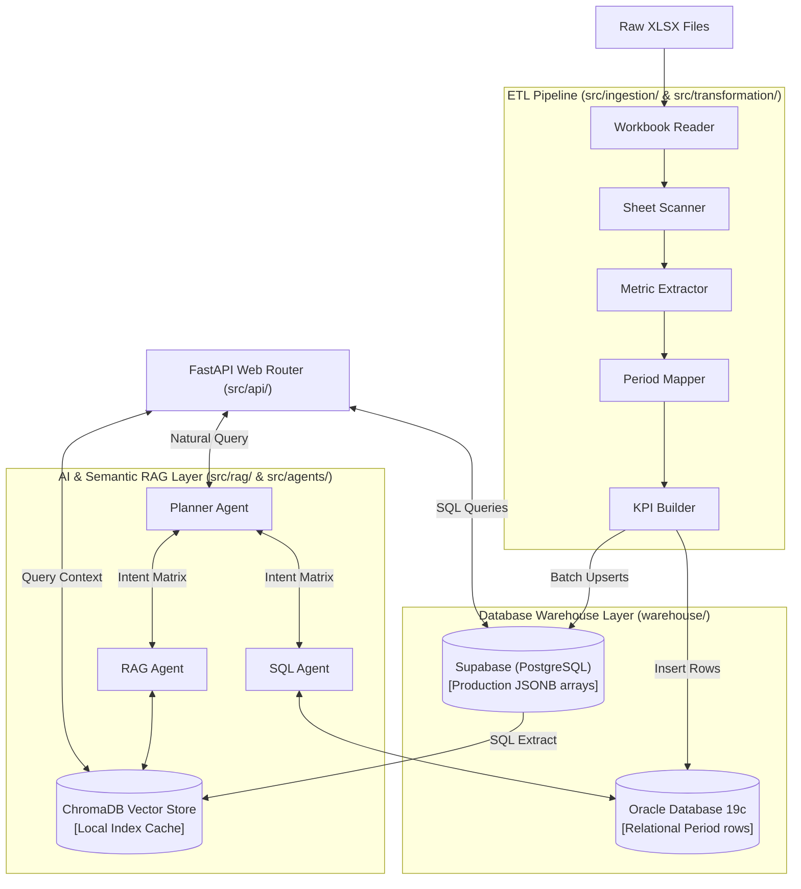

# FastAPI Backend Server (backend/)

This is the backend REST API engine for the **QuantumLens** platform. It handles Excel data ingestion pipelines, manages the dual-database warehouses, generates semantic vector embeddings, and hosts the multi-agent AI copilot.

For general details on the project architecture or dashboards, see the root [README.md](../README.md).

---

## Technical Stack & Configuration

| Module | Technology | Role |
| :--- | :--- | :--- |
| **Routing & Core** | FastAPI + Uvicorn | High-performance ASGI REST endpoints. |
| **Tabular Parser** | Pandas + openpyxl | Traverses sheets, extracts values, and cleans NaN anomalies. |
| **AI Embeddings** | SentenceTransformers | Local 384-dimensional dense vector generations (`all-MiniLM-L6-v2`). |
| **Vector Database**| ChromaDB | Zero-config, persistent local vector indexing. |
| **LLM Inference** | Groq Cloud Client | Context-grounded response generation via Llama-3.3. |

---

## Systems Architecture Diagram



---

## Dual-Database Warehouse Layouts

The database layer processes data into two distinct target topologies:

### 1. Supabase (PostgreSQL 15) Table: `metrics`
Stores complete time-series observations inside a single row using a dynamic JSONB array column.
* **Primary Key**: `id` (SERIAL)
* **Unique Constraint**: `metric_id` (enforces 1 row per KPI)
* **Time-Series Column**: `period_values` (JSONB)
* **Index**: B-Tree indices on `id`, `metric_id`, and `metric_name`

### 2. Oracle Database Table: `metrics`
Flattens observations into individual rows (one row per quarter/period) for OLAP reports.
* **Primary Key**: `id` (NUMBER GENERATED ALWAYS AS IDENTITY)
* **Chronological Columns**: `period` (VARCHAR2) & `value` (NUMBER)
* **Classification Columns**: `category` (VARCHAR2), `unit` (VARCHAR2)

---

## Local Ingestion and API Setup

### Prerequisites Checklist
- [ ] Python 3.13+ installed.
- [ ] SQLite3 and local system path configurations enabled.
- [ ] Oracle Client libraries (instant client) configured for python environment connections.

### Setup and execution commands

| Step | Action | Command | Notes |
| :--- | :--- | :--- | :--- |
| **1** | Create Virtual Env | `python -m venv .venv` | Creates sandbox environment. |
| **2** | Activate Env (Win) | `.venv\Scripts\Activate.ps1` | Activates powershell environment. |
| **3** | Activate Env (Unix)| `source .venv/bin/activate` | Activates bash environment. |
| **4** | Install Requirements | `pip install -r requirements.txt` | Installs Pandas, FastAPI, ChromaDB, Uvicorn. |
| **5** | Configure Environment | `copy .env.example .env` | Duplicate config file and inject credentials. |
| **6** | Run Ingestion Pipeline| `python src/ingestion/sheet_scanner.py` | Traverses XLSX data and structures raw records. |
| **7** | Load Database | `python warehouse/data_loader.py` | Batches metrics payload to Supabase metrics table. |
| **8** | Load Oracle Warehouse | `python warehouse/load_to_oracle.py` | Flattens observations and inserts records to Oracle. |
| **9** | Launch REST API | `uvicorn src.api.main:app --reload --port 8000` | Boots API server on port 8000 with hot-reload. |

---

## Environment Variables Configuration

> [!WARNING]
> - Never commit the `.env` file containing actual secrets to public repositories.
> - Ensure all variables are configured in the cloud host panel during deployments.

| Variable Name | Required | Description | Default Local |
| :--- | :--- | :--- | :--- |
| `SUPABASE_URL` | YES | Endpoint for Supabase Database REST interface. | `https://<YOUR_PROJECT_ID>.supabase.co` |
| `SUPABASE_KEY` | YES | Service Role administrative key to bypass RLS policies. | `<YOUR_SUPABASE_SERVICE_ROLE_KEY>` |
| `GROQ_API_KEY` | YES | API token for Groq Cloud LLM completions. | `<YOUR_GROQ_API_KEY>` |
| `VECTOR_DB_PATH` | NO | Local directory to persist ChromaDB index assets. | `src/rag/vector_db` |
| `EMBEDDINGS_PATH`| NO | Local file path caching pre-computed embeddings. | `data/generated/embeddings.json` |
| `EMBEDDING_MODEL`| NO | HuggingFace embedding model ID. | `sentence-transformers/all-MiniLM-L6-v2` |
| `TOP_K` | NO | Top document count returned during semantic search retrieval. | `5` |

---

## API Endpoints Reference

### Endpoints Matrix
| Method | Route | Description | Request Body (JSON) | Success Code |
| :--- | :--- | :--- | :--- | :--- |
| `GET` | `/` | Verify API server connectivity | None | `200 OK` |
| `GET` | `/health` | Ingestion status check | None | `200 OK` |
| `GET` | `/metrics` | Retrieve list of unique metrics | None | `200 OK` |
| `GET` | `/metric/{metric_id}`| Retrieve occurrences of a specific metric ID | None (Path Parameter) | `200 OK` |
| `GET` | `/record/{record_id}`| Retrieve metric row and timeline values by ID | None (Path Parameter) | `200 OK` |
| `POST` | `/search` | Query vector space for semantic similarity | `{"query": "...", "top_k": 3}`| `200 OK` |
| `POST` | `/ask` | Execute full multi-agent RAG reasoning | `{"question": "..."}` | `200 OK` |

---

### Request/Response JSON Formats

#### POST `/ask`

##### Request JSON Structure
```json
{
  "question": "Why did Expected Credit Losses (ECL) rise?"
}
```

##### Response JSON Structure
```json
{
  "question": "Why did Expected Credit Losses (ECL) rise?",
  "answer": "- According to sheet 'Group Income Statement' in '260505-1q-2026-data-pack-excel.xlsx':\n- Expected Credit Losses (ECL) rose due to fraud-related exposure on UK securitisation transactions and rising Middle East geopolitical volatility.",
  "sources": [
    {
      "metric_id": 5,
      "metric_name": "expected_credit_losses",
      "sheet_name": "Group Income Statement",
      "source_workbook": "260505-1q-2026-data-pack-excel.xlsx",
      "row_number": 12
    }
  ]
}
```

---

## Related Documentation
* [Primary Readme](../README.md): Project overview and complete monorepo details.
* [Frontend Readme](../frontend/README.md): Next.js dashboard visual portal instructions.
* [System Architecture Spec](../docs/architecture/architecture.md): Systems layers and sequence flows.
