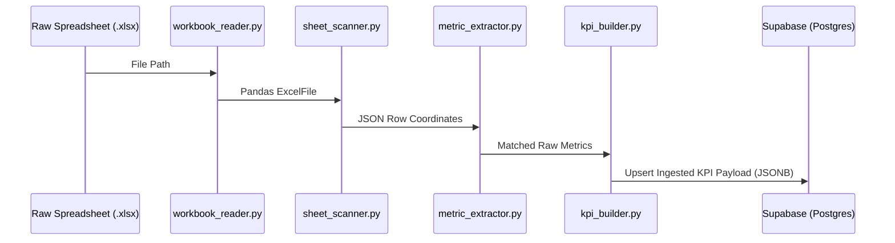
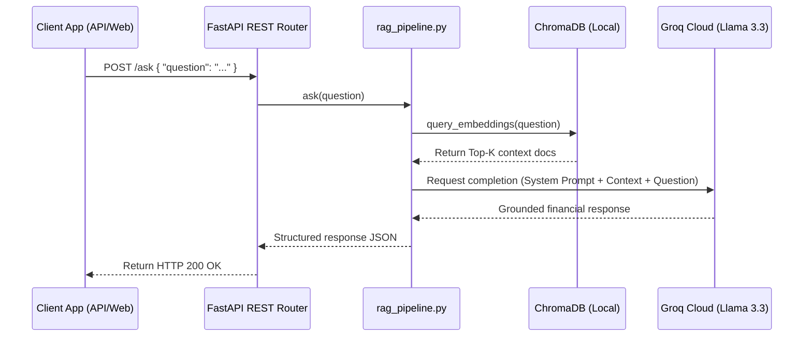

# 🏛️ System Architecture Spec

This document details the architectural layout, modules, and component interactions of **QuantumLens**. 

For a high-level overview, deployment metrics, or setup instructions, see the primary [README.md](../README.md).

---

## 🏗️ Layered Architecture Overview

QuantumLens is structured using a decoupled, layered design that separates data ingestion, metric transformation, warehouse persistence, semantic indexing, and API routing. This isolation ensures that ingestion formats (like Excel sheets or PDF documents) can change without impacting database logic, and RAG pipelines can adapt to different LLM providers without disrupting core analytics APIs.

```text
       Ingestion Layer
   [Workbook / Sheet Reader]
              │
              ▼
    Transformation Layer
 [Metric Normalization & Mapper]
              │
              ▼
      Warehouse Layer
 [PostgreSQL / Supabase Storage]
              │
              ▼
          AI Layer
  [ChromaDB / Groq Completions]
              │
              ▼
          API Router
      [FastAPI REST API]
```

---

## 📂 Modular System Breakdown

### 1. Ingestion Layer
The Ingestion Layer is responsible for discovering workbook sheets and converting raw cell layouts into structured coordinates.

- **Files**:
  - [workbook_reader.py](../src/ingestion/workbook_reader.py): Loads raw Excel workbooks into memory using Pandas in read-only mode to prevent memory exhaustion.
  - [sheet_scanner.py](../src/ingestion/sheet_scanner.py): Scans worksheets row-by-row, filtering out empty cells, and outputs standard JSON rows indicating the source sheet name, workbook, and coordinates.

---

### 2. Transformation Layer
The Transformation Layer normalizes metric names, cleans numerical arrays, and maps chronological data points into sequential database periods.

- **Files**:
  - [metric_extractor.py](../src/ingestion/metric_extractor.py): Matches raw text values to canonical names via a constant-time hashing catalog lookup. See [kpi_catalog.md](kpi_catalog.md) for dictionary catalog entries.
  - [value_extractor.py](../src/transformation/value_extractor.py): Filters cells to isolate floats, handles NaN or null inputs safely.
  - [period_mapper.py](../src/transformation/period_mapper.py): Converts chronological cell values to time-series sequences.
  - [kpi_builder.py](../src/transformation/kpi_builder.py): Computes performance trends (Up, Down, Flat) and compiles the finalized KPI payload.

---

### 3. Warehouse Layer
The Warehouse Layer acts as the relational storage interface, enforcing unique database constraints and handling query queries.

- **Files**:
  - [supabase_client.py](../src/warehouse/supabase_client.py): Initializes the cloud client connection.
  - [data_loader.py](../src/warehouse/data_loader.py): Handles batch uploads using primary key upsert logic to prevent duplicate record insertion. For table schema definitions, see [data_dictionary.md](data_dictionary.md).
  - [query_service.py](../src/warehouse/query_service.py): Wraps Postgres tables, providing query functions to external REST APIs.

---

### 4. AI Layer (Retrieval-Augmented Generation)
The AI Layer manages vector space generation, similarity indexing, and context-bounded query answering.

- **Files**:
  - [embedding_generator.py](../src/rag/embedding_generator.py): Extracts text records from PostgreSQL and generates 384-dimensional dense vectors.
  - [vector_loader.py](../src/rag/vector_loader.py): Connects to ChromaDB, registers collections, and loads embeddings.
  - [retrieval_engine.py](../src/rag/retrieval_engine.py): Executes semantic searches using cosine distance thresholds.
  - [rag_pipeline.py](../src/rag/rag_pipeline.py): Integrates search results into context prompts and requests LLM answers.

---

## 🔄 Component Interactions

### 1. Ingestion and ETL Data Flow
This diagram illustrates the sequence of processing raw spreadsheets into database tables:



---

### 2. RAG Query Retrieval Sequence
This diagram illustrates the sequence when a user queries the API for financial analytics:



---

## 🔗 Related Documentation
- [Primary Readme](../README.md): Project overview, installation scripts, API reference.
- [Database Schema (Data Dictionary)](data_dictionary.md): Detailed columns description, indices, and constraints.
- [KPI catalog mapping](kpi_catalog.md): Synonym dictionaries and lookup rules.
