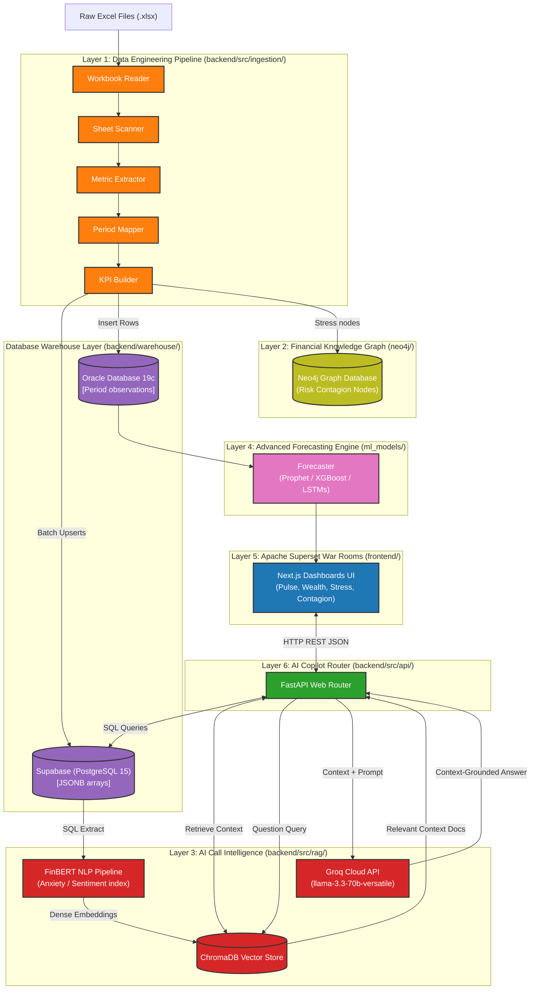
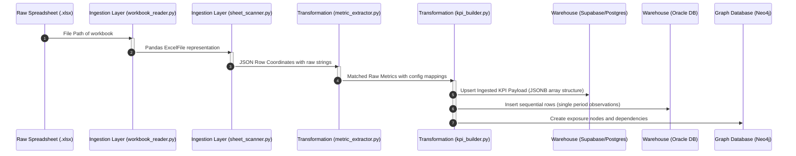
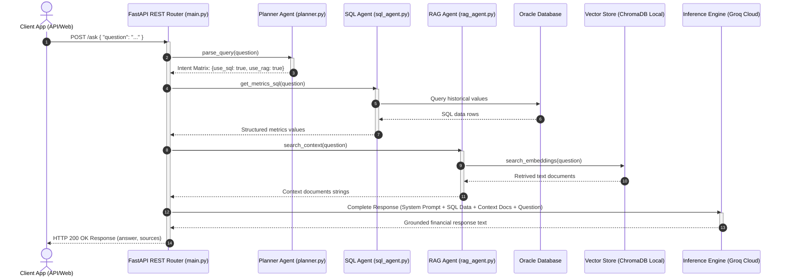

# System Architecture Specification

This document details the architectural layout, system layers, and component interactions of **QuantumLens** (also known as *HSBC Atlas* or *Project Basilisk*), an institutional-grade banking intelligence platform.

For a high-level overview, deployment metrics, or setup instructions, see the primary [README.md](../../README.md).

---

## 6-Layer Architecture Overview

QuantumLens is built on six decoupled engineering layers. This decoupling ensures that vector-indexed LLM reasoning and graph contagion modeling run independently of core transactional databases and ETL workflows.

---

## Technical Layers Matrix

| Layer | Responsibility | Input Shape | Output Shape | Data Store Target |
| :--- | :--- | :--- | :--- | :--- |
| **Layer 1: Pipeline** | Parsing Excel cells, stripping merged headers, and outputting JSON coordinates. | Raw Excel files (`.xlsx`) | Cleaned JSON coordinate maps | File cache / local disks |
| **Layer 2: Graph** | Modeling counterparty risk, wealth flows, and geopolitical contagion propagation paths. | Structured KPI metrics | Entity node networks and exposures | Neo4j Graph DB |
| **Layer 3: NLP** | Executing FinBERT sentiment classification and measuring management anxiety indices. | Earnings transcripts, executive remarks | Confidence and risk indexes | ChromaDB Vector Store |
| **Layer 4: Forecast** | Generating NII, RoTE, and credit provision forecasts under macroeconomic scenario stress tests. | Relational metrics history | Predictive timeline indicators | Warehouse databases |
| **Layer 5: UI Portal** | Hosting executive dashboards and rendering Recharts visualizations. | User selections, REST query parameters | Interactive dashboards views | Browser local state / caches |
| **Layer 6: AI Copilot**| Planning query intent and combining SQL metrics with semantic search documents. | Natural language questions | Factual, source-attributed text replies | Local host runtime |

---

## Modular System Breakdown

The system modules are partitioned as follows:

| Script / Module | Architecture Layer | Core Function | Primary Python Packages | File Path |
| :--- | :--- | :--- | :--- | :--- |
| **workbook_reader.py** | Layer 1: Data Pipeline | Reads binary workbooks in read-only mode to prevent memory leak issues. | `pandas`, `openpyxl` | [workbook_reader.py](../../backend/src/ingestion/workbook_reader.py) |
| **sheet_scanner.py** | Layer 1: Data Pipeline | Parses worksheets cell-by-cell and fills merged header regions programmatically. | `pandas`, `numpy` | [sheet_scanner.py](../../backend/src/ingestion/sheet_scanner.py) |
| **metric_extractor.py**| Layer 1: Data Pipeline | Normalizes names to a centralized config map in constant O(1) time. | `re`, `json` | [metric_extractor.py](../../backend/src/ingestion/metric_extractor.py) |
| **value_extractor.py** | Layer 1: Data Pipeline | Isolates floats, filtering out string footnotes or empty indicators. | `pandas`, `numpy` | [value_extractor.py](../../backend/src/ingestion/value_extractor.py) |
| **period_mapper.py** | Layer 1: Data Pipeline | Maps spreadsheet columns to sequential chronological period indexes. | `json` | [period_mapper.py](../../backend/src/transformation/period_mapper.py) |
| **kpi_builder.py** | Layer 1: Data Pipeline | Compiles metrics trend flags (`up`, `down`, `flat`) and timestamps records. | `datetime` | [kpi_builder.py](../../backend/src/transformation/kpi_builder.py) |
| **data_loader.py** | Layer 1: Data Pipeline | Batches records to Supabase tables using natural key upsert operations. | `supabase` | [data_loader.py](../../backend/warehouse/data_loader.py) |
| **load_to_oracle.py** | Layer 1: Data Pipeline | Flattens observations and uploads data rows to Oracle Database. | `oracledb` | [load_to_oracle.py](../../backend/warehouse/load_to_oracle.py) |
| **query_service.py** | Layer 6: AI Copilot | Wraps database queries, providing metrics arrays to FastAPI routers. | `oracledb` | [query_service.py](../../backend/warehouse/query_service.py) |
| **embedding_generator.py**| Layer 3: AI Intelligence | Creates vector embeddings from metrics metadata using local BAAI models. | `sentence-transformers` | [embedding_generator.py](../../backend/src/rag/embedding_generator.py) |
| **vector_loader.py** | Layer 3: AI Intelligence | Registers vector collections in ChromaDB and handles index persistence. | `chromadb` | [vector_loader.py](../../backend/src/rag/vector_loader.py) |
| **retrieval_engine.py**| Layer 3: AI Intelligence | Performs cosine searches on vectorized metrics with distance filters. | `chromadb` | [retrieval_engine.py](../../backend/src/rag/retrieval_engine.py) |
| **rag_pipeline.py** | Layer 6: AI Copilot | Orchestrates system prompts, injecting contexts for LLM execution. | `groq` | [rag_pipeline.py](../../backend/src/rag/rag_pipeline.py) |

---

## Detailed Data Flows & Sequence Diagrams

### 1. Ingestion and ETL Pipeline Data Flow

The following sequence illustrates the stages of processing raw spreadsheets into database tables:

---

### 2. Multi-Agent RAG Query Sequence

This sequence diagram illustrates the steps when a user queries the API for financial analytics:

---

## Related Documentation
* [Primary Readme](../../README.md): Project overview, installation scripts, API reference.
* [Database Schema (Data Dictionary)](../features/ingestion/data_dictionary.md): Detailed columns description, indices, and constraints.
* [KPI Catalog Mapping](../features/rag/kpi_catalog.md): Synonym dictionaries and lookup rules.
