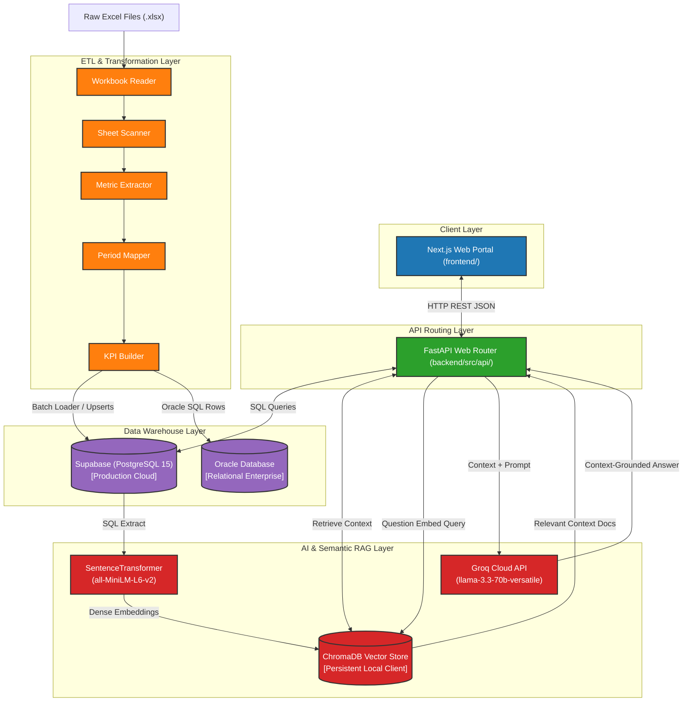
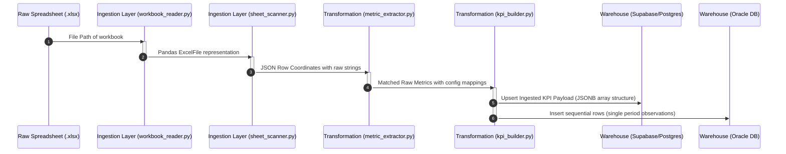
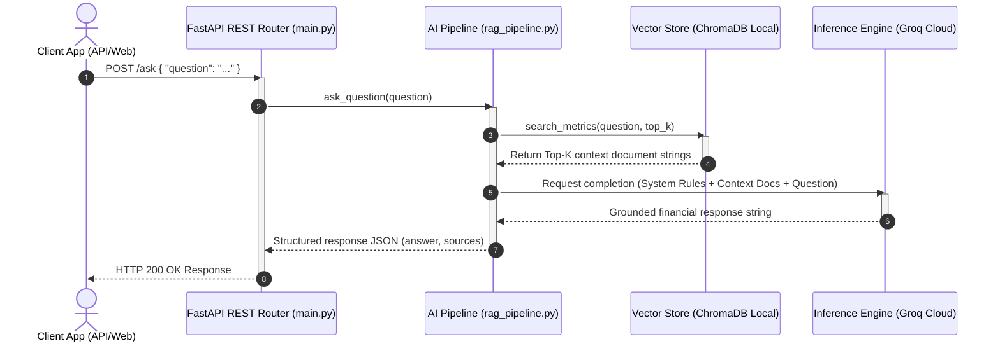

# System Architecture Specification

This document details the architectural layout, modules, and component interactions of **QuantumLens**. 

For a high-level overview, deployment metrics, or setup instructions, see the primary [README.md](../../README.md).

---

## Layered Architecture Overview

QuantumLens uses a decoupled, layered design that separates data ingestion, metric transformation, warehouse persistence, semantic indexing, and API routing.

### Architecture Topology Diagram

---

## Technical Layers Matrix

| Layer | Responsibility | Input Shape | Output Shape | Storage Target | Code Locations |
| :--- | :--- | :--- | :--- | :--- | :--- |
| **Client** | User interactions, analytics dashboards, and interactive chat interface. | Web events, filter selections | HTTP REST Payloads | Local Storage / Session State | `frontend/` |
| **API** | High-performance request routing, CORS configuration, exception handling, and query orchestration. | JSON Requests, parameter queries | JSON Responses | None (Stateless) | `backend/src/api/` |
| **ETL & Ingestion** | Extracting data cells from complex binary Excel files and cleaning structural noises. | Excel binary (`.xlsx`) | JSON cell coordinate arrays | File cache / JSON files | `backend/src/ingestion/` |
| **Transformation** | Metric normalizations, numeric isolations, chronological sequence indexing, and trend compiles. | Raw JSON row data | Clean KPI objects / time-series data | `backend/data/processed/` | `backend/src/transformation/` |
| **Warehouse** | Storing standardized relational observations and providing transactional consistency. | Structured KPI Records | Table rows | Supabase (Postgres) & Oracle | `backend/warehouse/` |
| **AI (RAG)** | Dense vector generations, semantic index management, and context-bounded query completions. | Natural language questions | Structured text answers with citations | Local ChromaDB collections | `backend/src/rag/` |

---

## Modular System Breakdown

The system is partitioned into the following functional scripts:

| Module / Script | Layer | Core Function | Primary Python Packages | File Path |
| :--- | :--- | :--- | :--- | :--- |
| **workbook_reader.py** | Ingestion | Discovers spreadsheet sheet list and reads workbooks in read-only mode to prevent memory leak issues. | `pandas`, `openpyxl` | [workbook_reader.py](../../backend/src/ingestion/workbook_reader.py) |
| **sheet_scanner.py** | Ingestion | Programmatically reads grid rows, stripping merged layout cells, and outputs standard coordinates. | `pandas`, `numpy` | [sheet_scanner.py](../../backend/src/ingestion/sheet_scanner.py) |
| **metric_extractor.py**| Ingestion | Performs lowercase exact regex boundary checks to identify normalized KPIs. | `re`, `json` | [metric_extractor.py](../../backend/src/ingestion/metric_extractor.py) |
| **value_extractor.py** | Ingestion | Isolates true numerical float values, discarding string notes or empty markers. | `pandas`, `numpy` | [value_extractor.py](../../backend/src/ingestion/value_extractor.py) |
| **period_mapper.py** | Transformation | Maps raw columns into sequential chronological period indexes (`period_index: 1, 2...`). | `json` | [period_mapper.py](../../backend/src/transformation/period_mapper.py) |
| **kpi_builder.py** | Transformation | Computes trend vectors (`up`, `down`, `flat`) based on latest values and appends timestamps. | `datetime` | [kpi_builder.py](../../backend/src/transformation/kpi_builder.py) |
| **data_loader.py** | Warehouse | Batch uploads structured JSON records to Supabase metrics table using upsert configurations. | `supabase` | [data_loader.py](../../backend/warehouse/data_loader.py) |
| **load_to_oracle.py** | Warehouse | Transforms JSON array series into single rows and loads them into Oracle SQL. | `oracledb` | [load_to_oracle.py](../../backend/warehouse/load_to_oracle.py) |
| **query_service.py** | Warehouse | Connects to Oracle to retrieve metric listings, historical trend queries, and filters. | `oracledb` | [query_service.py](../../backend/warehouse/query_service.py) |
| **embedding_generator.py**| AI Layer | Generates 384-dimensional vector embeddings from structured metrics in the warehouse. | `sentence-transformers` | [embedding_generator.py](../../backend/src/rag/embedding_generator.py) |
| **vector_loader.py** | AI Layer | Creates local persistent collections in ChromaDB and indexes embeddings for semantic search. | `chromadb` | [vector_loader.py](../../backend/src/rag/vector_loader.py) |
| **retrieval_engine.py**| AI Layer | Accepts queries, runs local cosine distance comparisons, and returns top-K records. | `chromadb` | [retrieval_engine.py](../../backend/src/rag/retrieval_engine.py) |
| **rag_pipeline.py** | AI Layer | Assembles system prompts containing retrieved context documents and queries Groq API. | `groq` | [rag_pipeline.py](../../backend/src/rag/rag_pipeline.py) |

---

## Detailed Data Flows & Sequence Diagrams

### 1. Ingestion and ETL Pipeline Data Flow

The following sequence illustrates the stages of processing raw spreadsheets into database tables:

---

### 2. RAG Query Retrieval Sequence

This sequence diagram illustrates the steps when a user queries the API for financial analytics:

---

## Related Documentation
* [Primary Readme](../../README.md): Project overview, installation scripts, API reference.
* [Database Schema (Data Dictionary)](../features/ingestion/data_dictionary.md): Detailed columns description, indices, and constraints.
* [KPI Catalog Mapping](../features/rag/kpi_catalog.md): Synonym dictionaries and lookup rules.
